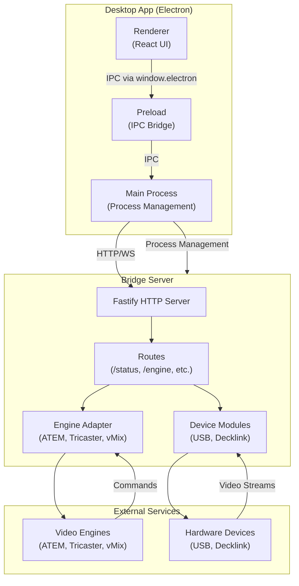
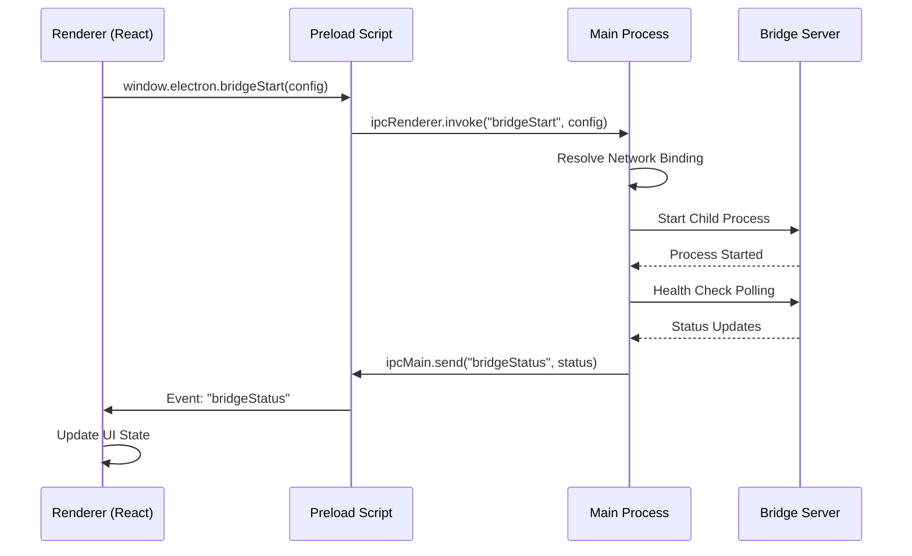
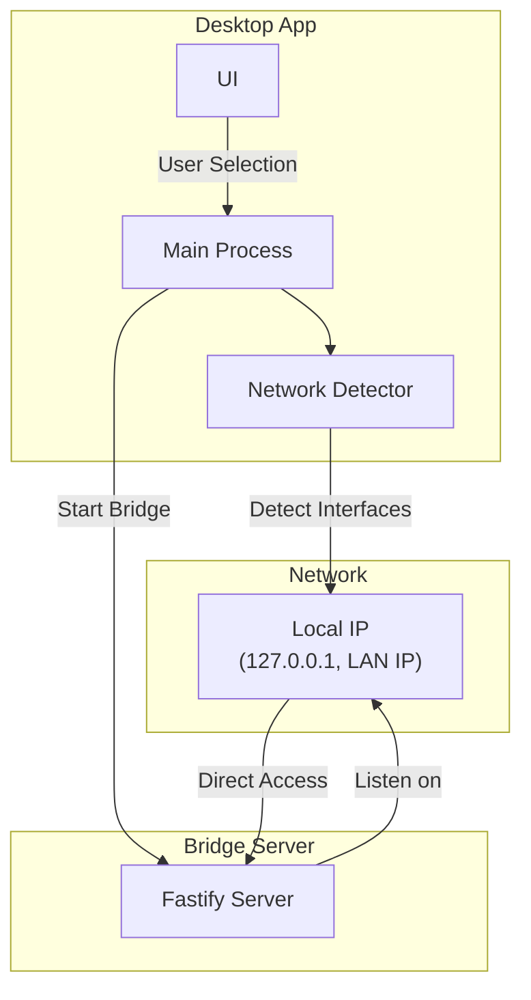

# Bridge Architektur Dokumentation

## Übersicht

Die Broadify Bridge ist eine Electron-basierte Desktop-Anwendung, die einen lokalen Bridge-Server startet und verwaltet. Die Architektur besteht aus zwei Hauptkomponenten:

1. **Desktop App (Electron)**: UI und Prozess-Management
2. **Bridge Server**: HTTP/WebSocket Server für Device- und Engine-Kommunikation

## Architektur-Komponenten

### 1. Desktop App (Electron)

#### Main Process (`src/electron/main.ts`)

- Fenster-Management
- Bridge-Prozess Start/Stop
- IPC Handler für UI-Kommunikation
- Health Check Polling
- Network Interface Detection

#### Preload (`src/electron/preload.cts`)

- Sichere IPC-Brücke zwischen Renderer und Main
- Exponiert `window.electron.*` APIs
- Verwendet `contextBridge` für Security

#### Renderer (`src/ui/App.tsx`)

- React 19 UI
- Bridge Status Monitoring
- Network Configuration
- Engine Control

### 2. Bridge Server (`apps/bridge/`)

#### Server (`apps/bridge/src/server.ts`)

- Fastify HTTP Server
- CORS Support
- WebSocket Plugin
- Route Registration

#### Routes

- `/status` - Bridge Health Status
- `/outputs` - Device Outputs
- `/devices` - Device Detection
- `/config` - Configuration Management
- `/engine/*` - Engine Control (ATEM, Tricaster, vMix)
- `/video/*` - Video Streaming
- `/ws` - WebSocket für Real-time Updates

#### Modules (`apps/bridge/src/modules/`)

- **USB Capture Module**: USB Video Capture Devices
- **Decklink Module**: Blackmagic Decklink Cards
- **Module Registry**: Zentrale Registrierung aller Module

#### Services (`apps/bridge/src/services/`)

- **Engine Adapter**: Abstraktion für ATEM/Tricaster/vMix
- **Device Detection**: Automatische Device-Erkennung
- **Output Management**: Output-Konfiguration

### 3. Services (Main Process)

#### Bridge Process Manager (`src/electron/services/bridge-process-manager.ts`)

- Startet Bridge als Child Process
- Port Auto-Discovery
- Process Monitoring
- Logging

#### Network Interface Detector (`src/electron/services/network-interface-detector.ts`)

- Erkennt verfügbare Netzwerk-Interfaces
- IP-Adress-Auflösung
- Interface-Filterung

#### Port Checker (`src/electron/services/port-checker.ts`)

- Port Verfügbarkeits-Prüfung
- Auto-Fallback Port Suche

#### Bridge Health Check (`src/electron/services/bridge-health-check.ts`)

- Polling des Bridge Status
- Health Status Updates an UI

## Data Flow Diagramme

### High-Level Architektur



### IPC Kommunikation Flow



### Bridge Server Internal Flow


### Engine Connection Flow


### Device Detection Flow


### Network Setup Flow



## Sicherheitszonen

### Security Boundaries

```mermaid
graph TB
    subgraph Sandbox["Renderer Sandbox"]
        Renderer["React UI<br/>(No Node APIs)"]
    end

    subgraph PreloadZone["Preload Zone"]
        Preload["Preload Script<br/>(contextBridge)"]
    end

    subgraph MainZone["Main Process Zone"]
        Main["Main Process<br/>(Full Node Access)"]
        Services["Services<br/>(Process Management)"]
    end

    subgraph BridgeZone["Bridge Zone"]
        Bridge["Bridge Server<br/>(HTTP/WS Server)"]
        Modules["Device Modules"]
    end

    Renderer -->|window.electron.*| Preload
    Preload -->|IPC (Validated)| Main
    Main -->|Child Process| Bridge
    Main -->|Process Control| Services
    Bridge -->|Hardware Access| Modules
```

## Konfiguration Flow


## Wichtige Verbindungen und Dataflows

### 1. UI → Bridge Kommunikation

**Flow:**

1. User interagiert mit React UI (`src/ui/App.tsx`)
2. UI ruft `window.electron.bridgeStart(config)` auf
3. Preload Script (`src/electron/preload.cts`) leitet IPC-Aufruf weiter
4. Main Process (`src/electron/main.ts`) empfängt IPC und startet Bridge-Prozess
5. Bridge Process Manager startet Bridge als Child Process
6. Bridge Server startet Fastify HTTP Server
7. Health Check Polling beginnt und sendet Status-Updates zurück an UI

**Datenfluss:**

- **Request**: `BridgeConfig` (host, port, networkBindingId)
- **Response**: `{success: boolean, error?: string, actualPort?: number}`
- **Updates**: `BridgeStatus` via IPC Events

### 2. Bridge → Engine Kommunikation

**Flow:**

1. Web App sendet `POST /engine/connect` mit Engine-Typ und IP/Port
2. Bridge Route validiert Request mit Zod Schema
3. Engine Adapter erstellt TCP-Verbindung zum Video Engine
4. Engine Adapter fragt Macros ab
5. State wird aktualisiert und an Client zurückgesendet
6. WebSocket Stream ermöglicht Real-time Updates

**Datenfluss:**

- **Request**: `{type: "atem"|"tricaster"|"vmix", ip: string, port: number}`
- **Response**: `{success: boolean, state: EngineStateT}`
- **Updates**: WebSocket Messages mit State Changes

### 3. Device Detection Flow

**Flow:**

1. Client ruft `GET /outputs` auf
2. Route delegiert an Module Registry
3. Module Registry iteriert über alle registrierten Module (USB, Decklink)
4. Jedes Module nutzt seinen Detector um Hardware zu finden
5. Detectors liefern Port-Listen zurück
6. Module aggregieren Ports zu Output-Listen
7. Module Registry kombiniert alle Outputs
8. Route sendet kombinierte Liste zurück

**Datenfluss:**

- **Request**: `GET /outputs`
- **Response**: `{output1: OutputDeviceT[], output2: OutputDeviceT[]}`
- **Hardware**: Native APIs (USB, Decklink SDK)

### 4. Network Setup

**Flow:**

1. User wählt Network Binding (localhost, ethernet, wifi, all)
2. Network Interface Detector löst IP-Adresse auf
3. Port Checker prüft Port-Verfügbarkeit
4. Main Process startet Bridge mit resolved IP/Port

**Datenfluss:**

- **Network Binding**: `NetworkBindingOptionT` → resolved IP address
- **Port**: Auto-fallback wenn Port belegt

### 5. Configuration Management

**Flow:**

1. Config Loader prüft drei Quellen (Priority: User > Template > Default)
2. User Config wird aus `userData/network-config.json` geladen
3. Falls nicht vorhanden: Template aus `config/network-config.json`
4. Falls nicht vorhanden: Hardcoded Default Config
5. Network Config wird verwendet um IP/Port zu resolven
6. Resolved Config wird als CLI Args an Bridge übergeben

**Datenfluss:**

- **Config Sources**: JSON Files → `NetworkConfigT`
- **Resolution**: `bindAddress` → actual IP address
- **Bridge Args**: `--host <ip> --port <port>`

## Technische Details

### IPC Channels

**Renderer → Main:**

- `bridgeStart`: Start Bridge Server
- `bridgeStop`: Stop Bridge Server
- `bridgeGetStatus`: Get current status
- `checkPortAvailability`: Check if port is available
- `getNetworkConfig`: Get network configuration
- `detectNetworkInterfaces`: Detect available interfaces
- `bridgeGetOutputs`: Get available output devices
- `engineConnect`: Connect to video engine
- `engineDisconnect`: Disconnect from engine
- `engineGetStatus`: Get engine status
- `engineGetMacros`: Get available macros
- `engineRunMacro`: Execute macro
- `engineStopMacro`: Stop macro

**Main → Renderer:**

- `bridgeStatus`: Status updates (via `ipcMain.send`)

### Bridge API Endpoints

**HTTP:**

- `GET /status` - Bridge health status
- `GET /outputs` - Available output devices
- `GET /devices` - Detected devices
- `POST /config` - Configure outputs
- `POST /engine/connect` - Connect to engine
- `POST /engine/disconnect` - Disconnect from engine
- `GET /engine/status` - Get engine status
- `GET /engine/macros` - Get macros
- `POST /engine/macros/:id/run` - Run macro
- `POST /engine/macros/:id/stop` - Stop macro

**WebSocket:**

- `WS /ws` - Real-time updates (topic-based subscription)

### Security Considerations

1. **Renderer Sandbox**: Kein direkter Node.js Zugriff
2. **Preload Validation**: Alle IPC Calls werden validiert
3. **Network Binding**: Standardmäßig localhost, LAN optional
4. **Input Validation**: Zod Schemas für alle API Requests

### Error Handling

- **Bridge Start Failures**: Port conflicts, address not available
- **Engine Connection Failures**: Timeout, connection refused, unreachable
- **Device Detection Failures**: Graceful degradation, empty lists
