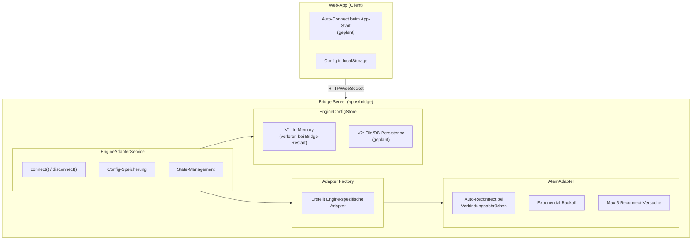
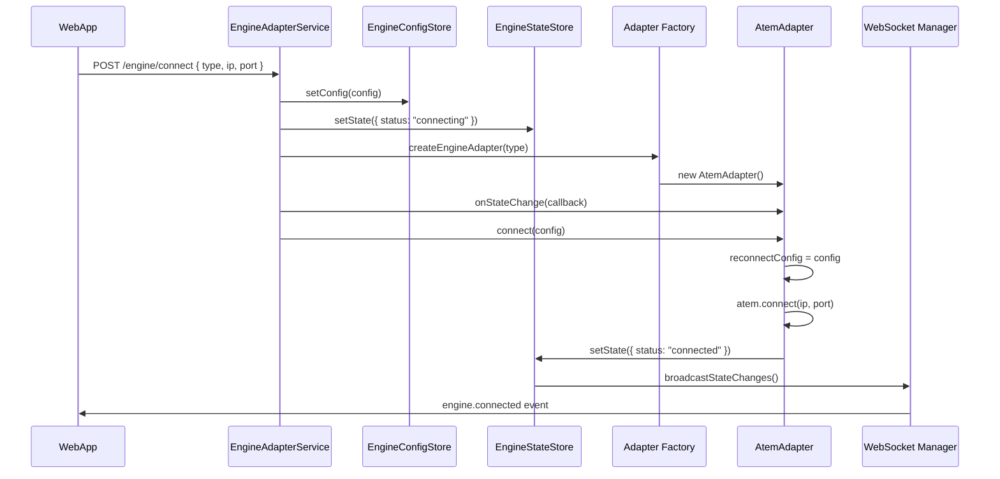
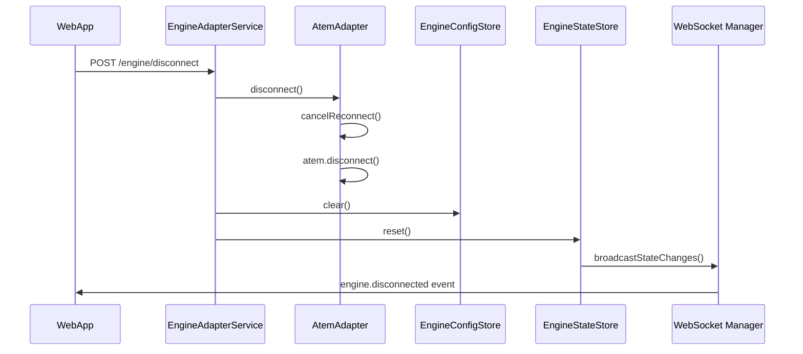
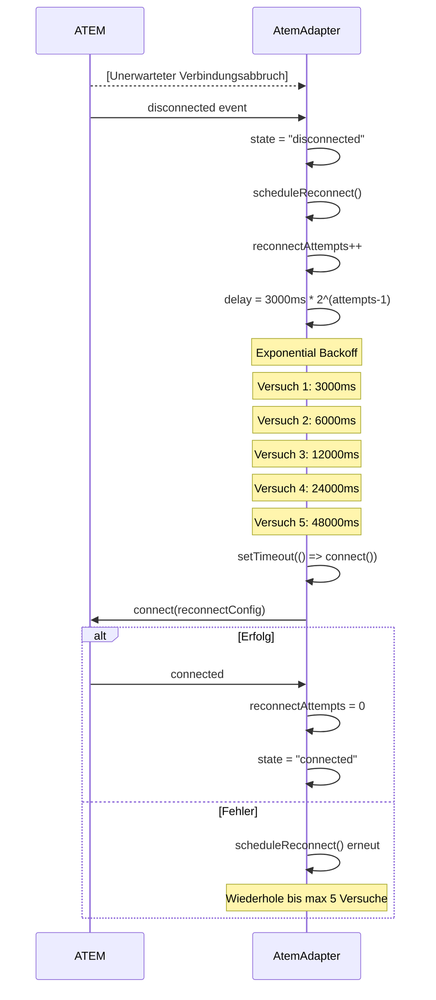
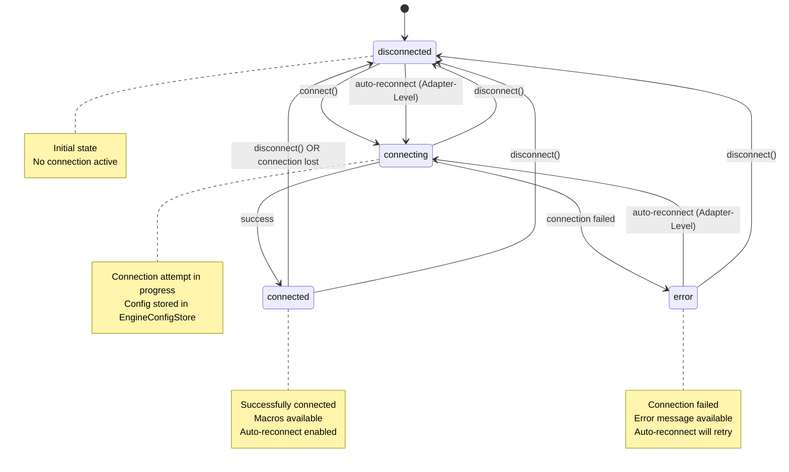

# ENGINE Auto-Connect Architektur Dokumentation

## Übersicht

Die ENGINE-Auto-Connection-Architektur besteht aus mehreren Ebenen, die zusammenarbeiten, um eine robuste und zuverlässige Verbindung zur Engine (ATEM/Tricaster/vMix) zu gewährleisten. Die Auto-Connect-Logik ist auf drei Ebenen implementiert:

1. **Adapter-Level**: Automatischer Reconnect bei Verbindungsabbrüchen (Adapter-spezifisch)
2. **Service-Level**: Config-Speicherung für zukünftige Reconnects
3. **Web-App-Level**: Auto-Connect beim App-Start (geplant)

## Architektur-Übersicht

### Komponenten-Hierarchie



## Detaillierte Komponenten-Analyse

### 1. EngineConfigStore

**Datei:** `apps/bridge/src/services/engine/engine-config-store.ts`

**Zweck:** Speichert Engine-Konfiguration für Auto-Reconnect nach Bridge-Restart.

**Implementierung:**

```typescript
export class EngineConfigStore {
  private config: EngineConnectConfig | null = null;

  getConfig(): EngineConnectConfig | null;
  setConfig(config: EngineConnectConfig): void;
  clear(): void;
  hasConfig(): boolean;
}
```

**Verhalten:**

- **V1 (aktuell)**: In-Memory Storage - Config geht bei Bridge-Restart verloren
- **V2 (geplant)**: File/DB Persistence - Config überlebt Bridge-Restart

**Verwendung:**

- Config wird beim `connect()` gespeichert
- Config wird beim `disconnect()` gelöscht
- Wird aktuell NICHT für automatischen Reconnect verwendet (nur für zukünftige Implementierung)

### 2. EngineAdapterService

**Datei:** `apps/bridge/src/services/engine-adapter.ts`

**Zweck:** Zentrale Service-Klasse für Engine-Verbindungen. Verwaltet Adapter-Instanzen und State.

**Wichtige Methoden:**

#### `connect(config: EngineConnectConfig)`

```typescript
async connect(config: EngineConnectConfig): Promise<void> {
  // 1. Prüfe ob bereits verbunden/verbindend
  if (currentState.status === "connected" || currentState.status === "connecting") {
    throw new Error("Engine is already connected or connecting");
  }

  // 2. Speichere Config für Auto-Reconnect
  engineConfigStore.setConfig(config);

  // 3. Update State zu "connecting"
  this.stateStore.setState({ status: "connecting", ...config });

  // 4. Erstelle Adapter via Factory
  this.adapter = createEngineAdapter(config.type);

  // 5. Subscribe zu Adapter State Changes
  this.adapter.onStateChange((state) => {
    this.stateStore.setState(state);
    this.broadcastStateChanges(state);
  });

  // 6. Verbinde Adapter
  await this.adapter.connect(config);
}
```

**Flow:**

1. Validierung des aktuellen Status
2. Config-Speicherung in `EngineConfigStore`
3. State-Update zu "connecting"
4. Adapter-Erstellung via Factory
5. State-Change-Subscription
6. Adapter-Verbindung

#### `disconnect()`

```typescript
async disconnect(): Promise<void> {
  // 1. Trenne Adapter-Verbindung
  if (this.adapter) {
    await this.adapter.disconnect();
    this.adapter = null;
  }

  // 2. Lösche Config
  engineConfigStore.clear();

  // 3. Reset State
  this.stateStore.reset();
  this.broadcastStateChanges(disconnectedState);
}
```

**Flow:**

1. Adapter trennen
2. Config löschen
3. State zurücksetzen
4. WebSocket-Broadcast

### 3. AtemAdapter - Auto-Reconnect Logik

**Datei:** `apps/bridge/src/services/engine/adapters/atem-adapter.ts`

**Zweck:** Implementiert automatischen Reconnect bei Verbindungsabbrüchen auf Adapter-Ebene.

**Konfiguration:**

```typescript
private reconnectTimer: NodeJS.Timeout | null = null;
private reconnectAttempts = 0;
private readonly maxReconnectAttempts = 5;
private readonly reconnectDelayMs = 3000;
private reconnectConfig: EngineConnectConfig | null = null;
```

**Reconnect-Trigger:**

Der Reconnect wird ausgelöst, wenn:

- Die ATEM-Verbindung unerwartet getrennt wird (`disconnected` Event)
- Der aktuelle Status "connected" war

```typescript
atem.on("disconnected", () => {
  if (this.state.status === "connected") {
    this.setState({ status: "disconnected" });
    this.scheduleReconnect(); // ← Auto-Reconnect starten
  }
});
```

**Reconnect-Algorithmus:**

```typescript
private scheduleReconnect(): void {
  // 1. Prüfe ob Config vorhanden
  if (!this.reconnectConfig) return;

  // 2. Prüfe Max-Versuche
  if (this.reconnectAttempts >= 5) {
    this.setState({
      status: "error",
      error: "Max reconnect attempts reached",
    });
    return;
  }

  // 3. Exponential Backoff berechnen
  this.reconnectAttempts++;
  const delay = this.reconnectDelayMs * Math.pow(2, this.reconnectAttempts - 1);
  // Versuch 1: 3000ms
  // Versuch 2: 6000ms
  // Versuch 3: 12000ms
  // Versuch 4: 24000ms
  // Versuch 5: 48000ms

  // 4. Reconnect nach Delay
  this.reconnectTimer = setTimeout(() => {
    if (this.state.status === "disconnected" && this.reconnectConfig) {
      this.connect(this.reconnectConfig).catch(() => {
        // Error handling in connect()
      });
    }
  }, delay);
}
```

**Reconnect-Timeline:**

```
Verbindungsabbruch
    ↓
[0ms]     Status: "disconnected"
    ↓
[3000ms]  Reconnect-Versuch 1
    ↓ (bei Fehler)
[6000ms]  Reconnect-Versuch 2
    ↓ (bei Fehler)
[12000ms] Reconnect-Versuch 3
    ↓ (bei Fehler)
[24000ms] Reconnect-Versuch 4
    ↓ (bei Fehler)
[48000ms] Reconnect-Versuch 5
    ↓ (bei Fehler)
Status: "error" - "Max reconnect attempts reached"
```

**Reconnect-Abbruch:**

Der Reconnect wird abgebrochen, wenn:

- `disconnect()` explizit aufgerufen wird
- `cancelReconnect()` aufgerufen wird

```typescript
private cancelReconnect(): void {
  if (this.reconnectTimer) {
    clearTimeout(this.reconnectTimer);
    this.reconnectTimer = null;
  }
  this.reconnectAttempts = 0;
}
```

### 4. Bridge Server - Kein Auto-Connect beim Start

**Datei:** `apps/bridge/src/server.ts`

**Wichtiger Hinweis:**

```typescript
// Note: Engine connection is now controlled by the Web-App
// The Web-App handles auto-connect and stores config in localStorage
// Bridge no longer auto-connects on startup
```

**Aktuelles Verhalten:**

- Bridge startet OHNE automatische Engine-Verbindung
- Web-App ist verantwortlich für Auto-Connect beim App-Start
- Config wird in Web-App localStorage gespeichert

### 5. Web-App Auto-Connect (Geplant)

**Status:** Noch nicht implementiert

**Geplante Implementierung:**

Die Web-App soll:

1. Beim App-Start prüfen, ob Engine-Config in localStorage vorhanden ist
2. Wenn vorhanden: Automatisch `POST /engine/connect` aufrufen
3. Config in localStorage speichern bei erfolgreichem Connect
4. Config aus localStorage löschen bei Disconnect

**Vorteile:**

- Config überlebt Browser-Restart
- Config überlebt Bridge-Restart (wenn Bridge V2 Persistence implementiert)
- Unabhängig von Bridge-Implementierung

## Datenfluss-Diagramm

### Connect-Flow



### Disconnect-Flow



### Auto-Reconnect-Flow (Adapter-Level)



## State-Maschine

### Engine Status States



**State-Übergänge:**

- `disconnected` → `connecting`: `connect()` aufgerufen
- `connecting` → `connected`: Verbindung erfolgreich
- `connecting` → `error`: Verbindung fehlgeschlagen
- `connected` → `disconnected`: `disconnect()` aufgerufen ODER Verbindungsabbruch
- `disconnected` → `connecting`: Auto-Reconnect (Adapter-Level)
- `error` → `connecting`: Auto-Reconnect (Adapter-Level)
- Jeder State → `disconnected`: `disconnect()` aufgerufen

## WebSocket Events

### Engine Status Events

Die Engine-Status-Änderungen werden via WebSocket an alle subscribed Clients broadcastet:

```typescript
// Status Update
{
  type: "engine.status",
  status: "connected" | "disconnected" | "connecting" | "error",
  error?: string
}

// Connection Events
{
  type: "engine.connected",
  state: EngineStateT
}

{
  type: "engine.disconnected"
}

{
  type: "engine.error",
  error: string
}
```

**Broadcast-Zeitpunkte:**

1. **Status-Änderung**: Bei jedem State-Update
2. **Connection**: Wenn Status von nicht-"connected" zu "connected" wechselt
3. **Disconnection**: Wenn Status von "connected" zu nicht-"connected" wechselt
4. **Error**: Wenn Status "error" ist

## Konfiguration & Persistence

### Aktueller Stand (V1)

**EngineConfigStore:**

- ✅ In-Memory Storage
- ❌ Keine Persistence
- ❌ Config geht bei Bridge-Restart verloren

**AtemAdapter:**

- ✅ Auto-Reconnect bei Verbindungsabbrüchen
- ✅ Exponential Backoff
- ✅ Max 5 Versuche

**Bridge Server:**

- ❌ Kein Auto-Connect beim Start
- ✅ Web-App übernimmt Auto-Connect

### Geplante Erweiterungen (V2)

**EngineConfigStore:**

- [ ] File/DB Persistence
- [ ] Config überlebt Bridge-Restart
- [ ] Automatischer Reconnect beim Bridge-Start (optional)

**Web-App:**

- [ ] Auto-Connect beim App-Start
- [ ] Config in localStorage
- [ ] Config-Synchronisation mit Bridge

## Fehlerbehandlung

### Connect-Fehler

```typescript
try {
  await engineAdapter.connect(config);
} catch (error) {
  // State wird automatisch auf "error" gesetzt
  // Error wird via WebSocket broadcastet
  // Config bleibt in EngineConfigStore gespeichert
}
```

### Reconnect-Fehler

```typescript
// AtemAdapter behandelt Reconnect-Fehler automatisch:
// - Bei jedem fehlgeschlagenen Versuch: scheduleReconnect() erneut
// - Nach 5 fehlgeschlagenen Versuchen: Status = "error"
// - Error wird via WebSocket broadcastet
```

### Disconnect während Reconnect

```typescript
// Wenn disconnect() während Reconnect aufgerufen wird:
// - cancelReconnect() wird aufgerufen
// - Reconnect-Timer wird abgebrochen
// - reconnectAttempts wird zurückgesetzt
```

## Best Practices

### 1. Config-Management

- **Speichern**: Config immer beim erfolgreichen Connect speichern
- **Löschen**: Config beim expliziten Disconnect löschen
- **Persistence**: V2 File/DB Persistence für Bridge-Restart-Resilienz

### 2. Reconnect-Strategie

- **Exponential Backoff**: Verhindert Server-Überlastung
- **Max Versuche**: Verhindert endlose Reconnect-Loops
- **Manueller Abbruch**: Disconnect sollte Reconnect abbrechen

### 3. State-Management

- **Single Source of Truth**: EngineStateStore ist die einzige State-Quelle
- **WebSocket-Broadcast**: Alle State-Änderungen werden broadcastet
- **Idempotenz**: Mehrfache Connect/Disconnect-Aufrufe sind sicher

### 4. Error Handling

- **Graceful Degradation**: Fehler sollten nicht die gesamte Bridge crashen
- **Error-Broadcast**: Fehler werden via WebSocket an Clients kommuniziert
- **Recovery**: Auto-Reconnect ermöglicht automatische Recovery

## Code-Referenzen

### Wichtige Dateien

- **EngineAdapterService**: [`apps/bridge/src/services/engine-adapter.ts`](apps/bridge/src/services/engine-adapter.ts)
- **EngineConfigStore**: [`apps/bridge/src/services/engine/engine-config-store.ts`](apps/bridge/src/services/engine/engine-config-store.ts)
- **EngineStateStore**: [`apps/bridge/src/services/engine/engine-state-store.ts`](apps/bridge/src/services/engine/engine-state-store.ts)
- **AtemAdapter**: [`apps/bridge/src/services/engine/adapters/atem-adapter.ts`](apps/bridge/src/services/engine/adapters/atem-adapter.ts)
- **Adapter Factory**: [`apps/bridge/src/services/engine/adapter-factory.ts`](apps/bridge/src/services/engine/adapter-factory.ts)
- **Engine Routes**: [`apps/bridge/src/routes/engine.ts`](apps/bridge/src/routes/engine.ts)
- **Bridge Server**: [`apps/bridge/src/server.ts`](apps/bridge/src/server.ts)

### Wichtige Code-Stellen

#### Config-Speicherung beim Connect

```51:62:apps/bridge/src/services/engine-adapter.ts
  async connect(config: EngineConnectConfig): Promise<void> {
    const currentState = this.stateStore.getState();

    if (
      currentState.status === "connected" ||
      currentState.status === "connecting"
    ) {
      throw new Error("Engine is already connected or connecting");
    }

    // Store config for auto-reconnect
    engineConfigStore.setConfig(config);
```

#### Auto-Reconnect im AtemAdapter

```290:317:apps/bridge/src/services/engine/adapters/atem-adapter.ts
  /**
   * Schedule automatic reconnect
   */
  private scheduleReconnect(): void {
    if (!this.reconnectConfig) {
      return;
    }

    if (this.reconnectAttempts >= 5) {
      this.setState({
        status: "error",
        error: "Max reconnect attempts reached",
      });
      return;
    }

    this.reconnectAttempts++;
    const delay =
      this.reconnectDelayMs * Math.pow(2, this.reconnectAttempts - 1); // Exponential backoff

    this.reconnectTimer = setTimeout(() => {
      if (this.state.status === "disconnected" && this.reconnectConfig) {
        this.connect(this.reconnectConfig).catch(() => {
          // Error handling is done in connect method
        });
      }
    }, delay);
  }
```

## Zusammenfassung

Die ENGINE-Auto-Connection-Architektur besteht aus:

1. **Adapter-Level Auto-Reconnect**: Automatischer Reconnect bei Verbindungsabbrüchen mit Exponential Backoff
2. **Service-Level Config-Storage**: Config-Speicherung für zukünftige Reconnects
3. **Web-App-Level Auto-Connect**: Geplante Auto-Connect-Funktionalität beim App-Start

**Aktueller Status:**

- ✅ Adapter-Level Auto-Reconnect implementiert (AtemAdapter)
- ✅ Service-Level Config-Storage implementiert (EngineConfigStore)
- ⏳ Web-App-Level Auto-Connect geplant

**Nächste Schritte:**

- [ ] EngineConfigStore V2: File/DB Persistence
- [ ] Web-App: Auto-Connect beim App-Start
- [ ] Web-App: Config-Synchronisation mit Bridge
