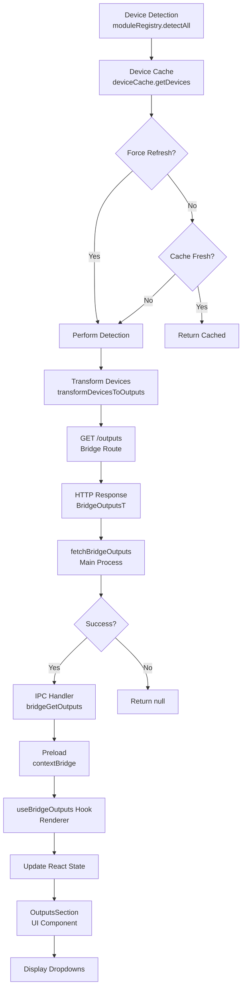

# Output Check Logic Dokumentation

## Übersicht

Die Output-Check-Logik ermöglicht es der Desktop App, verfügbare Output-Geräte von der Bridge abzurufen und in der UI anzuzeigen. Die Logik erstreckt sich über mehrere Schichten: von der Device-Detection in der Bridge über HTTP-Kommunikation, IPC-Kommunikation im Electron Main Process bis hin zur React UI.

**Zweck:**

- Abruf verfügbarer Output-Geräte (Output1: Hardware-Devices, Output2: Connection-Types)
- Anzeige in der UI mit Verfügbarkeits-Status
- Automatisches Refetching wenn Bridge erreichbar wird
- Transformation des internen Device/Port-Modells zu UI-kompatiblem Format

**Architektur-Überblick:**

```
Device Detection (Bridge)
    ↓
Device Cache (Bridge)
    ↓
/outputs Route (Bridge)
    ↓ HTTP GET
fetchBridgeOutputs (Main Process)
    ↓ IPC
bridgeGetOutputs Handler (Main Process)
    ↓ IPC
Preload (contextBridge)
    ↓
useBridgeOutputs Hook (Renderer)
    ↓ React State
OutputsSection Component (UI)
```

## Beteiligte Dateien

### Bridge Layer

#### `apps/bridge/src/routes/outputs.ts`

- **Zweck:** HTTP Route `GET /outputs` für Output-Abfragen
- **Funktionen:**
  - `transformDevicesToOutputs()` - Transformiert Device/Port-Modell zu UI-Format
  - `registerOutputsRoute()` - Registriert Fastify Route
- **Features:**
  - Unterstützt `?refresh=1` Query-Parameter für erzwungenes Refresh
  - Rate Limiting für manuelle Refreshes
  - Error Handling mit HTTP Status Codes

#### `apps/bridge/src/services/device-cache.ts`

- **Zweck:** Caching-Service für Device-Detection-Ergebnisse
- **Klasse:** `DeviceCache`
- **Features:**
  - Cache TTL: 1 Sekunde
  - Rate Limiting: 2 Sekunden für manuelle Refreshes
  - Verhindert concurrent Detection
  - Singleton-Instanz: `deviceCache`

### Main Process Layer

#### `src/electron/main.ts`

- **Zweck:** IPC Handler für `bridgeGetOutputs`
- **Handler:** `ipcMainHandle("bridgeGetOutputs", ...)` (Zeile 452-486)
- **Logik:**
  - Prüft ob Bridge läuft
  - Ruft `fetchBridgeOutputs()` auf
  - Gibt leere Arrays zurück wenn Bridge nicht läuft
  - Logging für Debugging

#### `src/electron/services/bridge-outputs.ts`

- **Zweck:** HTTP-Fetching von Bridge `/outputs` Endpoint
- **Funktion:** `fetchBridgeOutputs(config: BridgeConfig | null)`
- **Features:**
  - Timeout: 5 Sekunden
  - Host-Normalisierung (0.0.0.0 → 127.0.0.1)
  - Error Handling mit detailliertem Logging
- **Types:**
  - `OutputDeviceT` - Einzelnes Output-Device
  - `BridgeOutputsT` - Response-Format mit output1/output2 Arrays

### Preload Layer

#### `src/electron/preload.cts`

- **Zweck:** IPC Bridge zwischen Renderer und Main Process
- **Exposed API:** `window.electron.bridgeGetOutputs()`
- **Implementierung:** Nutzt `ipcInvoke()` Wrapper für Type-Safety

### Renderer Layer

#### `src/ui/hooks/use-bridge-outputs.ts`

- **Zweck:** React Hook für Output-Management
- **Hook:** `useBridgeOutputs()`
- **Features:**
  - State Management (outputs, loading, error)
  - Auto-Fetch beim Mount
  - Verhindert concurrent Fetches
  - Returns: `{ outputs, loading, error, refetch }`

#### `src/ui/components/OutputsSection.tsx`

- **Zweck:** UI-Komponente für Output-Auswahl
- **Props:**
  - `output1`, `output2` - Aktuelle Auswahl
  - `output1Options`, `output2Options` - Verfügbare Optionen
  - `loading` - Loading-State
  - `onOutput1Change`, `onOutput2Change` - Change-Handler
- **Features:**
  - Filtert nach `available` Flag
  - Zeigt "No outputs available" wenn leer
  - Disabled-State während Loading

#### `src/ui/App.tsx`

- **Zweck:** Haupt-Komponente, nutzt `useBridgeOutputs` Hook
- **Features:**
  - Auto-Select erste verfügbare Output beim Laden
  - Refetch wenn Bridge reachable wird (nur einmal beim Übergang)
  - Übergibt Outputs an `OutputsSection` Component

### Type Definitions

#### `types.d.ts`

- **Types:**
  - `OutputDeviceT` (Zeile 96-101) - Device-Information
  - `BridgeOutputsT` (Zeile 107-110) - Response-Format
  - IPC Event Mapping (Zeile 207, 236)

## Datenfluss



## Detaillierte Komponenten-Beschreibung

### Bridge Layer

#### `/outputs` Route

Die Route transformiert das interne Device/Port-Modell zu einem UI-kompatiblen Format:

**Output1 (Hardware Devices):**

- Enthält alle Devices mit output-fähigen Ports
- Filter: `port.direction === "output" || "bidirectional"`
- Status: `available = device.status.present && device.status.ready && !device.status.inUse`

**Output2 (Connection Types):**

- Enthält eindeutige Connection-Types von output-fähigen Ports
- Deduplizierung über `connectionTypesSeen` Set
- Status: `available = port.status.available`

**Query-Parameter:**

- `?refresh=1` - Erzwingt Device-Detection-Refresh (mit Rate Limiting)

**Code-Beispiel:**

```typescript
// apps/bridge/src/routes/outputs.ts
fastify.get("/outputs", async (request, reply) => {
  const refresh = request.query as { refresh?: string };
  const forceRefresh = refresh?.refresh === "1";

  const devices = await deviceCache.getDevices(forceRefresh);
  const outputs = transformDevicesToOutputs(devices);

  return outputs;
});
```

#### Device Cache

Der Device Cache verwaltet Detection-Ergebnisse mit folgenden Regeln:

- **Cache TTL:** 1 Sekunde
- **Rate Limit:** 2 Sekunden für manuelle Refreshes
- **Concurrent Prevention:** Verhindert gleichzeitige Detections

**Code-Beispiel:**

```typescript
// apps/bridge/src/services/device-cache.ts
async getDevices(forceRefresh = false): Promise<DeviceDescriptorT[]> {
  const needsRefresh = forceRefresh ||
    this.cachedDevices.length === 0 ||
    timeSinceLastDetection >= this.CACHE_TTL;

  if (!needsRefresh) {
    return this.cachedDevices;
  }

  // Rate limit check für forceRefresh
  // Concurrent detection prevention
  // Perform detection via moduleRegistry.detectAll()
}
```

### Main Process Layer

#### IPC Handler

Der Handler in `main.ts` koordiniert den Output-Abruf:

**Logik:**

1. Prüft ob Bridge läuft (`bridgeProcessManager.isRunning()`)
2. Ruft `fetchBridgeOutputs(config)` auf
3. Gibt Ergebnisse zurück oder leere Arrays wenn Bridge nicht läuft

**Code-Beispiel:**

```typescript
// src/electron/main.ts
ipcMainHandle("bridgeGetOutputs", async () => {
  const config = bridgeProcessManager.getConfig();

  if (config) {
    const bridgeOutputs = await fetchBridgeOutputs(config);
    if (bridgeOutputs) {
      return bridgeOutputs;
    }
  }

  // Bridge is Single Source of Truth - no fallback detection
  return {
    output1: [],
    output2: [],
  };
});
```

#### HTTP Fetching

Die `fetchBridgeOutputs` Funktion macht HTTP-Requests zur Bridge:

**Features:**

- Host-Normalisierung: `0.0.0.0` → `127.0.0.1` (für HTTP-Requests)
- Timeout: 5 Sekunden via `AbortController`
- Error Handling mit detailliertem Logging

**Code-Beispiel:**

```typescript
// src/electron/services/bridge-outputs.ts
export async function fetchBridgeOutputs(
  config: BridgeConfig | null
): Promise<BridgeOutputsT | null> {
  const fetchHost = config.host === "0.0.0.0" ? "127.0.0.1" : config.host;
  const url = `http://${fetchHost}:${config.port}/outputs`;

  const controller = new AbortController();
  const timeoutId = setTimeout(() => controller.abort(), OUTPUTS_FETCH_TIMEOUT);

  const response = await fetch(url, {
    signal: controller.signal,
    method: "GET",
  });

  clearTimeout(timeoutId);

  if (!response.ok) {
    return null;
  }

  return (await response.json()) as BridgeOutputsT;
}
```

### Preload Layer

Das Preload-Script exponiert die API sicher via `contextBridge`:

**Code-Beispiel:**

```typescript
// src/electron/preload.cts
electron.contextBridge.exposeInMainWorld("electron", {
  bridgeGetOutputs: () => ipcInvoke("bridgeGetOutputs"),
});
```

### Renderer Layer

#### React Hook

Der `useBridgeOutputs` Hook verwaltet den Output-State:

**Features:**

- Auto-Fetch beim Component Mount
- Verhindert concurrent Fetches via `isFetchingRef`
- Loading und Error States
- `refetch()` Funktion für manuelles Refresh

**Code-Beispiel:**

```typescript
// src/ui/hooks/use-bridge-outputs.ts
export function useBridgeOutputs() {
  const [outputs, setOutputs] = useState<BridgeOutputsT | null>(null);
  const [loading, setLoading] = useState(false);
  const isFetchingRef = useRef(false);

  const fetchOutputs = useCallback(async () => {
    if (isFetchingRef.current) return;

    isFetchingRef.current = true;
    setLoading(true);

    try {
      const result = await window.electron.bridgeGetOutputs();
      setOutputs(result);
    } catch (err) {
      setError(err.message);
    } finally {
      setLoading(false);
      isFetchingRef.current = false;
    }
  }, []);

  useEffect(() => {
    fetchOutputs();
  }, [fetchOutputs]);

  return { outputs, loading, error, refetch: fetchOutputs };
}
```

#### UI Component

Die `OutputsSection` Komponente zeigt die Output-Auswahl:

**Features:**

- Filtert verfügbare Outputs
- Zeigt Loading-State
- Disabled wenn keine Outputs verfügbar
- Fallback zu Name wenn ID nicht gefunden

**Code-Beispiel:**

```typescript
// src/ui/components/OutputsSection.tsx
export function OutputsSection({
  output1,
  output2,
  output1Options,
  output2Options,
  loading = false,
  onOutput1Change,
  onOutput2Change,
}: OutputsSectionProps) {
  const availableOutput1 = output1Options.filter((opt) => opt.available);
  const availableOutput2 = output2Options.filter((opt) => opt.available);

  return (
    <Card>
      <Select
        value={output1}
        onValueChange={onOutput1Change}
        disabled={loading || availableOutput1.length === 0}
      >
        {/* Dropdown Options */}
      </Select>
    </Card>
  );
}
```

#### App Integration

Die Haupt-App nutzt den Hook und integriert Output-Management:

**Features:**

- Auto-Select erste verfügbare Output beim Laden
- Refetch wenn Bridge reachable wird (nur beim Übergang unreachable → reachable)
- Übergibt Outputs an Bridge Start Config

**Code-Beispiel:**

```typescript
// src/ui/App.tsx
const { outputs: bridgeOutputs, refetch: refetchOutputs } = useBridgeOutputs();

// Auto-select erste verfügbare Output
useEffect(() => {
  if (bridgeOutputs) {
    if (!output1 && bridgeOutputs.output1.length > 0) {
      const firstAvailable = bridgeOutputs.output1.find((opt) => opt.available);
      if (firstAvailable) setOutput1(firstAvailable.id);
    }
    // Gleiches für output2
  }
}, [bridgeOutputs]);

// Refetch wenn Bridge reachable wird
useEffect(() => {
  if (bridgeStatus.reachable && !prevReachableRef.current) {
    refetchOutputs();
  }
  prevReachableRef.current = bridgeStatus.reachable;
}, [bridgeStatus.reachable]);
```

## Type Definitions

### OutputDeviceT

```typescript
export type OutputDeviceT = {
  id: string; // Eindeutige ID (Device-ID oder Connection-Type)
  name: string; // Display-Name
  type: "decklink" | "capture" | "connection"; // Device-Typ
  available: boolean; // Verfügbarkeits-Status
};
```

**Verwendung:**

- Output1: Hardware-Devices (decklink, capture)
- Output2: Connection-Types (connection)

### BridgeOutputsT

```typescript
export type BridgeOutputsT = {
  output1: OutputDeviceT[]; // Hardware-Devices
  output2: OutputDeviceT[]; // Connection-Types
};
```

**IPC Event Mapping:**

```typescript
// types.d.ts
export interface EventPayloadMapping {
  bridgeGetOutputs: BridgeOutputsT;
}

export interface Window {
  electron: {
    bridgeGetOutputs: () => Promise<BridgeOutputsT>;
  };
}
```

## Error Handling & Edge Cases

### Timeout-Verhalten

**Timeout:** 5 Sekunden (`OUTPUTS_FETCH_TIMEOUT`)

**Implementierung:**

- Nutzt `AbortController` für Request-Abbruch
- Timeout wird nach erfolgreichem Request gecleared
- Bei Timeout: `fetch()` wirft `AbortError`

**Code:**

```typescript
const controller = new AbortController();
const timeoutId = setTimeout(() => controller.abort(), OUTPUTS_FETCH_TIMEOUT);

try {
  const response = await fetch(url, { signal: controller.signal });
  clearTimeout(timeoutId);
  // ...
} catch (error) {
  // Timeout führt zu AbortError
}
```

### Bridge nicht erreichbar

**Szenarien:**

1. Bridge läuft nicht → Handler gibt leere Arrays zurück
2. Bridge läuft, aber `/outputs` Endpoint nicht erreichbar → `fetchBridgeOutputs` gibt `null` zurück
3. HTTP Error (4xx, 5xx) → `fetchBridgeOutputs` gibt `null` zurück

**Verhalten:**

- Main Process Handler gibt leere Arrays zurück wenn `fetchBridgeOutputs` fehlschlägt
- UI zeigt "No outputs available" wenn Arrays leer
- Kein Fallback zu Device-Detection im Main Process (Bridge ist Single Source of Truth)

### Keine Outputs verfügbar

**UI-Verhalten:**

- Dropdowns sind disabled
- Zeigt "No outputs available" als Placeholder
- Loading-State während Fetch

**Code:**

```typescript
<Select disabled={loading || availableOutput1.length === 0}>
  {availableOutput1.length === 0 ? (
    <SelectItem value="no-outputs" disabled>
      {loading ? "Loading outputs..." : "No outputs available"}
    </SelectItem>
  ) : (
    // Options
  )}
</Select>
```

### Rate Limiting

**Bridge-Seite:**

- Rate Limit: 2 Sekunden für manuelle Refreshes (`?refresh=1`)
- HTTP 429 bei Überschreitung
- Error-Message enthält Wartezeit

**Code:**

```typescript
// apps/bridge/src/services/device-cache.ts
if (forceRefresh) {
  const timeSinceLastRefresh = now - this.lastDetectionTime;
  if (timeSinceLastRefresh < this.REFRESH_RATE_LIMIT) {
    throw new Error(`Rate limit exceeded. Please wait ${...} seconds`);
  }
}
```

**Renderer-Seite:**

- `isFetchingRef` verhindert concurrent Fetches
- Hook gibt früh zurück wenn bereits Fetch läuft

## Integration Points

### Device Detection

**Verbindung:**

- Output-Check nutzt `deviceCache.getDevices()` für Device-Daten
- Device Cache ruft `moduleRegistry.detectAll()` auf
- Module Registry koordiniert alle Device-Module (DeckLink, USB-Capture, etc.)

**Ablauf:**

```
Output Check Request
  ↓
Device Cache (getDevices)
  ↓
Module Registry (detectAll)
  ↓
Device Modules (DeckLink, USB-Capture, ...)
  ↓
Transform zu Output-Format
```

### Bridge Health Check

**Verbindung:**

- Output-Refetch wird ausgelöst wenn Bridge reachable wird
- Nutzt `bridgeStatus.reachable` Flag aus Health Check
- Refetch nur beim Übergang unreachable → reachable (nicht bei jedem Update)

**Code:**

```typescript
// src/ui/App.tsx
useEffect(() => {
  if (bridgeStatus.reachable && !prevReachableRef.current) {
    refetchOutputs(); // Nur beim ersten Übergang zu reachable
  }
  prevReachableRef.current = bridgeStatus.reachable;
}, [bridgeStatus.reachable]);
```

### Bridge Start/Stop

**Verbindung:**

- Outputs werden beim Bridge Start übergeben (optional, Bridge startet in Idle-Mode)
- Outputs werden beim Bridge Stop zurückgesetzt
- Output-Check funktioniert nur wenn Bridge läuft

**Code:**

```typescript
// src/electron/main.ts
ipcMainHandle("bridgeStart", async (event, config: BridgeConfig) => {
  if (config.outputs) {
    bridgeOutputs = config.outputs; // Optional
  }
  // Bridge startet auch ohne Outputs (Idle-Mode)
});

ipcMainHandle("bridgeStop", async () => {
  bridgeOutputs = null; // Reset beim Stop
});
```

## Code-Beispiele

### Kompletter Datenfluss-Beispiel

**1. Bridge Route Handler:**

```typescript
// apps/bridge/src/routes/outputs.ts
fastify.get("/outputs", async (request, reply) => {
  const refresh = request.query as { refresh?: string };
  const forceRefresh = refresh?.refresh === "1";

  const devices = await deviceCache.getDevices(forceRefresh);
  const outputs = transformDevicesToOutputs(devices);

  return outputs;
});
```

**2. Main Process Fetch:**

```typescript
// src/electron/services/bridge-outputs.ts
const url = `http://127.0.0.1:8787/outputs`;
const response = await fetch(url, { signal: controller.signal });
const data = (await response.json()) as BridgeOutputsT;
return data;
```

**3. IPC Handler:**

```typescript
// src/electron/main.ts
ipcMainHandle("bridgeGetOutputs", async () => {
  const config = bridgeProcessManager.getConfig();
  if (config) {
    return (await fetchBridgeOutputs(config)) || { output1: [], output2: [] };
  }
  return { output1: [], output2: [] };
});
```

**4. React Hook Usage:**

```typescript
// src/ui/App.tsx
const { outputs, loading, refetch } = useBridgeOutputs();

// Auto-refetch wenn Bridge reachable
useEffect(() => {
  if (bridgeStatus.reachable && !prevReachableRef.current) {
    refetch();
  }
}, [bridgeStatus.reachable]);
```

**5. UI Component:**

```typescript
// src/ui/components/OutputsSection.tsx
<OutputsSection
  output1={output1}
  output2={output2}
  output1Options={bridgeOutputs?.output1 || []}
  output2Options={bridgeOutputs?.output2 || []}
  loading={outputsLoading}
  onOutput1Change={setOutput1}
  onOutput2Change={setOutput2}
/>
```

## Zusammenfassung

Die Output-Check-Logik ist eine mehrschichtige Architektur, die Device-Detection-Ergebnisse von der Bridge zur UI transportiert:

1. **Bridge** transformiert Devices zu UI-Format und stellt HTTP-Endpoint bereit
2. **Main Process** macht HTTP-Requests und exponiert IPC-Handler
3. **Preload** stellt sichere IPC-Bridge bereit
4. **Renderer** nutzt React Hook für State-Management und UI-Komponente für Anzeige

**Wichtige Prinzipien:**

- Bridge ist Single Source of Truth (kein Fallback-Detection im Main Process)
- Outputs sind optional beim Bridge Start (Idle-Mode)
- Automatisches Refetching wenn Bridge erreichbar wird
- Rate Limiting und Timeout-Handling für Stabilität
- Type-Safety durch TypeScript über alle Schichten
