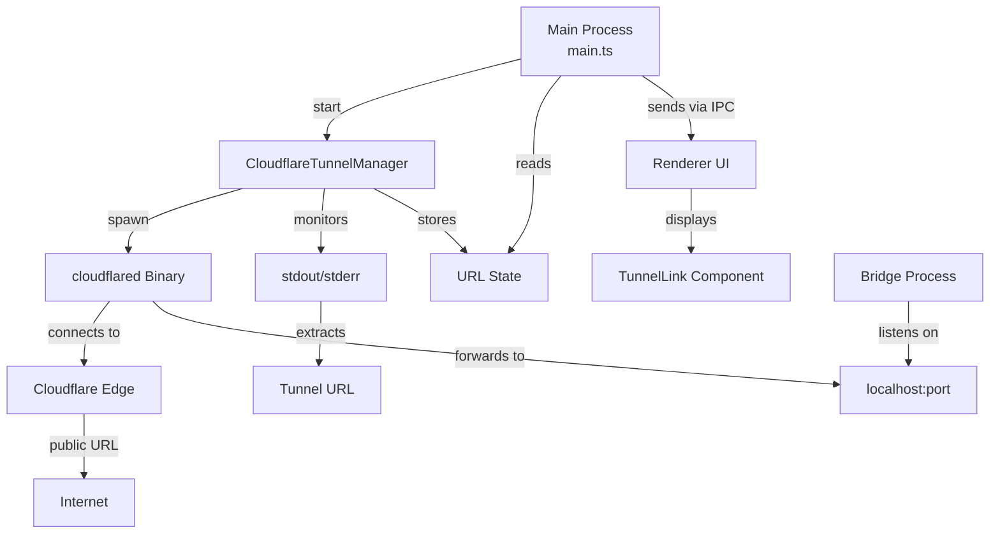
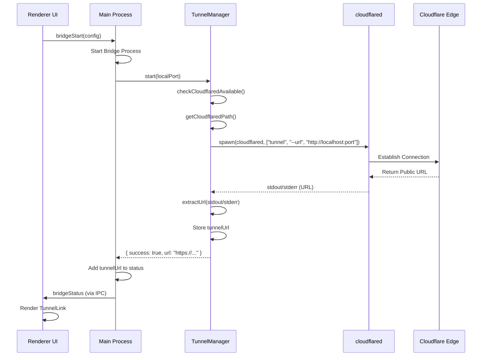
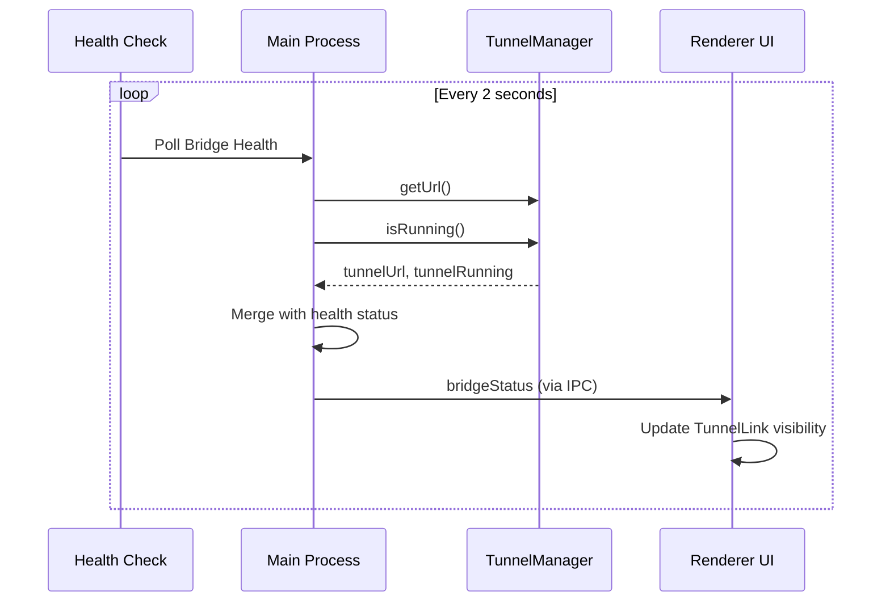

# Cloudflare Tunnel Architektur Dokumentation

## Übersicht

Die Broadify Bridge App nutzt Cloudflare Tunnels, um den lokalen Bridge-Server über das Internet erreichbar zu machen. Der Tunnel wird nur in **Production** gestartet und ist für den Betrieb erforderlich. In Development wird der Tunnel nicht gestartet.

## Architektur-Übersicht



## Komponenten

### 1. CloudflareTunnelManager Service

**Datei:** `src/electron/services/cloudflare-tunnel-manager.ts`

**Zuständigkeit:**

- Start/Stop des cloudflared Prozesses
- URL-Extraktion aus stdout/stderr
- Logging (Production)
- Verfügbarkeitsprüfung des cloudflared Binaries

**Wichtige Methoden:**

- `start(localPort: number)`: Startet Tunnel für lokalen Port
- `stop()`: Stoppt Tunnel (SIGTERM, dann SIGKILL)
- `isRunning()`: Prüft ob Prozess läuft
- `getUrl()`: Gibt aktuelle Tunnel-URL zurück
- `checkCloudflaredAvailable()`: Prüft Binary-Verfügbarkeit
- `getCloudflaredPath()`: Bestimmt Binary-Pfad (Dev vs. Production)

**URL-Extraktion:**

- Parst stdout/stderr nach `https://*.trycloudflare.com` oder `https://*.cloudflaretunnel.com`
- Ignoriert URLs mit Pfaden (nur Base-URL)
- Timeout: 30 Sekunden für URL-Extraktion
- Fallback: Prozess kann weiterlaufen auch wenn URL nicht sofort gefunden wird

### 2. Binary Management

**Download Script:** `scripts/download-cloudflared.js`

**Funktionalität:**

- Lädt neueste cloudflared Release von GitHub
- Unterstützt: macOS (arm64/x64), Windows (x64), Linux (x64)
- Extrahiert Binaries aus `.tgz`/`.tar.gz`/`.zip`
- Speichert in `resources/cloudflared/{platform}/`

**Bundling:**

- `electron-builder.json` kopiert `resources/cloudflared` nach `extraResources`
- Production: Binary unter `process.resourcesPath/cloudflared/{platform}/`
- Development: Nutzt System-PATH (`cloudflared`)

### 3. Main Process Integration

**Datei:** `src/electron/main.ts`

**Tunnel Start (Production only):**

```typescript
// Nach erfolgreichem Bridge-Start
if (!isDev() && result.success) {
  const tunnelResult = await cloudflareTunnelManager.start(bridgeConfig.port);
  if (!tunnelResult.success) {
    // Tunnel ist required → Bridge stoppen
    await bridgeProcessManager.stop();
    return {
      success: false,
      error: `Tunnel start failed: ${tunnelResult.error}`,
    };
  }
}
```

**Tunnel Stop:**

```typescript
// Beim Bridge-Stop
if (!isDev()) {
  await cloudflareTunnelManager.stop();
}
```

**Status Updates:**

- Health Check Polling fügt `tunnelUrl` und `tunnelRunning` zum Status hinzu
- Nur in Production werden Tunnel-Infos übertragen

### 4. UI Integration

**Komponente:** `src/ui/components/TunnelLink.tsx`

**Funktionalität:**

- Zeigt Tunnel-URL nur wenn `tunnelRunning === true` und `tunnelUrl` vorhanden
- Klick öffnet URL extern (via `window.electron.openExternal`)
- Fallback: `window.open()` wenn IPC nicht verfügbar

**Rendering:**

- Wird nur in `App.tsx` angezeigt wenn `bridgeStatus.tunnelRunning === true`
- Position: Zwischen Header und NetworkSection

### 5. Typdefinitionen

**Datei:** `src/electron/types.ts`

```typescript
export type BridgeStatus = {
  // ... andere Felder
  tunnelUrl?: string | null; // Cloudflare Tunnel URL
  tunnelRunning?: boolean; // Tunnel-Prozess Status
};
```

## Datenfluss

### 1. Tunnel Start Sequenz



### 2. Status Updates



## Konfiguration

### Development vs. Production

| Aspekt           | Development               | Production                                   |
| ---------------- | ------------------------- | -------------------------------------------- |
| Tunnel Start     | ❌ Nicht gestartet        | ✅ Automatisch nach Bridge-Start             |
| Binary Source    | System PATH               | Bundled Binary                               |
| Logging          | Console (stdout/stderr)   | File (`cloudflare-tunnel.log`)               |
| Fehlerbehandlung | Warnung                   | Bridge wird gestoppt wenn Tunnel fehlschlägt |
| UI Anzeige       | TunnelLink nicht sichtbar | TunnelLink sichtbar wenn aktiv               |

### Binary-Pfad Logik

```typescript
// Development
return "cloudflared"; // System PATH

// Production
process.resourcesPath / cloudflared / { platform } / { binary };
// Platform: mac-arm64, mac-x64, win, linux
// Binary: cloudflared (Unix) oder cloudflared.exe (Windows)
```

## Fehlerbehandlung

### Tunnel Start Fehler

1. **Binary nicht verfügbar:**

   - Prüfung via `checkCloudflaredAvailable()`
   - Timeout: 3 Sekunden
   - Fehler: "cloudflared is not installed or not available in PATH"

2. **URL-Extraktion fehlgeschlagen:**

   - Timeout: 30 Sekunden
   - Fallback: Prozess läuft weiter, URL kann später abgerufen werden
   - Log: Vollständiger stdout/stderr Output (erste 1000 Zeichen)

3. **Prozess crashed:**
   - Exit-Code wird geloggt
   - Fehler wird aus stderr extrahiert
   - Bridge wird gestoppt (Production)

### Tunnel Stop Fehler

- Graceful: SIGTERM (5 Sekunden Timeout)
- Force: SIGKILL wenn SIGTERM fehlschlägt
- Log-Stream wird geschlossen

## Logging

### Development

- Alle stdout/stderr Ausgaben werden in Console geloggt
- Format: `[Tunnel STDOUT]` / `[Tunnel STDERR]`

### Production

- Log-Datei: `app.getPath("userData")/cloudflare-tunnel.log`
- Format: Timestamp + `[STDOUT]` / `[STDERR]` / `[ERROR]` / `[EXIT]`
- Append-Mode: Neue Sessions werden angehängt

## Security Considerations

1. **Quick Tunnel (kein Token):**

   - Nutzt `cloudflared tunnel --url` (Quick Tunnel)
   - Keine Authentifizierung erforderlich
   - URL ist temporär (Session-basiert)

2. **Localhost Binding:**

   - Tunnel verbindet nur zu `localhost:{port}`
   - Keine direkte Internet-Exposition des Bridge-Servers

3. **Keine Secrets im Renderer:**
   - Tunnel-URL wird nur zur Anzeige verwendet
   - Keine Authentifizierung über Tunnel-URL

## Bekannte Limitationen

1. **URL-Extraktion:**

   - Abhängig von cloudflared Output-Format
   - Kann bei Format-Änderungen fehlschlagen
   - Fallback: Prozess läuft weiter, URL kann später abgerufen werden

2. **Quick Tunnel:**

   - URLs sind temporär (Session-basiert)
   - Keine persistente URL möglich ohne Cloudflare Account

3. **Platform Support:**
   - Nur x64 Architekturen unterstützt
   - ARM64 nur für macOS

## Zukünftige Verbesserungen

1. **Named Tunnels:**

   - Persistente URLs mit Cloudflare Account
   - Token-basierte Authentifizierung

2. **Tunnel Health Monitoring:**

   - Separate Health Checks für Tunnel
   - Automatischer Restart bei Verbindungsabbruch

3. **Multi-Platform Support:**

   - ARM64 für Linux/Windows
   - Weitere Architekturen

4. **Error Recovery:**
   - Automatischer Retry bei Start-Fehlern
   - Backoff-Strategie
