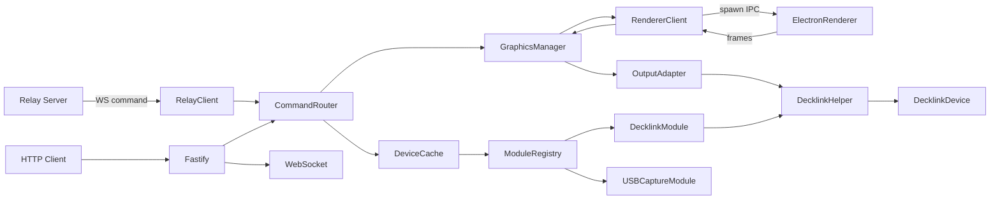

# Bridge – Architektur & Struktur (Stufe 1)

## Checkliste Stufe 1
- [ ] Kurzüberblick abgeschlossen
- [ ] Architekturdiagramm verifiziert
- [ ] Datenflüsse beschrieben
- [ ] Security-Boundaries dokumentiert
- [ ] Projektstruktur beschrieben

## Kurzüberblick
Die Bridge ist ein lokaler Dienst, der Geräte erkennt, Graphics rendert und Outputs (z. B. SDI/HDMI) bedient. Sie stellt eine HTTP-API und WebSocket-Snapshots bereit und kann über einen Relay-Server externe Commands empfangen. Die Bridge ist die Single Source of Truth für Outputs und Device-Status.

## Hauptkomponenten (Runtime)
- Fastify Server: HTTP-Routen, WebSocket-Endpoint
- Relay Client: Empfang von Commands (WebSocket outbound)
- Command Router: zentrale Command-Dispatch-Logik
- Graphics Manager: Layer, Presets, Rendering, Output
- Renderer: separater Electron-Offscreen-Prozess (optional Stub)
- Output Adapter: DeckLink/Stub, schreibt Frames an Helper
- Device Module Registry: Device-Detection + Watcher
- Helper-Integration: DeckLink Helper (native)

## Architekturdiagramm (Mermaid)

## Zentrale Datenflüsse
### 1) Graphics Command-Flow (Relay)
1. Relay Client empfängt `command`-Messages.
2. Command Router validiert und dispatcht `graphics_*`.
3. Graphics Manager rendert Layer → Renderer.
4. Renderer liefert RGBA Frames.
5. Graphics Manager compositet und sendet Frames an Output-Adapter.
6. Output-Adapter streamt Frames an DeckLink Helper.

### 2) Output/Device-Flow (HTTP)
1. UI/Client ruft `/outputs` ab.
2. Device Cache fragt Module Registry.
3. DeckLink Module nutzt Helper für Device-Liste + Modes.
4. Outputs werden als UI-Format zurückgegeben.

### 3) Renderer-IPC
1. Bridge startet Electron Renderer Prozess.
2. IPC-Handshake via Token.
3. Kommandos: `set_assets`, `create_layer`, `update_values`, `update_layout`, `remove_layer`.
4. Renderer sendet `frame`-Messages mit RGBA-Payload.

## Security-Boundaries
- Netzwerk: Relay-Commands sind untrusted → Zod-Validierung + Sanitizing.
- Renderer IPC: lokal auf `127.0.0.1`, Token-Handshake, Payload-Limits.
- Helper: native Binary mit festen Args, `X_OK`-Checks.

## Projektstruktur (relevant)
- Bridge Entry: `apps/bridge/src/index.ts`
- Server/Routen: `apps/bridge/src/server.ts`, `apps/bridge/src/routes/*`
- Commands: `apps/bridge/src/services/command-router.ts`
- Graphics: `apps/bridge/src/services/graphics/*`
- Renderer: `apps/bridge/src/services/graphics/renderer/*`
- Output Adapter: `apps/bridge/src/services/graphics/output-adapters/*`
- Devices: `apps/bridge/src/modules/*`
- Helper: `apps/bridge/native/decklink-helper/*`

## Offene Punkte
- Detaillierte Security-Risiken pro Subsystem
- Schnittstellen-Details für Relay-Commands
- Betriebsdetails (Run/Build/Packaging)
