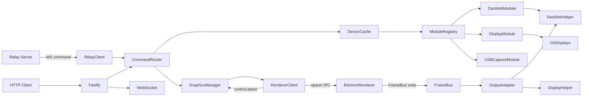

# Bridge – Architektur & Struktur (Stufe 1)

## Checkliste Stufe 1
- [x] Kurzüberblick abgeschlossen
- [x] Architekturdiagramm verifiziert
- [x] Datenflüsse beschrieben
- [x] Security-Boundaries dokumentiert
- [x] Projektstruktur beschrieben

## Kurzüberblick
Die Bridge ist ein lokaler Dienst, der Geräte erkennt, Graphics rendert und Outputs (z. B. SDI/HDMI/Display) bedient. Sie stellt eine HTTP-API und WebSocket-Snapshots bereit und kann über einen Relay-Server externe Commands empfangen. Die Bridge ist die Single Source of Truth für Output-Konfiguration und Device-Status.

## Hauptkomponenten (Runtime)
- Fastify Server: HTTP-Routen, WebSocket-Endpoint
- Relay Client: Empfang von Commands (WebSocket outbound)
- Command Router: zentrale Command-Dispatch-Logik
- Graphics Manager: Layer, Presets, Renderer-/Output-Orchestrierung
- Renderer: separater Electron-Offscreen-Prozess (Single-Window) oder Stub
- FrameBus Session: Shared-Memory-Konfiguration (Data-Plane)
- Output Adapter: DeckLink/Display/Stub, liest Frames via FrameBus
- Device Module Registry: Device-Detection + Watcher
- Helper-Integration: DeckLink Helper + Display Helper (native)

## Architekturdiagramm (Mermaid)

```mermaid
flowchart LR
  Relay[Relay Server] -->|WS command| RelayClient
  RelayClient --> CommandRouter
  CommandRouter --> DeviceCache
  CommandRouter --> GraphicsManager

  GraphicsManager --> RendererClient
  RendererClient -->|spawn IPC| ElectronRenderer
  RendererClient -->|control-plane| GraphicsManager
  ElectronRenderer -->|FrameBus write| FrameBus
  FrameBus --> OutputAdapter
  OutputAdapter --> DecklinkHelper
  OutputAdapter --> DisplayHelper

  DeviceCache --> ModuleRegistry
  ModuleRegistry --> DecklinkModule
  ModuleRegistry --> DisplayModule
  ModuleRegistry --> USBCaptureModule
  DecklinkModule --> DecklinkHelper
  DisplayModule --> OSDisplays

  ClientHTTP[HTTP Client] --> Fastify
  Fastify --> CommandRouter
  Fastify --> WebSocket
```

## Zentrale Datenflüsse
### 1) Graphics Command-Flow (Relay)
1. Relay Client empfängt `command`-Messages.
2. Command Router validiert und dispatcht `graphics_*`.
3. Graphics Manager validiert Payloads und steuert Renderer/Output.
4. Renderer rendert im Single-Window und schreibt RGBA in FrameBus.
5. Output-Adapter/Helper lesen FrameBus und geben aus.

### 2) Output/Device-Flow (HTTP)
1. UI/Client ruft `/outputs` ab.
2. Device Cache fragt Module Registry.
3. Module Registry erkennt DeckLink/Display/USB-Capture (plattformabhängig).
4. Outputs werden als UI-Format zurückgegeben.

### 3) Renderer-IPC
1. Bridge startet Electron Renderer Prozess.
2. IPC-Handshake via Token.
3. Kommandos: `renderer_configure`, `set_assets`, `create_layer`, `update_values`, `update_layout`, `remove_layer`.
4. IPC ist Control-Plane (`ready`/`error`), Frames laufen über FrameBus.

## Security-Boundaries
- Netzwerk: Relay-Commands sind untrusted → Zod-Validierung + Sanitizing.
- Renderer IPC: lokal auf `127.0.0.1`, Token-Handshake, Payload-Limits.
- HTTP/WS-Routen: lokal oder Token (`x-bridge-auth` / `Authorization Bearer`).
- Helper: native Binary mit festen Args, `X_OK`-Checks.

## Projektstruktur (relevant)
- Bridge Entry: `apps/bridge/src/index.ts`
- Server/Routen: `apps/bridge/src/server.ts`, `apps/bridge/src/routes/*`
- Commands: `apps/bridge/src/services/command-router.ts`
- Graphics: `apps/bridge/src/services/graphics/*`
- Renderer: `apps/bridge/src/services/graphics/renderer/*`
- Output Adapter: `apps/bridge/src/services/graphics/output-adapters/*`
- Devices: `apps/bridge/src/modules/*`
- Helper: `apps/bridge/native/decklink-helper/*`, `apps/bridge/native/display-helper/*`

## Offene Punkte
- Detaillierte Security-Risiken pro Subsystem
- Schnittstellen-Details für Relay-Commands
- Betriebsdetails (Run/Build/Packaging)
