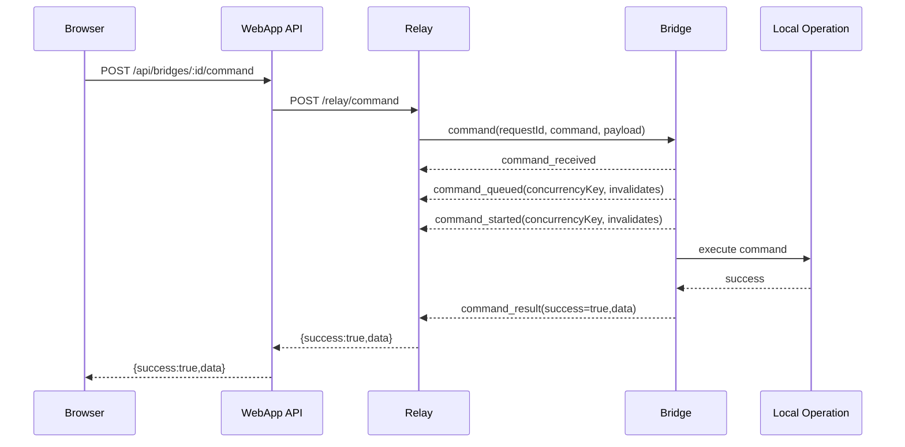
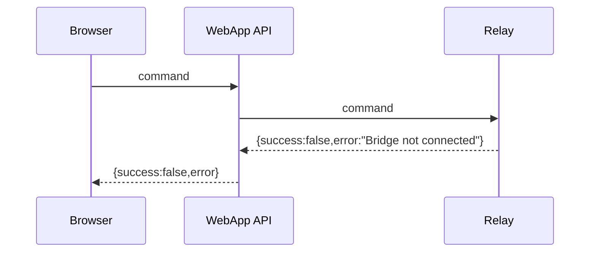
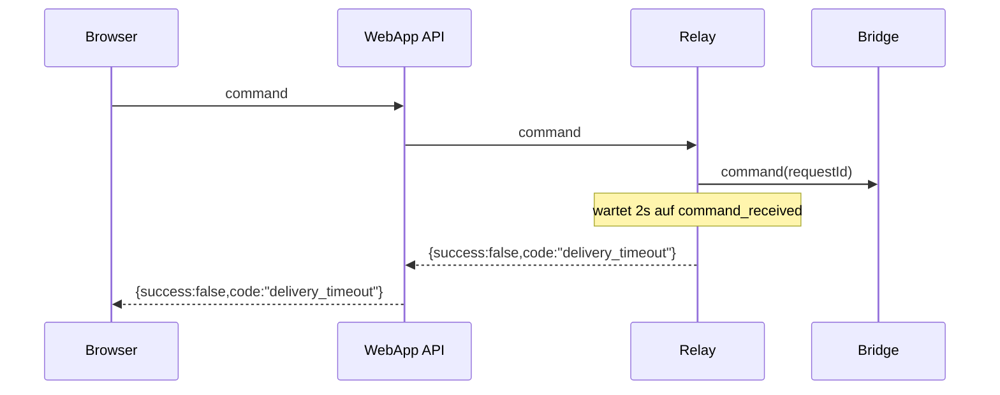
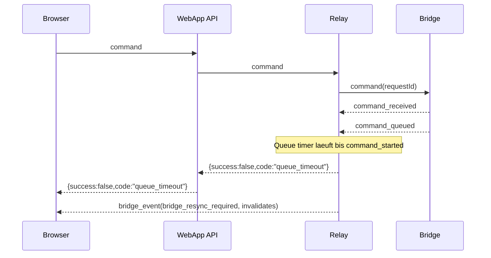
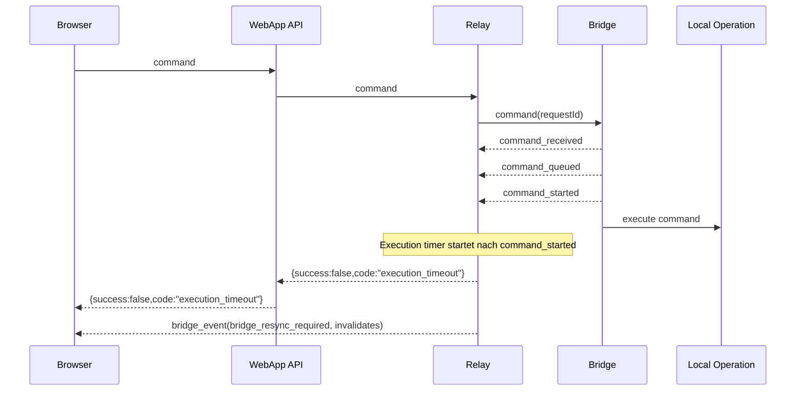
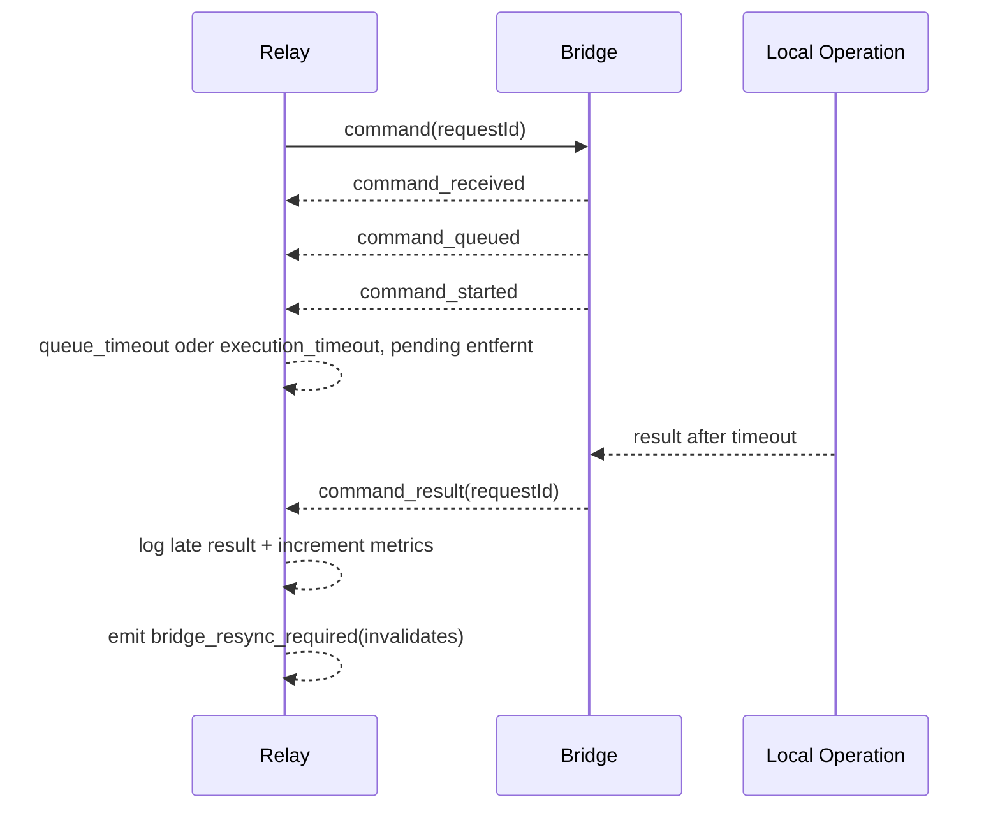
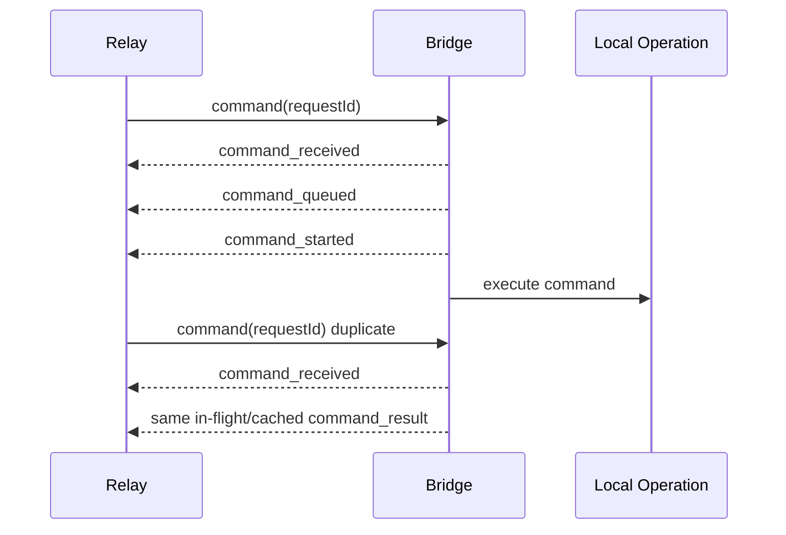
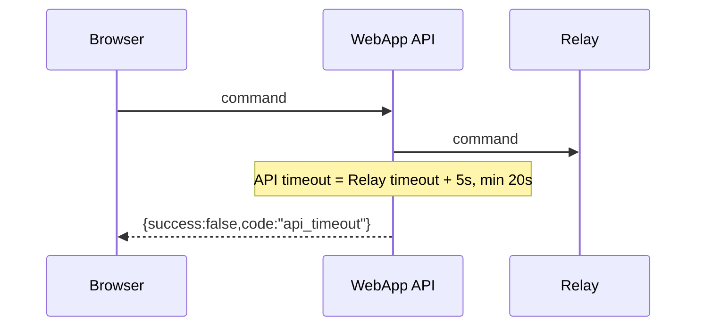
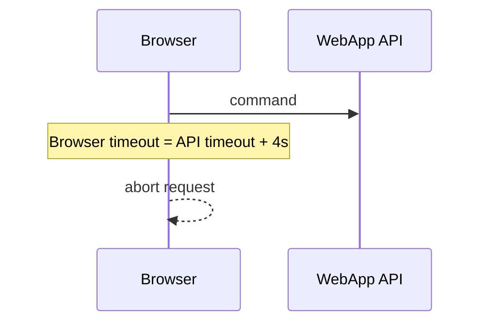
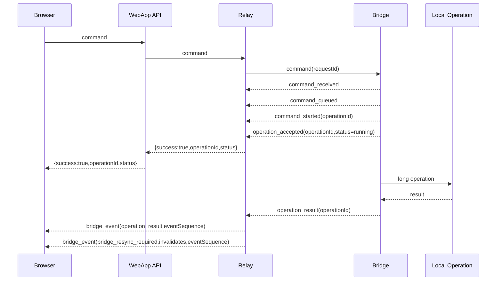

# Production Timeout Dataflows

## Zweck

Diese Datei beschreibt die aktuelle Timeout-Kette zwischen Browser, WebApp API,
Relay und Bridge sowie die moeglichen Success- und Error-Dataflows. Sie ist als
Grundlage fuer kritische Analyse gedacht.

## Grundregel

```text
Bridge lokale SLA < Relay Command Timeout < WebApp API Timeout < Browser Timeout
```

Transport-Liveness und Command-SLAs sind getrennt:

- WebSocket Heartbeats pruefen nur, ob die Verbindung lebt.
- Command-Timeouts bewerten, ob ein fachliches Command-Ergebnis rechtzeitig
  geliefert wurde.
- Bridge-Library-Calls werden nicht pauschal abgebrochen, wenn die darunter
  liegende Library nicht abortbar ist. Die Bridge loggt lokale SLA-Verletzungen.
- Command-Lifecycle und Transport-Liveness sind getrennt: `command_received`,
  `command_queued`, `command_started` und `command_result` bestimmen die
  fachliche SLA, WebSocket-Heartbeats nur die Verbindungsgesundheit.

## Timeout-Tabelle

| Command / Klasse | Bridge lokale SLA | Relay ACK | Relay Queue | Relay Execution | Relay gesamt | WebApp API | Browser |
| --- | ---: | ---: | ---: | ---: | ---: | ---: | ---: |
| Fast commands | 8s | 2s | 5s | 12s | 19s | 24s | 28s |
| `engine_connect` | 11s | 2s | 20s | 18s | 40s | 45s | 49s |
| `list_outputs` | 11s | 2s | 5s | 15s | 22s | 27s | 31s |
| Graphics configure/send/update/remove | 16s | 2s | 10s | 20s | 32s | 37s | 41s |
| Helper-start commands | 30s | 2s | 20s | 35s | 57s | 62s | 66s |

Fast commands umfassen u. a. `get_status`, `engine_get_status`,
`engine_get_macros`, `graphics_list` und einfache Engine-Aktionen. Helper-start
umfasst z. B. `engine_vmix_ensure_browser_input`, `meeting_engine_start` und
`meeting_camera_start`.

Aktiv async umgesetzt ist in diesem Bridge-Repo aktuell
`engine_vmix_ensure_browser_input`. `meeting_engine_start` und
`meeting_camera_start` sind in Relay/WebApp als Async-Kandidaten vorbereitet,
aber in der Bridge noch keine akzeptierten Relay-Commands.

## Dataflow 1: Success



Eigenschaften:

- `command_received` bedeutet: Bridge hat Signatur/TTL/JTI/Allowlist validiert.
- `command_queued` bedeutet: Bridge hat den Command in die passende
  Concurrency-Queue aufgenommen.
- `command_started` bedeutet: lokale Ausfuehrung hat begonnen; erst ab hier
  laeuft der Execution-Timeout.
- Bei Side-Effects fuehrt die Bridge Commands seriell aus.
- Read-only Commands koennen parallel laufen, aber bounded.

## Dataflow 2: Bridge Offline



Eigenschaften:

- Kein langer Browser-Timeout.
- Relay antwortet sofort, weil kein Bridge-WebSocket fuer `bridgeId` verbunden
  ist.

## Dataflow 3: Delivery Timeout



Semantik:

- Relay hat keinen `command_received` innerhalb des ACK-Timeouts gesehen.
- Interpretation fuer UI/Operator: Transport-/Delivery-Problem.
- Replay ist nur erlaubt, wenn die Replay-Policy des Commands es zulaesst.

## Dataflow 4: Queue Timeout



Semantik:

- Bridge hat den Command angenommen, aber die lokale Ausfuehrung wurde nicht
  rechtzeitig gestartet.
- Dieser Fall deutet auf Backpressure, Resource-Busy oder einen blockierten
  Bridge-Prozess hin, nicht zwingend auf eine langsame lokale Library.
- Das Relay sendet `bridge_resync_required` mit den bekannten
  `invalidates`-Scopes.

## Dataflow 5: Execution Timeout



Semantik:

- Bridge hat den Command gestartet, aber kein `command_result` innerhalb der
  Execution-SLA geliefert.
- UI soll diesen Zustand als unsicher behandeln: "Command laeuft
  moeglicherweise noch, Status wird synchronisiert."
- WebApp-Relay-Hooks laden Engine-, Graphics- und Meeting-State nach
  `bridge_resync_required` neu.

## Dataflow 6: Late Result After Timeout



Semantik:

- Das spaete Result wird nicht mehr als aktiver Request verarbeitet.
- Relay loggt strukturiert `requestId`, `command`, Timeout-Klasse und
  Result-Status.
- Metriken: `command_timeout_late_result_total` und
  `relay_command_phase_duration_ms_*{phase="late_result"}`.
- Danach ist Resync massgeblich fuer UI-State; das spaete Result wird nicht als
  HTTP-Erfolg nachgeliefert.

## Dataflow 7: Duplicate `requestId`



Semantik:

- Bridge dedupliziert gleiche `requestId`s nur, wenn `command` und
  `payloadHash` ebenfalls identisch sind.
- Gleiche `requestId` mit anderem Command oder Payload wird mit
  `request_id_conflict` abgelehnt.
- Wenn der erste Lauf noch aktiv ist, haengt der zweite Request am in-flight
  Result.
- Wenn das Result bereits vorliegt, wird aus dem Dedupe-Cache geantwortet.
- Side-Effects werden dadurch nicht doppelt ausgefuehrt.

## Dataflow 8: WebApp API Timeout



Semantik:

- Sollte normalerweise nur auftreten, wenn Relay nicht rechtzeitig antwortet
  oder der HTTP-Pfad gestoert ist.
- Die API wartet bewusst laenger als Relay, damit Relay die fachliche Timeout-
  Klasse liefern kann.

## Dataflow 9: Browser Timeout



Semantik:

- Sollte nur greifen, wenn die WebApp API nicht rechtzeitig antwortet.
- Keine harte 15s-Einheitsgrenze mehr.

## Dataflow 10: Async Operation



Semantik:

- Async-Commands blockieren nicht bis zum lokalen Abschluss.
- Relay persistiert Operation-State unter `RELAY_OPERATION_STORE_FILE`.
- Konfliktierende Operationen auf demselben `concurrencyKey` werden mit
  `resource_busy`, `operation_in_progress` oder `conflicting_command`
  abgelehnt bzw. bei `join_existing` an die bestehende Operation gekoppelt.
- Bridge-Events enthalten `eventSequence`; WebApp-Hooks laden bei Sequenzluecke
  gezielt neu.

## Resync-Events

Bridge/Relay/WebApp nutzen Resync, um unsichere Zustaende nach Reconnect oder
Timeout zu bereinigen:

- `bridge_resync_required`: WebApp-Hooks laden die betroffenen Scopes neu.
  Das Event kann `invalidates` enthalten, z. B. `["engine.status"]`,
  `["graphics"]` oder `["outputs"]`.
- `engine_status_snapshot`: Engine-State Refresh.
- `graphics_snapshot`: Graphics-State Refresh.
- `outputs_snapshot`: Output-Status; Bridge nutzt Cache und erzwingt keinen
  teuren Device-Refresh.

## Aktuelle Implementierungsorte

Bridge:

- `apps/bridge/src/services/relay-command-policy.ts`
- `apps/bridge/src/services/relay-client.ts`

Relay:

- `broadify-relay/src/command-timeouts.ts`
- `broadify-relay/src/index.ts`
- `broadify-relay/src/reliability-metrics.ts`

WebApp:

- `broadify/lib/bridge-command-timeouts.ts`
- `broadify/app/api/bridges/[bridgeId]/command/route.ts`
- `broadify/lib/bridge-commands.ts`
- `broadify/hooks/use-relay-engine-updates.ts`
- `broadify/hooks/use-relay-graphics-updates.ts`
- `broadify/hooks/use-relay-meeting-updates.ts`

## Kritische Review-Fragen

- Sind `engine_connect` mit 20s Queue-, 18s Execution-SLA und 45s API-SLA ausreichend fuer
  reale ATEM/vMix/TriCaster-Netzwerke?
- Soll `list_outputs` bei kaltem Cache weiterhin eine Bridge-SLA von 11s haben,
  oder braucht Device-Discovery eine eigene laengere Klasse?
- Welche Commands duerfen nach `delivery_timeout` replayed werden, ohne
  unerwuenschte Side-Effects zu riskieren?
- Sind die aktuellen `invalidates`-Scopes pro Command granular genug, oder
  braucht die WebApp feinere Scopes fuer Meeting-Kamera/Output/Graphics?
- Reicht die in-memory Late-Result-TTL von 5 Minuten im Relay fuer Analyse und
  Metriken?
- Welche Helper-Starts sollen in einer naechsten Stufe auf echte asynchrone
  `operationId`-Flows migriert werden?
