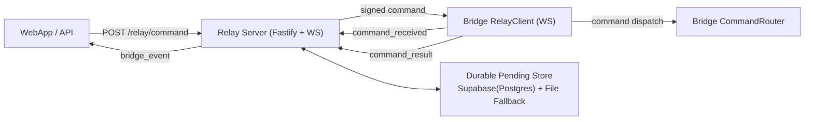

# Relay Enterprise Architecture (Bridge V2)

## Ziel
Diese Doku beschreibt die aktuelle produktive Relay-Architektur nach den Reliability-Upgrades:
- stabile Verbindung bei instabilem Netz
- kontrollierte Wiederherstellung nach Disconnect
- keine stillen Zustandsabweichungen
- nachvollziehbare Diagnostik über Logs und Metriken

## Systemübersicht

## Verbindungs- und Delivery-Modell

1. Bridge verbindet sich per WebSocket und sendet `bridge_hello` mit:
- `protocolVersion`
- `sessionId`
- `lastProcessedSequence`

2. Relay authentisiert enrolled Bridges per Challenge-Response:
- `bridge_auth_challenge`
- `bridge_auth_response`
- `bridge_auth_ok`

3. Command-Delivery:
- Relay sendet signierten `command` mit `sequence` + `requestId`.
- Bridge sendet zuerst `command_received` (Ack), danach `command_result`.
- Bei Duplikaten (`requestId`) nutzt Bridge einen Dedupe-Cache und sendet das gecachte Result erneut (keine doppelte Ausführung).

4. Reconnect/Resume:
- Beide Seiten nutzen aktive WS-Heartbeats.
- Bei Disconnect hält Relay Pending Requests in einem Resume-Fenster.
- Nach Reconnect replayt Relay nur replay-fähige Commands innerhalb der Grenzen.
- Nach Auth/Reconnect wird ein Resync getriggert (`bridge_resync_required`), Bridge publiziert Status-Snapshots.

## Reliability-Bausteine

- Aktive Heartbeats auf Relay- und Bridge-Seite.
- Idle-/Missed-Heartbeat-Erkennung und kontrolliertes Close/Terminate.
- Sequenzierte Commands mit Ack-before-result.
- Pending-Resume-Window mit Replay-Limits.
- Durable Pending Store:
  - Primary: Supabase/Postgres (`relay_pending_commands`)
  - Fallback: File Store (`RELAY_PENDING_STORE_FILE`)
- Laufzeit-Metriken:
  - WS connect/disconnect/heartbeat timeout
  - command sent/ack/result/timeout/replay
  - resync required
- `/metrics` Endpoint + Timeout-Rate-Alert-Evaluator.

## Security-Controls

- Signierte Relay-Commands (Ed25519), TTL/JTI-Validation auf Bridge-Seite.
- Bridge-Authentisierung via Enrollment-Key Challenge.
- Caller-Assertion für HTTP Command-Ingress (WebApp/API -> Relay).
- RLS + Service-Role-Zugriff für `relay_pending_commands`.
- Keine Secrets in Logs.

## Pflichtkonfiguration

### Relay
- `SUPABASE_URL`
- `SUPABASE_SECRET_KEY`
- `RELAY_SIGNING_PRIVATE_KEY`
- `RELAY_SIGNING_KID`
- `RELAY_CALLER_ASSERTION_PUBLIC_KEY`
- `RELAY_CALLER_ASSERTION_KID`

### Bridge
- `RELAY_JWKS_URL` (oder `BRIDGE_RELAY_JWKS_URL`)
  oder alternativ:
- `RELAY_SIGNING_PUBLIC_KEY` + `RELAY_SIGNING_KID`

### Store/Operability (empfohlen explizit setzen)
- `RELAY_PENDING_STORE_BACKEND=supabase`
- `RELAY_PENDING_STORE_SUPABASE_TABLE=relay_pending_commands`
- `RELAY_PENDING_STORE_FILE=/tmp/broadify-relay/pending-commands.json`

## Test-Runbook (Praxis)

### Test 1: Basis-Smoketest
1. Bridge starten und auf Relay verbinden.
2. `GET /health` auf Relay prüfen (`ok: true`, `bridgesConnected >= 1`).
3. Einen echten `POST /relay/command` senden.
4. Erwartung:
- HTTP-Antwort `success: true` (oder fachlicher Fehler vom Command, aber kein Transportfehler).
- Relay-Logs zeigen connect/auth + command lifecycle.

### Test 2: Reconnect-Stabilität
1. Während laufender Verbindung Relay-Prozess neu starten.
2. Erwartung:
- Bridge reconnectet automatisch.
- `bridge_auth_ok` erscheint erneut.
- Bridge sendet Resync-Snapshots (`bridge_status_snapshot`, `engine_status_snapshot`, `outputs_snapshot`, `graphics_snapshot`).
- Danach laufen Engine-Live-Events wieder ueber `bridge_event(engine_status|engine_macro_execution|engine_error)` weiter.

### Test 3: Heartbeat/Timeout
1. WS-Verkehr kurz unterbrechen (Netz kurz aus / Firewall-Regel / Prozess-Suspend).
2. Erwartung:
- kontrollierter Disconnect mit Heartbeat- oder Idle-Hinweis in Logs.
- automatische Reconnect-Sequenz ohne manuellen Restart.

### Test 4: Replay/Dedupe
1. Command senden und während Verarbeitung kurzzeitig Verbindung stören.
2. Erwartung:
- kein doppelter Side-Effect auf Bridge-Seite (Dedupe über `requestId`).
- Relay replayt nur erlaubte Commands gemäß Replay-Policy.

### Test 5: Metrics
1. `GET /metrics` abrufen.
2. Erwartung:
- Counter/Gauges vorhanden (`relay_command_*`, `relay_ws_*`, `relay_timeout_rate_rolling`).

## Abnahmekriterien

- Kein manueller Eingriff nach kurzzeitigen Netzwerkproblemen nötig.
- Keine stillen Disconnects über längere Zeit.
- Keine doppelte Command-Ausführung bei Replay.
- Resync nach Reconnect stellt konsistenten Zustand wieder her.
