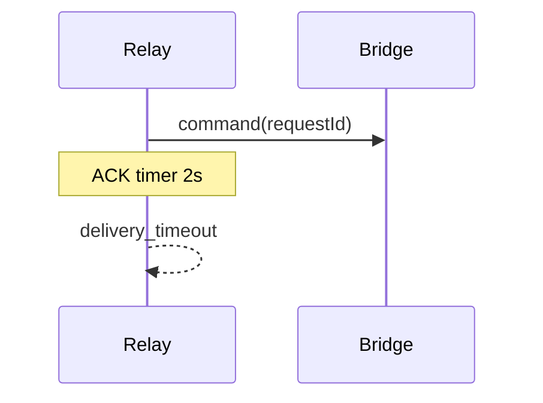
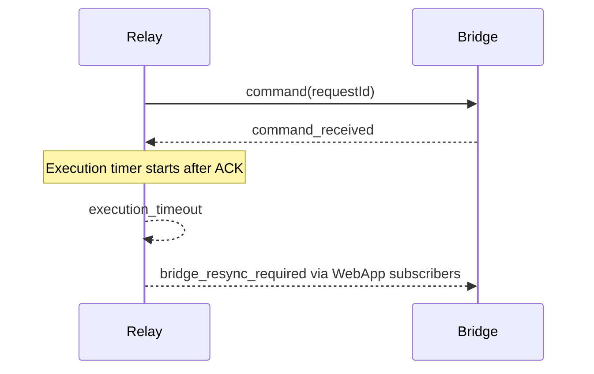
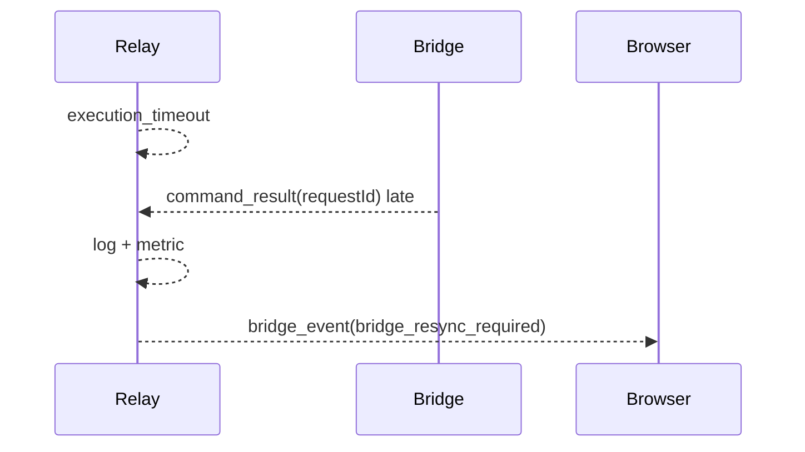
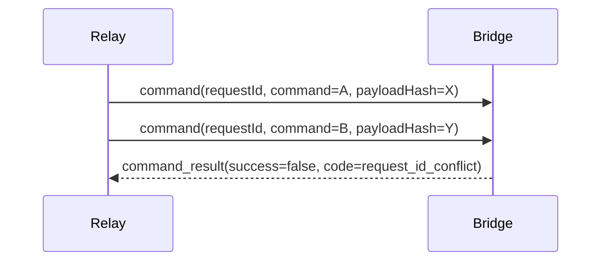
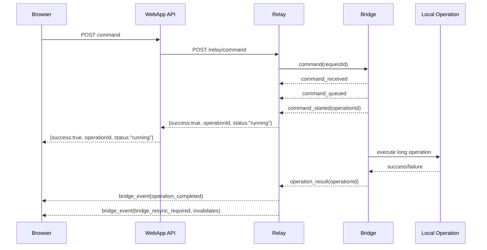

# Timeout State Machine Plan

## Ziel

Diese Planung schaerft die aktuelle Timeout-Architektur nach der ersten
kritischen Analyse. Sie trennt kurzfristig Delivery und Execution sauberer und
beschreibt als zweite Stufe eine vollstaendige Command-State-Machine mit
Queue-/Started-Signalen.

## Stufe 1: Sofortiger Produktions-Hardening-Schritt

Status: umgesetzt.

### Ziele

- `delivery_timeout` darf nicht mehr den vollen command-spezifischen Timeout
  dauern.
- Relay-Execution-Timeout startet erst nach `command_received`.
- Dedupe basiert nicht nur auf `requestId`, sondern auch auf `command` und
  `payloadHash`.
- Gleiche `requestId` mit anderem Command oder Payload wird als
  `request_id_conflict` abgelehnt.
- Late Results werden nicht als HTTP-Erfolg ausgeliefert, loesen aber Resync aus.
- Strukturierte Timeout-/Conflict-Codes werden bis zur WebApp durchgereicht.

### Stufe-1-Policy

| Phase | Timeout | Bedeutung |
| --- | ---: | --- |
| ACK / Delivery | 2s | Bridge muss `command_received` senden |
| Execution | command-spezifisch | Startet erst nach `command_received` |
| WebApp API | ACK + Execution + 5s, mindestens 20s | Wartet laenger als Relay |
| Browser | API + 4s | Wartet laenger als WebApp API |

### Stufe-1-Timeouts

| Command / Klasse | ACK | Execution | Relay gesamt | WebApp API | Browser |
| --- | ---: | ---: | ---: | ---: | ---: |
| Fast commands | 2s | 12s | 14s | 20s | 24s |
| `engine_connect` | 2s | 18s | 20s | 25s | 29s |
| `list_outputs` | 2s | 15s | 17s | 22s | 26s |
| Graphics configure/send/update/remove | 2s | 20s | 22s | 27s | 31s |
| Helper-start commands | 2s | 35s | 37s | 42s | 46s |

### Dataflows

#### Delivery Timeout



#### Execution Timeout



#### Late Result



#### Request-ID Conflict



## Stufe 2: Vollstaendige Command-State-Machine

Status: umgesetzt fuer die vorhandenen Bridge-Commands; Meeting-Async bleibt
abhaengig von einer separaten Bridge-Erweiterung fuer `meeting_*` Relay-
Commands.

- Umgesetzt: synchrone Command-State-Machine mit `command_received`,
  `command_queued`, `command_started`, `command_result`, getrennten ACK-/Queue-/
  Execution-Timeouts, Late-Result-Resync und Phase-Duration-Metriken.
- Umgesetzt: `operationId`-basierte Async-Operations fuer vorhandene
  langlebige Bridge-Commands, aktuell `engine_vmix_ensure_browser_input`.
- Umgesetzt: Relay Operation-State-Persistenz, Resource-Busy-Semantik,
  monotones Event-Sequencing und Operation-Events fuer die WebApp.
- Noch offen: `meeting_engine_start` und `meeting_camera_start` koennen erst
  aktiv migriert werden, wenn die Bridge diese `meeting_*` Commands in
  Allowlist, Command-Router und nativer Runtime bereitstellt.

### Ziele

- Queue-Wartezeit und lokale Ausfuehrungszeit trennen.
- Lange Commands fuer eine spaetere asynchrone Operation markieren.
- Resync zielgerichtet ueber `invalidates` statt global.
- Resource-Konflikte ueber `concurrencyKey` sichtbar machen.
- Produktionswerte ueber neue Phase-Duration-Metriken datenbasiert
  nachschaerfen.

### Ziel-State-Machine

```text
created
-> delivered
-> queued
-> started
-> succeeded | failed
-> timed_out_pending
-> late_succeeded | late_failed
```

### Zusaetzliche Bridge-/Relay-Messages

```ts
type CommandQueued = {
  type: "command_queued";
  requestId: string;
  bridgeId: string;
  sequence?: number;
  queuePosition?: number;
  concurrencyKey?: string;
  invalidates?: string[];
};

type CommandStarted = {
  type: "command_started";
  requestId: string;
  bridgeId: string;
  sequence?: number;
  concurrencyKey?: string;
  invalidates?: string[];
};
```

### Ziel-Policy pro Command

```ts
type CommandPolicy = {
  ackTimeoutMs: number;
  queueTimeoutMs: number;
  executionTimeoutMs: number;
  replayPolicy: "always" | "same_request_id_only" | "after_state_check" | "never";
  concurrencyKey: "engine" | "graphics" | "meeting.camera" | "meeting.output" | string;
  invalidates: string[];
  executionMode: "sync" | "async";
};
```

### Stufe-2-Timeout-Semantik

- ACK timer startet beim Senden an die Bridge.
- Queue timer startet nach `command_received` und wird bei `command_queued`
  erneuert. Dadurch haengt ein Request nicht unendlich, falls ein Queue-Event
  verloren geht.
- Execution timer startet bei `command_started`.
- `command_result` beendet die Operation.
- Late Results werden als State-Update/Invalidation verarbeitet, aber nicht dem
  alten HTTP-Request zugeordnet.

### Umgesetzte Timeout-Werte

| Command / Klasse | ACK | Queue | Execution | Relay gesamt | WebApp API | Browser |
| --- | ---: | ---: | ---: | ---: | ---: | ---: |
| Fast commands | 2s | 5s | 12s | 19s | 24s | 28s |
| `engine_connect` | 2s | 20s | 18s | 40s | 45s | 49s |
| `list_outputs` | 2s | 5s | 15s | 22s | 27s | 31s |
| Graphics configure/send/update/remove | 2s | 10s | 20s | 32s | 37s | 41s |
| Helper-start commands | 2s | 20s | 35s | 57s | 62s | 66s |

### Async-Operation-Kandidaten

- `meeting_engine_start`
- `meeting_camera_start`
- Device-/Output-Refresh mit Hardware-Scan
- vMix Browser-Input Setup
- Langsame Helper-/Treiberinitialisierung

Hinweis: In diesem Bridge-Repo ist `engine_vmix_ensure_browser_input` der erste
aktiv umgesetzte Async-Kandidat. Die Meeting-Kandidaten sind in Relay/WebApp
klassifiziert, aber in der Bridge noch nicht als Relay-Commands vorhanden.

## Stufe 2 Fertigstellungsplan

### Zielbild

Stufe 2 ist erst vollstaendig fertig, wenn langlebige oder ressourcenbindende
Commands nicht mehr als lange offene HTTP-Requests modelliert werden muessen.
Kurze Commands bleiben synchron. Lange Commands werden als Operation gestartet,
dauerhaft verfolgt und ueber Relay/WebApp-Events oder Statusabfragen
abgeschlossen.

Ziel-Flow fuer langlebige Commands:



### Scope-Abgrenzung

In Scope:

- Async-Operations fuer klar definierte langlebige Commands.
- Persistenter Operation-State im Relay, damit HTTP-Requests, Browser-Tabs oder
  Relay-Restarts den fachlichen Operation-Status nicht verlieren.
- Bridge-seitige Resource-Concurrency per `concurrencyKey`.
- WebApp-UI-Zustand fuer `running`, `timed_out_pending`, `completed`,
  `failed`, `resource_busy` und `conflicting_command`.
- Event-Sequencing oder State-Versioning fuer verlorene Relay-Events.
- Metriken fuer ACK, Queue, Execution, Operation-Laufzeit, Late Result,
  Resource Busy und Replay-Entscheidungen.

Nicht in Scope:

- Multi-Region-/Multi-Instance-Relay-State ohne externen WS-/Pending-State.
- Legacy-Graphics-Pfade oder neue Frame-Transporte.
- Abbruch nicht-abortbarer nativer Libraries. Timeout bedeutet weiterhin nicht
  automatisch, dass die lokale Operation beendet wurde.

### Arbeitspaket 2.1: Command-Policy vervollstaendigen

Status: umgesetzt.

Ziel: eine einzige Policy beschreibt Timeout, Replay, Concurrency,
Invalidierung und Ausfuehrungsmodus.

Policy-Felder:

```ts
type CommandPolicy = {
  command: string;
  ackTimeoutMs: number;
  queueTimeoutMs: number;
  executionTimeoutMs: number;
  operationTimeoutMs?: number;
  replayPolicy: "always" | "same_request_id_only" | "after_state_check" | "never";
  concurrencyKey: string;
  invalidates: string[];
  executionMode: "sync" | "async";
  resourceConflictPolicy: "reject" | "join_existing" | "queue";
};
```

Umsetzung:

- Bridge-Policy und Relay-Policy auf ein gemeinsames Schema bringen.
- WebApp-Timeout-Ableitung aus derselben Klassifizierung generieren oder
  testbasiert gegen Relay-Policy spiegeln.
- Invalidates-Matrix pro Command dokumentieren.
- Replay-Policy pro Command explizit freigeben; kein implizites Replay fuer
  Side-Effects.

Done-Kriterien:

- Jeder erlaubte Relay-Command hat eine vollstaendige Policy.
- Tests schlagen fehl, wenn ein Command ohne `invalidates`, `concurrencyKey`,
  `replayPolicy` oder `executionMode` existiert.
- WebApp-, Relay- und Bridge-Timeouts koennen nicht unbemerkt auseinanderlaufen.

### Arbeitspaket 2.2: Async-Operation-Vertrag einfuehren

Status: umgesetzt fuer `engine_vmix_ensure_browser_input`.

Neue Bridge-/Relay-Messages:

```ts
type OperationAccepted = {
  type: "operation_accepted";
  requestId: string;
  operationId: string;
  bridgeId: string;
  command: string;
  status: "running";
  concurrencyKey: string;
  invalidates: string[];
};

type OperationProgress = {
  type: "operation_progress";
  operationId: string;
  bridgeId: string;
  command: string;
  status: "queued" | "running";
  message?: string;
  progress?: number;
  stateVersion?: number;
};

type OperationResult = {
  type: "operation_result";
  operationId: string;
  bridgeId: string;
  command: string;
  success: boolean;
  data?: unknown;
  error?: string;
  code?: string;
  invalidates: string[];
  stateVersion?: number;
};
```

HTTP-Vertrag fuer async Commands:

```json
{
  "success": true,
  "operationId": "uuid",
  "status": "running",
  "command": "meeting_engine_start"
}
```

Umsetzung:

- Relay erkennt `executionMode: "async"` und antwortet nach
  `operation_accepted`, nicht erst nach lokalem Abschluss.
- Bridge erzeugt `operationId` deterministisch pro angenommenem Command oder
  nutzt Relay-provided `requestId -> operationId`.
- WebApp speichert laufende Operationen pro Bridge/Command/Ressource.
- Status kann per Event und per API-Snapshot rekonstruiert werden.

Done-Kriterien:

- Lange Commands blockieren keine 40-66s HTTP-Verbindungen mehr.
- Browser-Reload verliert den sichtbaren Operation-Status nicht.
- Spaete Operation Results werden als echte Operation-Abschluesse verarbeitet,
  nicht als alte HTTP-Erfolge.

### Arbeitspaket 2.3: Operation-State persistieren

Status: umgesetzt mit File-backed Relay Operation Store.

Relay-Operation-State:

```ts
type DurableOperation = {
  operationId: string;
  requestId: string;
  bridgeId: string;
  command: string;
  payloadHash: string;
  status:
    | "accepted"
    | "queued"
    | "running"
    | "succeeded"
    | "failed"
    | "timed_out_pending"
    | "late_succeeded"
    | "late_failed";
  concurrencyKey: string;
  invalidates: string[];
  createdAt: number;
  queuedAt?: number;
  startedAt?: number;
  completedAt?: number;
  timeoutAt?: number;
  result?: unknown;
  error?: string;
  code?: string;
  stateVersion: number;
};
```

Umsetzung:

- Operation-State in bestehendem Pending-Store-Konzept oder eigener Tabelle
  persistieren.
- TTL pro Status definieren:
  - laufend: bis Abschluss oder operator-relevanter Timeout
  - abgeschlossen: mindestens UI-Session-Recovery-Zeit
  - fehlgeschlagen/timed-out: laenger fuer Diagnose
- Relay-Restart rekonstruiert laufende Operationen und fordert gezielten Resync
  an.

Done-Kriterien:

- Relay-Restart waehrend async Operation fuehrt nicht zu unbekanntem UI-Zustand.
- Operationen sind per `operationId` nachlesbar.
- Alte Operationen werden kontrolliert aufgeraeumt.

### Arbeitspaket 2.4: Resource-Concurrency und Konfliktsemantik

Status: umgesetzt fuer Async-Operationen per `concurrencyKey`.

Ziel: Nach einem Timeout oder waehrend einer laufenden Operation kann kein
zweiter widerspruechlicher Command dieselbe Ressource unkontrolliert starten.

Fehlercodes:

- `resource_busy`: Ressource ist durch kompatible oder inkompatible Operation
  belegt.
- `operation_in_progress`: derselbe fachliche Vorgang laeuft bereits.
- `conflicting_command`: neuer Command widerspricht laufender Operation.
- `request_id_conflict`: gleiche `requestId`, anderer Command oder Payload.

Umsetzung:

- Bridge fuehrt pro `concurrencyKey` einen aktiven Operation-/Command-Slot.
- Policy entscheidet bei Konflikt:
  - `reject`: sofortiger Fehler.
  - `join_existing`: bestehende Operation zurueckgeben.
  - `queue`: kontrolliert warten, begrenzt durch `queueTimeoutMs`.
- Toggle-Commands langfristig durch explizite Set-Commands ersetzen.

Done-Kriterien:

- Doppelter `engine_connect` mit neuer `requestId` waehrend laufendem Connect
  startet keine zweite lokale Connect-Operation.
- Idempotente Set-Commands koennen dedupliziert oder gejoint werden.
- Tests decken `resource_busy`, `operation_in_progress` und
  `conflicting_command` ab.

### Arbeitspaket 2.5: Event-Sequencing und verlorene Events

Status: umgesetzt ueber `eventSequence` pro Bridge-Event.

Ziel: WebApp kann erkennen, ob Relay-/Bridge-Events verloren wurden.

Umsetzung:

- Relay versieht Bridge-Events mit monotonem `stateVersion` oder `eventSequence`
  pro Bridge.
- WebApp speichert letzte gesehene Version pro Bridge.
- Bei Sequenzluecke triggert WebApp gezielten Snapshot-Resync.
- Bridge-Snapshots enthalten die aktuelle State-Version, damit Resync und Events
  zusammengefuehrt werden koennen.

Done-Kriterien:

- Test simuliert verlorenes `operation_result`; WebApp erkennt Luecke und laedt
  Status neu.
- Reconnect fuehrt zu genau einem gezielten Resync statt mehrfacher globaler
  Refreshes.

### Arbeitspaket 2.6: WebApp-UX fuer unsichere und laufende Zustaende

Status: umgesetzt fuer Resync/Refresh; dedizierte sichtbare Operation-UI bleibt
optional.

UI-Zustaende:

- `running`: Operation laeuft.
- `queued`: Operation wartet auf Ressource.
- `timed_out_pending`: Timeout erreicht, Operation kann noch laufen.
- `completed`: Operation erfolgreich abgeschlossen.
- `failed`: Operation fachlich fehlgeschlagen.
- `resource_busy`: Aktion aktuell blockiert.
- `stale`: Event-Luecke oder Reconnect; Snapshot wird geladen.

Umsetzung:

- Bestehende Relay-Hooks verarbeiten `operation_progress`,
  `operation_result`, `bridge_resync_required` und Sequenzluecken.
- Buttons fuer betroffene `concurrencyKey`s werden waehrend inkompatibler
  Operationen deaktiviert oder zeigen Busy-State.
- `execution_timeout` und `queue_timeout` bleiben unsichere Zustaende mit
  Resync, nicht finale Bridge-Crashes.

Done-Kriterien:

- Benutzer kann nach timeoutendem `engine_connect` nicht sofort mehrere
  konkurrierende Connects starten.
- UI zeigt laufende Helper-Starts als Operation, nicht als haengenden Request.
- Resync erzeugt kein sichtbares Flackern durch globale Vollrefreshes, wenn nur
  einzelne Scopes invalidiert sind.

### Arbeitspaket 2.7: Datenbasierte Timeout-Nachschaerfung

Status: teilweise umgesetzt; Produktions-p95/p99-Dashboards bleiben offen.

Pflichtmetriken:

- ACK-Dauer: `phase="ack"`.
- Queue-Dauer: `phase="queue"`.
- Execution-Dauer: `phase="execution"`.
- Gesamt-Dauer: `phase="total"`.
- Async-Operation-Dauer: `phase="operation"`.
- Late-Result-Delay: `phase="late_result"`.
- Timeout-Zaehler nach `delivery`, `queue`, `execution`, `operation`.
- Resource-Konflikte nach `code`, `command`, `concurrencyKey`.

Umsetzung:

- Prometheus/OpenTelemetry-Export fuer alle Phase-Duration-Metriken.
- Dashboards fuer p50/p95/p99 pro Command-Klasse.
- Timeout-Werte nach realen p99-Werten plus Sicherheitsmarge anpassen.
- Separate Analyse fuer ATEM, vMix, TriCaster, Device Detection und native
  Helper-Starts.

Done-Kriterien:

- Timeout-Werte sind nicht mehr nur konstruiert, sondern mit Produktionsdaten
  begruendet.
- Review-Dokument enthaelt pro Command-Klasse p95/p99 und gewaehlte SLA.

### Arbeitspaket 2.8: Testplan fuer Abschluss

Status: teilweise umgesetzt mit Unit-/Hook-Tests; echte E2E-Hardwaretests
bleiben offen.

Bridge:

- `command_queued` und `command_started` enthalten `concurrencyKey`,
  `queuePosition` und `invalidates`.
- Async Command sendet `operation_accepted` und spaeter `operation_result`.
- Gleiche Operation mit gleicher Semantik wird gejoint oder dedupliziert.
- Konfliktierende Operation auf gleicher Ressource wird kontrolliert abgelehnt.
- Duplicate `requestId` mit anderem Payload bleibt `request_id_conflict`.

Relay:

- ACK-, Queue-, Execution- und Operation-Timeouts sind getrennt.
- Async HTTP-Response kommt nach `operation_accepted`.
- Operation-State ueberlebt Relay-Restart oder fuehrt zu definiertem Resync.
- Late `operation_result` aktualisiert Operation-State und loest Resync aus.
- Metriken enthalten Command, Timeout-Klasse, Phase und Timeout-Kind.

WebApp:

- API-/Browser-Timeouts bleiben laenger als Relay-SLAs.
- Async Commands zeigen `running` statt blockierendem Request.
- `queue_timeout` und `execution_timeout` erzeugen unsicheren Zustand plus
  Resync.
- Sequenzluecken fuehren zu gezieltem Snapshot-Reload.
- Resource-Busy verhindert doppelte Benutzeraktionen.

End-to-End:

- `meeting_engine_start` laeuft als Async Operation.
- `meeting_camera_start` laeuft als Async Operation.
- Timeout waehrend Operation + spaeter Erfolg fuehrt zu korrektem finalen UI-
  State.
- Relay-Reconnect waehrend Operation fuehrt nicht zu doppelter lokaler
  Ausfuehrung.

### Arbeitspaket 2.9: Rollout-Plan

Status: geplant fuer Meeting-Command-Migration.

1. Policy-Felder und Messages versioniert einfuehren, alte sync Commands
   unveraendert lauffaehig lassen.
2. Relay und Bridge fuer Async-Operationen hinter Feature-Flag aktivieren.
3. Zuerst einen risikoarmen Kandidaten umstellen, z. B. vMix Browser-Input
   Setup oder Meeting-Helper-Start in interner Umgebung.
4. WebApp-UI fuer laufende Operationen aktivieren.
5. Metriken mindestens einige Produktionstage sammeln.
6. Timeout-Werte datenbasiert nachschaerfen.
7. Weitere Kandidaten migrieren.
8. Lange synchrone HTTP-Pfade fuer migrierte Commands entfernen.

Rollback:

- Feature-Flag deaktiviert Async-Vertrag pro Command.
- Bestehende sync Command-Pfade bleiben bis nach stabiler Produktionsphase
  erhalten.
- Operation-State-Persistenz darf bei Rollback ignoriert werden, muss aber
  aufraeumbar bleiben.

### Abschlusskriterien fuer Stufe 2

Stufe 2 gilt als vollstaendig fertig, wenn alle Punkte erfuellt sind:

- Alle Commands haben vollstaendige Policy mit Timeout, Replay,
  Concurrency, Invalidates und Execution Mode.
- Mindestens ein vorhandener langlebiger Bridge-Command laeuft als echte Async-
  Operation; aktuell `engine_vmix_ensure_browser_input`.
- `meeting_engine_start` und `meeting_camera_start` werden nach Bridge-
  Command-Router-Erweiterung als Async-Operations migriert.
- Relay persistiert Operation-State und kann ihn nach Restart rekonstruieren
  oder kontrolliert resynchronisieren.
- Bridge verhindert konfliktierende Folge-Commands pro Ressource.
- WebApp erkennt laufende, unsichere, abgeschlossene und konfliktierende
  Operationen.
- Event-Sequencing oder State-Versioning erkennt verlorene Events.
- Metriken erlauben p95/p99-Auswertung pro Command und Phase.
- Timeout-Werte wurden nach Produktionsdaten reviewed.
- Bridge-, Relay-, WebApp- und E2E-Tests decken Success, Delivery Timeout,
  Queue Timeout, Execution Timeout, Operation Timeout, Late Result, Replay,
  Resource Busy und Relay-Reconnect ab.

### Bereits umgesetzte Metriken

Diese Metriken existieren bereits fuer die synchrone State-Machine und bleiben
Grundlage fuer die Fertigstellung:

- `relay_command_phase_duration_ms_*{phase="ack"}`
- `relay_command_phase_duration_ms_*{phase="queue"}`
- `relay_command_phase_duration_ms_*{phase="execution"}`
- `relay_command_phase_duration_ms_*{phase="total"}`
- `relay_command_phase_duration_ms_*{phase="late_result"}`
- `request_id_conflict_total`
- `resource_busy_total`

### Entscheidungen vor Umsetzung der Restarbeiten

- Finaler erster Async-Kandidat: empfohlen `meeting_engine_start`, danach
  `meeting_camera_start`.
- Persistenzort fuer Operation-State: eigener Relay-Store oder Erweiterung des
  bestehenden Pending Stores.
- Operation-Retention: konkrete TTL fuer `running`, `succeeded`, `failed` und
  `timed_out_pending`.
- Event-Recovery-Modell: `eventSequence` pro Bridge oder State-Version pro
  Scope.
- Granularitaet der `concurrencyKey`s fuer Meeting-Kamera, Meeting-Engine,
  Graphics und Outputs.
- Commands, die von Toggle-Semantik auf explizite Set-Semantik migriert werden
  sollen.
