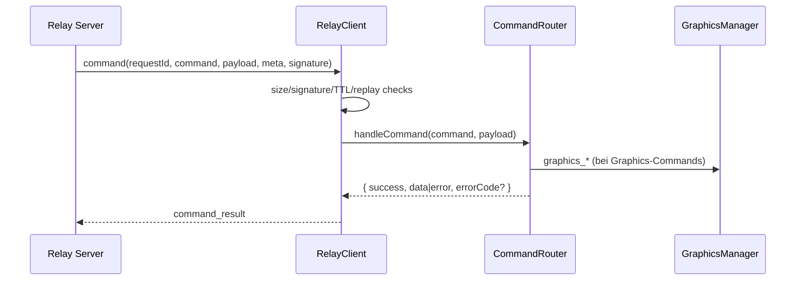
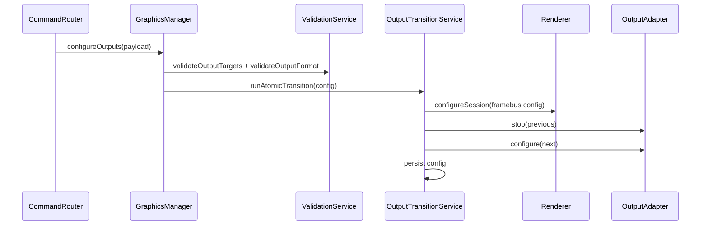
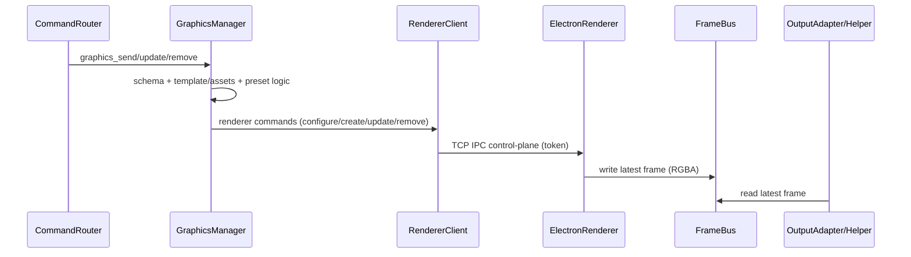
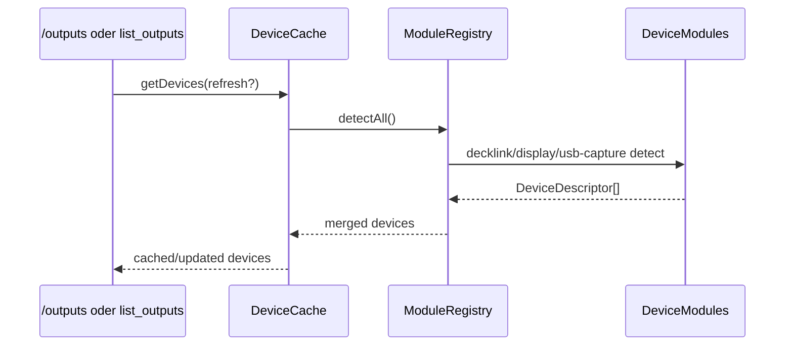
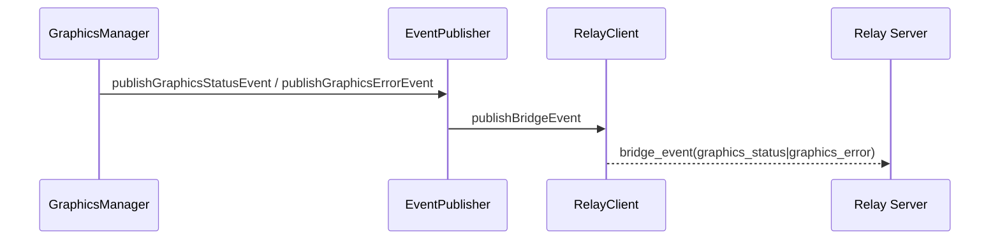

# Bridge – Dataflows (Aktueller Stand)

## Zweck
Diese Datei beschreibt die aktuellen Laufzeit-Datenfluesse der Bridge als zentrale Referenz ausserhalb des abgeschlossenen Refactor-Ordners.

## 1) Command-Ingress (Relay -> Bridge)

Wesentliche Punkte:
- Relay-Payloads sind untrusted und werden vor Ausfuehrung geprueft.
- Non-Graphics-Validierung liegt im Command Router (`relay-command-schemas.ts`).
- Graphics-Validierung liegt im Graphics-Stack (`graphics-schemas.ts` + Services).

## 2) Output-Konfiguration (`graphics_configure_outputs`)

Wesentliche Punkte:
- Transition ist serialisiert und atomar (`GraphicsOutputTransitionService`).
- Bei Fehlern wird Rollback auf vorherigen Runtime-Zustand versucht.
- FrameBus-Umgebungsvariablen werden pro Session gesetzt.

## 3) Graphics-Render-Flow (`graphics_send`, Updates, Remove)

Wesentliche Punkte:
- Renderer-IPC ist Control-Plane, nicht Frame-Transport.
- Data-Plane ist FrameBus (Shared Memory).
- `sendFrame()` der Output-Adapter ist im aktuellen Pfad ein No-op.

## 4) Device-/Output-Discovery-Flow

Wesentliche Punkte:
- Cache TTL und Refresh-Rate-Limit begrenzen Detection-Last.
- Ausgabe wird auf UI-kompatibles Output-Modell transformiert.

## 5) Status- und Error-Events

Wesentliche Punkte:
- `graphics_status` und `graphics_error` werden ueber Relay als Bridge-Events publiziert.
- Fehlercodes: `output_config_error`, `renderer_error`, `output_helper_error`, `graphics_error`.
