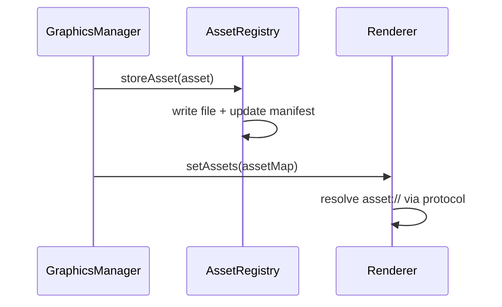

# Bridge Feature – Asset‑Management & Template‑Security

## Zweck
Diese Doku beschreibt, wie Assets gespeichert und geladen werden, sowie die Sicherheits‑Regeln für HTML/CSS‑Templates.

## Einstiegspunkte
- Asset Registry: `apps/bridge/src/services/graphics/asset-registry.ts`
- Template Sanitizer: `apps/bridge/src/services/graphics/template-sanitizer.ts`
- Template Bindings: `apps/bridge/src/services/graphics/template-bindings.ts`
- Renderer (Asset‑Protocol): `apps/bridge/src/services/graphics/renderer/electron-renderer-entry.ts`

## Asset‑Management
### Speicherung
- Assets werden im Bridge‑UserData‑Verzeichnis gespeichert.
- Struktur: `graphics-assets/` + `assets.json` Manifest.
- Größenlimits:
  - Pro Asset: 10 MB
  - Gesamt: 100 MB

### Asset‑IDs
- `assetId` muss `[a-zA-Z0-9_-]+` matchen.
- Assets werden per `asset://<assetId>` referenziert.

### Ablauf (Mermaid)

## Template‑Security
### HTML/CSS Regeln
Blockiert werden:
- `<script>` Tags
- Inline‑Event‑Handler (`on*=`)
- `<iframe>`, `<object>`, `<embed>`, `<link>`
- `javascript:` URLs
- Externe URLs (`http`, `https`, `data`, `file`, `ftp`)
- `@import` in CSS
- `</style>` Sequenzen (Style Breakout)

### Sanitizing
- CSS‑Block‑Kommentare werden vor Validierung entfernt.
- Template wird vor Rendern validiert.

### Bindings
- Text‑Bindings und CSS‑Variablen werden aus Schema/Defaults abgeleitet.
- `animation` wird in CSS‑Klassen gemappt (siehe `animation-css.ts`).

## Fehlerbilder
- Asset nicht vorhanden → Validation Error (`Missing asset reference`)
- Asset zu groß → Error (10MB/100MB Limits)
- Template enthält unsichere Tags/URLs → Validation Error

## Relevante Dateien
- `apps/bridge/src/services/graphics/asset-registry.ts`
- `apps/bridge/src/services/graphics/template-sanitizer.ts`
- `apps/bridge/src/services/graphics/template-bindings.ts`
- `apps/bridge/src/services/graphics/renderer/electron-renderer-entry.ts`
