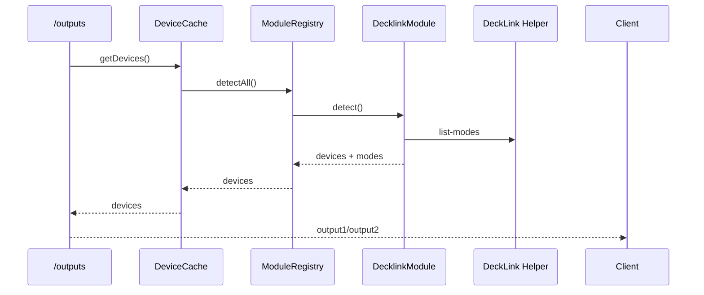

# Bridge Feature – Device Outputs (Port‑Model, Availability, Modes)

## Zweck
Diese Doku beschreibt das Device/Port‑Modell, wie daraus UI‑Outputs abgeleitet werden und wie Verfügbarkeit/Modes ermittelt werden.

## Datenmodell
### DeviceDescriptorT
- `id`, `displayName`, `type`, `vendor`, `model`
- `ports`: Liste von `PortDescriptorT`
- `status`: `present`, `ready`, `inUse`, `signal`, `lastSeen`

### PortDescriptorT
- `id`, `displayName`
- `type`: `sdi | hdmi | usb | displayport | thunderbolt`
- `direction`: `input | output | bidirectional`
- `role`: `fill | key | video`
- `capabilities`: `formats`, `modes`
- `status`: `available`, `signal`, `format`

Quelle: `packages/protocol/src/index.ts`

## Ableitung der UI‑Outputs
Die Route `/outputs` mappt Devices/Ports auf UI‑Outputs:
- `output1`: alle non‑key Output‑Ports
- `output2`: nur `role === key`
- `available`: `device.present && device.ready && !device.inUse && port.available`

Implementierung:
- `apps/bridge/src/routes/outputs.ts`
- `apps/bridge/src/services/command-router.ts` (transformDevicesToOutputs)

## Display Modes
DeckLink‑Ports erhalten Display‑Modes aus dem Helper:
- `apps/bridge/src/modules/decklink/decklink-detector.ts`
- `apps/bridge/src/modules/decklink/decklink-helper.ts`

Die Modes werden als `OutputDisplayModeT` am Port gespeichert.

## Ablauf (Mermaid)

## Fehlerbilder
- Keine Devices → leere Output‑Listen
- Helper‑Fehler → Ports ohne Modes
- Port nicht verfügbar → `available=false`

## Relevante Dateien
- `packages/protocol/src/index.ts`
- `apps/bridge/src/routes/outputs.ts`
- `apps/bridge/src/services/device-cache.ts`
- `apps/bridge/src/modules/decklink/decklink-detector.ts`
- `apps/bridge/src/modules/decklink/decklink-helper.ts`
