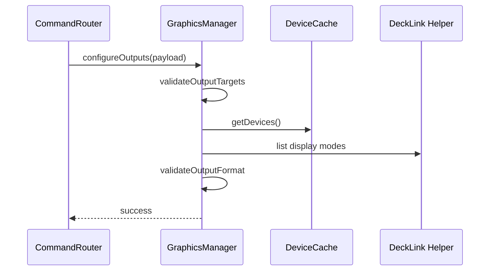

# Bridge Feature – Output‑Konfiguration & Pixel‑Policy

## Zweck
Diese Doku beschreibt, wie Outputs konfiguriert, validiert und für Hardware‑Ausgabe vorbereitet werden (Ports, Formate, Pixel‑Formate, Range/Colorspace).

## Einstiegspunkte
- Command: `graphics_configure_outputs`
- Validierung/Orchestrierung: `apps/bridge/src/services/graphics/graphics-manager.ts`
- Schemas: `apps/bridge/src/services/graphics/graphics-schemas.ts`
- Output‑Policy: `apps/bridge/src/services/graphics/output-format-policy.ts`
- Port‑Parsing: `apps/bridge/src/services/graphics/output-adapters/decklink-port.ts`
- Device‑Detection: `apps/bridge/src/services/device-cache.ts`, `apps/bridge/src/modules/decklink/*`

## Payload (Beispiel)
```json
{
  "version": 1,
  "outputKey": "key_fill_sdi",
  "targets": {
    "output1Id": "<device>-sdi-a",
    "output2Id": "<device>-sdi-b"
  },
  "format": { "width": 1920, "height": 1080, "fps": 50 },
  "range": "legal",
  "colorspace": "auto"
}
```

## Output‑Key Regeln
- `key_fill_sdi`
  - Output1/Output2 erforderlich
  - Beide SDI, gleicher Device
  - Output1 = Fill, Output2 = Key
- `key_fill_split_sdi`
  - Output1/Output2 erforderlich
  - Beide SDI, **kein** Key‑Port
- `video_sdi`
  - Output1 erforderlich
  - SDI‑Port, **kein** Key‑Port
- `video_hdmi`
  - Output1 erforderlich
  - HDMI‑Port
- `key_fill_ndi`
  - NDI Streamname erforderlich
- `stub`
  - Keine Targets erforderlich

## Format‑Validierung
Validierung erfolgt in `GraphicsManager.validateOutputFormat`:
- Für DeckLink‑Outputs wird der Helper nach Display‑Modes abgefragt
- `requireKeying` wird gesetzt, wenn Key/Fill genutzt wird
- Pixel‑Formate werden gegen die Policy geprüft

### Pixel‑Policy
- Video: `VIDEO_PIXEL_FORMAT_PRIORITY = ["10bit_yuv", "8bit_yuv"]`
- Key/Fill: `KEY_FILL_PIXEL_FORMAT_PRIORITY = ["8bit_argb", "8bit_bgra"]`

## Ablauf (Mermaid)


## Fehlerbilder
- Ports nicht verfügbar → Validation Error
- Format nicht unterstützt → Validation Error
- Helper nicht verfügbar → leerer Mode‑List → Validation Error
- Port‑IDs ungültig → parseDecklinkPortId() Fehler

## Relevante Dateien
- `apps/bridge/src/services/graphics/graphics-manager.ts`
- `apps/bridge/src/services/graphics/graphics-schemas.ts`
- `apps/bridge/src/services/graphics/output-format-policy.ts`
- `apps/bridge/src/services/graphics/output-adapters/decklink-port.ts`
- `apps/bridge/src/modules/decklink/decklink-helper.ts`
