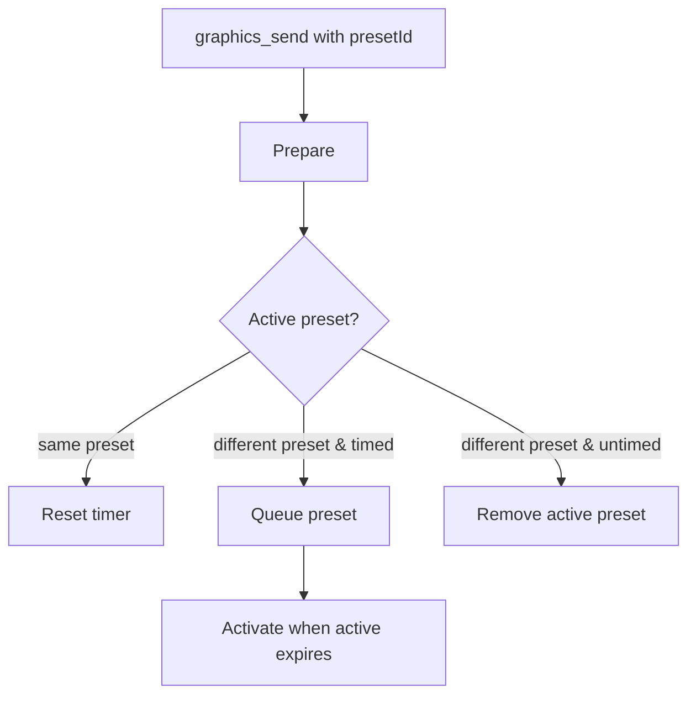

# Bridge Feature – Preset‑Queue & Lifecycle

## Zweck
Diese Doku beschreibt, wie Presets in der Graphics‑Pipeline verwaltet werden (Queueing, Aktivierung, Ablauf, Entfernen).

## Einstiegspunkte
- Orchestrierung: `apps/bridge/src/services/graphics/graphics-manager.ts`
- Schemas: `apps/bridge/src/services/graphics/graphics-schemas.ts`

## Begriffe
- **Preset**: Gruppierung mehrerer Layer unter einer `presetId`.
- **Active Preset**: Aktuelles Preset, dessen Layer aktiv gerendert werden.
- **Queued Preset**: Warteschlange für zeitgesteuerte Presets.

## Ablauf (Mermaid)

## Regeln & Verhalten
### Preset‑Queueing
- Wenn ein aktives Preset läuft und ein anderes Preset mit `durationMs` kommt, wird es in die Queue gelegt.
- Mehrere Layer desselben Presets werden im Queue‑Entry zusammengeführt.
- Queue‑Limit: `MAX_QUEUED_PRESETS`.

### Timer & Ablauf
- Preset‑Timer startet beim ersten Frame‑Output (nicht sofort beim `send`).
- `durationMs` steuert das Ablauf‑Event.
- Nach Ablauf werden alle Layer des Presets entfernt.
- Danach wird das nächste Preset aus der Queue aktiviert.

### Entfernen
- `graphics_remove` entfernt nur einen Layer.
- `graphics_remove_preset` entfernt alle Layer eines Presets.
- `clearQueue` löscht alle queued Presets.

## Edge‑Cases
- `durationMs` ohne `presetId` → Validation Error.
- Active Preset ohne Dauer wird bei neuem Preset ersetzt.
- Queue ist voll → Error.

## Relevante Dateien
- `apps/bridge/src/services/graphics/graphics-manager.ts`
- `apps/bridge/src/services/graphics/graphics-schemas.ts`
