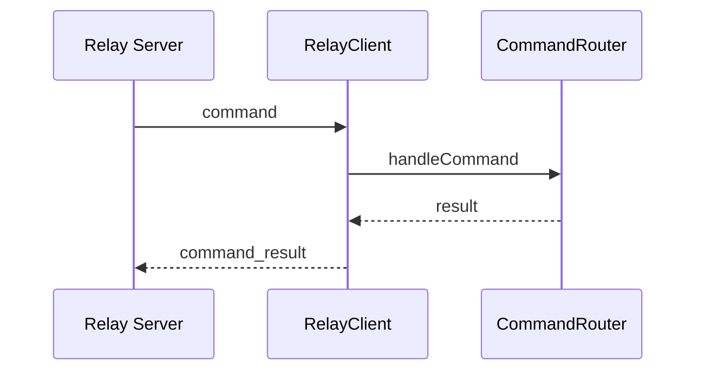

# Bridge Feature – Relay‑Protokoll

## Zweck
Beschreibt das Relay‑Protokoll (Message‑Typen, Command‑Envelope, Resultate, Reconnect‑Strategie).

## Komponenten
- Relay Client: `apps/bridge/src/services/relay-client.ts`
- Command Router: `apps/bridge/src/services/command-router.ts`

## Message‑Typen
### bridge_hello
Wird direkt nach Verbindungsaufbau gesendet.
```json
{ "type": "bridge_hello", "bridgeId": "<id>", "version": "<semver>", "bridgeName": "<optional>" }
```

### command
Command‑Envelope vom Relay an die Bridge.
```json
{ "type": "command", "requestId": "<uuid>", "command": "graphics_send", "payload": { ... } }
```

#### bridge_pair_validate
Validiert einen Pairing‑Code gegen die Bridge‑Context‑Daten (Code + Ablaufzeit).
```json
{ "type": "command", "requestId": "<uuid>", "command": "bridge_pair_validate", "payload": { "pairingCode": "ABCD1234" } }
```

Antwort (success):
```json
{ "type": "command_result", "requestId": "<uuid>", "success": true, "data": { "bridgeId": "<id>", "bridgeName": "<name|null>" } }
```

### command_result
Antwort der Bridge.
```json
{ "type": "command_result", "requestId": "<uuid>", "success": true, "data": { ... } }
```

## Ablauf (Mermaid)


## Reconnect‑Strategie
- Exponentieller Backoff (1s → 60s)
- Reconnect nur wenn nicht shutting down

## Security
- Payloads sind untrusted → Validation downstream (Zod)
- Graphics payloads für Logging sanitized

## Relevante Dateien
- `apps/bridge/src/services/relay-client.ts`
- `apps/bridge/src/services/command-router.ts`
