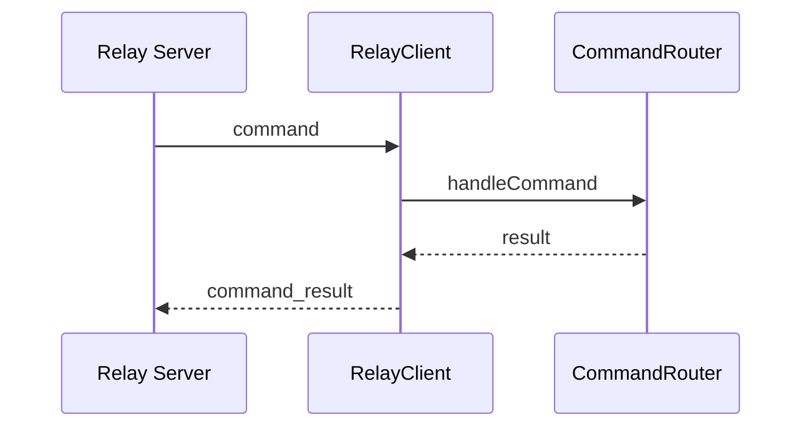

# Bridge Feature – Relay‑Protokoll

## Zweck
Beschreibt das Relay‑Protokoll (Message‑Typen, Command‑Envelope, Resultate, Reconnect‑Strategie).

## Komponenten
- Relay Client: `apps/bridge/src/services/relay-client.ts`
- Command Router: `apps/bridge/src/services/command-router.ts`

## Message‑Typen
### bridge_hello
Wird direkt nach Verbindungsaufbau gesendet.
```json
{ "type": "bridge_hello", "bridgeId": "<id>", "version": "<semver>", "bridgeName": "<optional>" }
```

### command
Command‑Envelope vom Relay an die Bridge.
```json
{
  "type": "command",
  "requestId": "<uuid>",
  "command": "graphics_send",
  "payload": { ... },
  "meta": {
    "bridgeId": "<uuid>",
    "orgId": "<uuid>",
    "scope": ["command:graphics_send"],
    "iat": 1712345678,
    "exp": 1712345708,
    "jti": "<uuid>",
    "kid": "<key-id>"
  },
  "signature": "<base64url>"
}
```

#### bridge_pair_validate
Validiert einen Pairing‑Code gegen die Bridge‑Context‑Daten (Code + Ablaufzeit).
```json
{
  "type": "command",
  "requestId": "<uuid>",
  "command": "bridge_pair_validate",
  "payload": { "pairingCode": "ABCD1234" },
  "meta": {
    "bridgeId": "<uuid>",
    "orgId": "<uuid>",
    "scope": ["command:bridge_pair_validate"],
    "iat": 1712345678,
    "exp": 1712345708,
    "jti": "<uuid>",
    "kid": "<key-id>"
  },
  "signature": "<base64url>"
}
```

Antwort (success):
```json
{ "type": "command_result", "requestId": "<uuid>", "success": true, "data": { "bridgeId": "<id>", "bridgeName": "<name|null>" } }
```

### command_result
Antwort der Bridge.
```json
{ "type": "command_result", "requestId": "<uuid>", "success": true, "data": { ... } }
```

## Ablauf (Mermaid)


## Reconnect‑Strategie
- Exponentieller Backoff (1s → 60s)
- Reconnect nur wenn nicht shutting down

## Security
- Payloads sind untrusted → Zod-Validierung im `CommandRouter`
  (`relay-command-schemas.ts`) und im `GraphicsManager`
- Commands sind signiert (Ed25519) und enthalten `meta` + `signature`
- Bridge validiert Signatur, TTL und Replay‑Schutz (jti‑Cache)

## Key Distribution
- Relay stellt Public Keys via `/.well-known/jwks.json` bereit (`kid` fuer Rotation).
- Bridge erwartet `BRIDGE_RELAY_SIGNING_PUBLIC_KEY` (PEM) oder `BRIDGE_RELAY_JWKS_URL`.
- `.env` wird nur im Dev-Modus geladen (`apps/bridge/src/index.ts`);
  in Produktion muessen Env‑Variablen vom Launcher gesetzt werden.

## Relevante Dateien
- `apps/bridge/src/services/relay-client.ts`
- `apps/bridge/src/services/command-router.ts`
