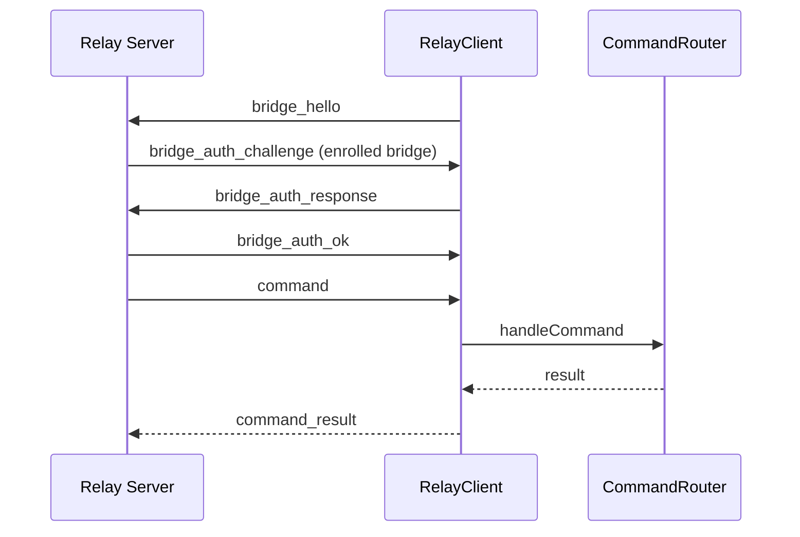

# Bridge Feature – Relay‑Protokoll

## Zweck
Beschreibt das Relay‑Protokoll (Message‑Typen, Command‑Envelope, Resultate, Reconnect‑Strategie).

## Komponenten
- Relay Client: `apps/bridge/src/services/relay-client.ts`
- Command Router: `apps/bridge/src/services/command-router.ts`

## Message‑Typen
### bridge_hello
Wird direkt nach Verbindungsaufbau gesendet.
```json
{
  "type": "bridge_hello",
  "bridgeId": "<id>",
  "version": "<semver>",
  "bridgeName": "<optional>",
  "auth": { "bridgeKeyId": "<key-id>", "algorithm": "ed25519" }
}
```

### bridge_auth_challenge / bridge_auth_response
Relay authentisiert enrolled Bridges nach `bridge_hello` per Challenge‑Response.

Relay -> Bridge:
```json
{
  "type": "bridge_auth_challenge",
  "bridgeId": "<id>",
  "challengeId": "<uuid>",
  "nonce": "<uuid>",
  "iat": 1712345678,
  "exp": 1712345693,
  "bridgeKeyId": "<key-id>",
  "algorithm": "ed25519"
}
```

Bridge -> Relay:
```json
{
  "type": "bridge_auth_response",
  "bridgeId": "<id>",
  "challengeId": "<uuid>",
  "bridgeKeyId": "<key-id>",
  "algorithm": "ed25519",
  "signature": "<base64url>"
}
```

Relay -> Bridge (Ergebnis):
```json
{ "type": "bridge_auth_ok", "bridgeId": "<id>" }
```
oder
```json
{ "type": "bridge_auth_error", "bridgeId": "<id>", "error": "string" }
```

### command
Command‑Envelope vom Relay an die Bridge.
```json
{
  "type": "command",
  "requestId": "<uuid>",
  "command": "graphics_send",
  "payload": { ... },
  "meta": {
    "bridgeId": "<uuid>",
    "orgId": "<uuid>",
    "scope": ["command:graphics_send"],
    "iat": 1712345678,
    "exp": 1712345708,
    "jti": "<uuid>",
    "kid": "<key-id>"
  },
  "signature": "<base64url>"
}
```

#### bridge_pair_validate
Validiert einen Pairing‑Code gegen die Bridge‑Context‑Daten (Code + Ablaufzeit).
```json
{
  "type": "command",
  "requestId": "<uuid>",
  "command": "bridge_pair_validate",
  "payload": { "pairingCode": "ABCD1234" },
  "meta": {
    "bridgeId": "<uuid>",
    "orgId": "<uuid>",
    "scope": ["command:bridge_pair_validate"],
    "iat": 1712345678,
    "exp": 1712345708,
    "jti": "<uuid>",
    "kid": "<key-id>"
  },
  "signature": "<base64url>"
}
```

Antwort (success):
```json
{
  "type": "command_result",
  "requestId": "<uuid>",
  "success": true,
  "data": {
    "bridgeId": "<id>",
    "bridgeName": "<name|null>",
    "relayEnrollment": {
      "keyId": "<key-id>",
      "algorithm": "ed25519",
      "publicKeyPem": "-----BEGIN PUBLIC KEY-----..."
    }
  }
}
```

### command_result
Antwort der Bridge.
```json
{ "type": "command_result", "requestId": "<uuid>", "success": true, "data": { ... } }
```

### bridge_event
Asynchrones Event der Bridge an das Relay. Wird fuer Live-Status und Resync-Snapshots genutzt.

```json
{
  "type": "bridge_event",
  "bridgeId": "<id>",
  "event": "engine_macro_execution",
  "data": {
    "reason": "execution_changed",
    "execution": {
      "runId": "<uuid>",
      "macroId": 1,
      "macroName": "Macro 1",
      "engineType": "atem",
      "status": "running",
      "triggeredAt": 1712345678000,
      "startedAt": 1712345678100,
      "waitingAt": null,
      "completedAt": null,
      "actualDurationMs": null,
      "loop": false,
      "stopRequestedAt": null
    },
    "lastCompletedExecution": null
  },
  "timestamp": 1712345678123
}
```

Wichtige Engine-Events:

- `engine_status`: Engine-Snapshot inklusive Macro-Katalog und Runtime.
- `engine_macro_execution`: Lifecycle-Update fuer `pending`, `running`, `waiting`, `completed`, `stopped`, `failed`.
- `engine_error`: Engine-Fehler.
- `engine_status_snapshot`: Snapshot beim Resync nach `bridge_auth_ok`.

## Ablauf (Mermaid)

```mermaid
sequenceDiagram
  participant Relay as Relay Server
  participant Bridge as RelayClient
  participant Router as CommandRouter

  Bridge->>Relay: bridge_hello
  Relay->>Bridge: bridge_auth_challenge (enrolled bridge)
  Bridge->>Relay: bridge_auth_response
  Relay->>Bridge: bridge_auth_ok
  Relay->>Bridge: command
  Bridge->>Router: handleCommand
  Router-->>Bridge: result
  Bridge-->>Relay: command_result
```

## Reconnect‑Strategie
- Exponentieller Backoff (1s → 60s)
- Reconnect nur wenn nicht shutting down

## Security
- Payloads sind untrusted → Zod-Validierung im `CommandRouter`
  (`relay-command-schemas.ts`) und im `GraphicsManager`
- Commands sind signiert (Ed25519) und enthalten `meta` + `signature`
- Bridge validiert Signatur, TTL und Replay‑Schutz (jti‑Cache)
- Bridge authentisiert sich gegen Relay per lokalem Ed25519-Keypair + Challenge‑Response (`bridge_hello`-Pfad)
- Fuer ungepairte Bridges erlaubt das Relay einen `pairing-only` Bootstrap-Pfad (nur `bridge_pair_validate`)

## Key Distribution
- Relay stellt Public Keys via `/.well-known/jwks.json` bereit (`kid` fuer Rotation).
- Bridge erwartet `BRIDGE_RELAY_SIGNING_PUBLIC_KEY` (PEM) oder `BRIDGE_RELAY_JWKS_URL`.
- `.env` wird nur im Dev-Modus geladen (`apps/bridge/src/index.ts`);
  in Produktion muessen Env‑Variablen vom Launcher gesetzt werden.

## Relevante Dateien
- `apps/bridge/src/services/relay-client.ts`
- `apps/bridge/src/services/command-router.ts`
