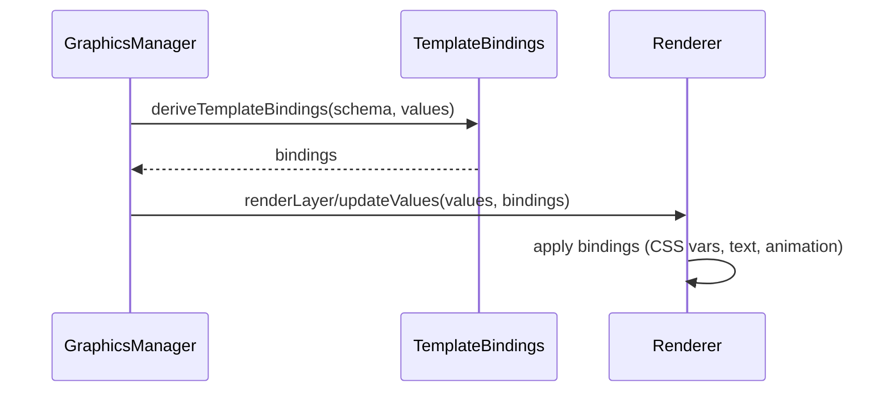

# Bridge Feature – Renderer Bindings & Animations

## Zweck
Diese Doku beschreibt, wie Template‑Bindings (Text, CSS‑Variablen, Animationen) aus Schema/Values abgeleitet und im Renderer angewendet werden.

## Einstiegspunkte
- Bindings: `apps/bridge/src/services/graphics/template-bindings.ts`
- Renderer: `apps/bridge/src/services/graphics/renderer/electron-renderer-entry.ts`
- Standard‑Animationen: `apps/bridge/src/services/graphics/renderer/animation-css.ts`

## Bindings – Überblick
Bindings werden aus Schema und Defaults abgeleitet und reduzieren Renderer‑Kosten:
- `cssVariables`: `--<key>` → CSS‑Variable
- `textContent`: Text‑Bindings für `[data-bid="<key>"]`
- `textTypes`: z. B. `list` für List‑Rendering
- `animationClass`: `anim-*`

## Ablauf (Mermaid)

## Animationen
- Unterstützte Werte: `ease`, `ease-in`, `ease-out`, `ease-in-out`, `linear`, `slide-up`, `slide-down`, `slide-left`, `slide-right`
- Mapping: `animation` → `anim-<value>`
- Klassen werden mit `state-enter/state-exit` kombiniert.

## Renderer‑Anwendung
- `window.__applyValues` setzt Template‑HTML (falls `{{ }}` vorhanden)
- Text‑Bindings werden über `data-bid` gesetzt
- CSS‑Variablen werden direkt auf `:root` gesetzt
- Animation‑Class wird dem Root‑Element zugewiesen
- Root‑Element ist entweder `[data-root="graphic"]` oder das `#graphic-root`
- Animation‑CSS wirkt nur, wenn das Root‑Element die Klasse `root` trägt

## Fehlerbilder
- Ungültiger Animation‑Wert → Fallback `anim-ease-out`
- Fehlendes `data-bid` → Text‑Update wird ignoriert

## Relevante Dateien
- `apps/bridge/src/services/graphics/template-bindings.ts`
- `apps/bridge/src/services/graphics/renderer/electron-renderer-entry.ts`
- `apps/bridge/src/services/graphics/renderer/animation-css.ts`
