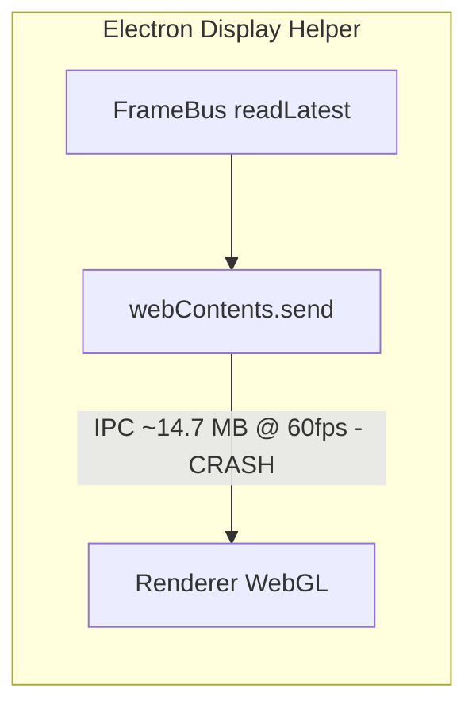
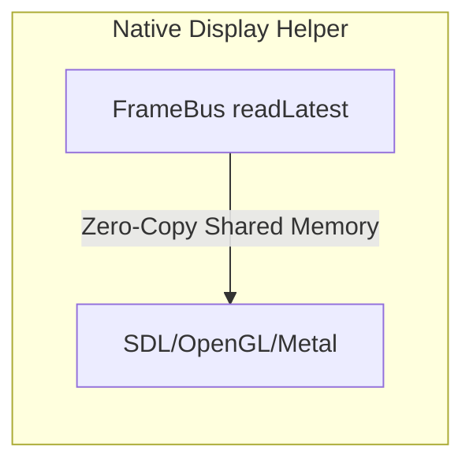

# Display Native Helper – Migrationsplan

## Status (Stand Implementierung)

| Phase | Status |
|-------|--------|
| Phase 0: Vorbereitung | Abgeschlossen |
| Phase 1: Native Helper MVP | Abgeschlossen |
| Phase 2: Adapter-Integration | Abgeschlossen |
| Phase 3: Display-Auswahl | Teilweise (MVP: `--display-index 0`) |
| Phase 4: Stabilisierung | Ausstehend |
| Phase 5: Cleanup | Ausstehend |

**Implementierte Dateien:** `apps/bridge/native/display-helper/`, `apps/bridge/src/modules/display/display-helper.ts`, Änderungen in `display-output-adapter.ts`.

## Zweck

Dokumentation der Migration vom Electron Display Helper zu einem nativen C++ Display Helper. Ziel ist die Beseitigung des IPC-Bottlenecks (SIGSEGV bei ~14,7 MB @ 60 fps) durch Zero-Copy Frame-Transport über Shared Memory – analog zur DeckLink-Architektur.

## Kontext

### Problem

Der Electron Display Helper crasht mit SIGSEGV beim Senden von Frames über `webContents.send("display-frame", frame)` von Main zu Renderer. Ursache: Chromium-IPC-Serialisierung bei großen Binärblobs (~14,7 MB) bei 60 fps.

### Lösung

Ersetzung des Electron-Helpers durch einen nativen Prozess, der direkt aus dem FrameBus liest und über SDL2/OpenGL/Metal fullscreen rendert. Kein Frame-Transport über IPC.

### Referenz

- Native Display Helper: `apps/bridge/native/display-helper/`
- Display Helper Pfad-Auflösung: `apps/bridge/src/modules/display/display-helper.ts`
- DeckLink Helper: `apps/bridge/native/decklink-helper/`
- FrameBus C-Header: `apps/bridge/native/framebus/include/framebus.h`
- Output Helper Contract: `docs/bridge/refactor/graphics-realtime-output-helper-contract.md`

---

## Architektur-Vergleich

### Aktuell (Electron)

### Ziel (Native)

---

## Schwierigkeiten und zu beachtende Punkte

### 1. Plattform-APIs für Display-Auswahl

| Aspekt | Elektron | Native (macOS) | Schwierigkeit |
|--------|----------|----------------|---------------|
| Display-Liste | `screen.getAllDisplays()` | CGDisplay/NSScreen oder SDL | Mittel |
| Match by Name | `display.label` / `display.name` | SDL_GetDisplayName oder CoreGraphics | Mittel |
| Match by Resolution | `display.size.width/height` | SDL_GetDisplayBounds oder CGDisplayMode | Gering |
| External bevorzugt | `display.internal === false` | CGDisplayIsBuiltin | Mittel |
| Fullscreen auf Display | `BrowserWindow` mit bounds | SDL_CreateWindow + SDL_WINDOW_FULLSCREEN | Gering |

**Hinweis:** SDL2 bietet `SDL_GetNumVideoDisplays()`, `SDL_GetDisplayName(int)`, `SDL_GetDisplayBounds(int, SDL_Rect*)`. Die Zuordnung zu Device-Namen (z.B. "Odyssey G5") kann plattformspezifisch sein; SDL-Labels können von Electron-Labels abweichen.

### 2. Pixel-Format und Farbraum

| Thema | Zu beachten |
|-------|-------------|
| FrameBus-Format | RGBA8 (wie festgelegt). Keine Konvertierung nötig. |
| OpenGL/Metal | `GL_RGBA`, `GL_UNSIGNED_BYTE` für Texture-Upload. |
| V-Sync | SDL_RenderPresent vs. Metal Present: SDL auf Metal kann V-Sync-Bugs haben (ProMotion/M1). OpenGL-Backend als Fallback prüfen. |
| Skalierung | Frame 2560×1440 auf Display 3840×2160: Skalierung im Shader oder SDL_RenderSetLogicalSize. |

### 3. Prozess-Lebenszyklus

| Thema | Zu beachten |
|-------|-------------|
| Ready-Signal | `{"type":"ready"}` auf stdout, erst nach erfolgreichem FrameBus-Open und Fenster-Create. |
| Shutdown | Kein stdin im FrameBus-Modus; Shutdown via SIGTERM (Bridge sendet bei stop()). |
| Crash-Recovery | Helper-Crash: Bridge erkennt Exit, kann Output-Adapter neu konfigurieren. Kein Auto-Restart ohne explizite Logik. |

### 4. Build und Deployment

| Thema | Zu beachten |
|-------|-------------|
| Build-Toolchain | clang, SDL2. macOS: `brew install sdl2` oder system libs. |
| Kein Electron | Helper ist eigenständige Binary, keine Electron-Runtime. |
| Pfad-Auflösung | Dev: `apps/bridge/native/display-helper/display-helper`. Prod: `resourcesPath/native/display-helper/display-helper` (analog DeckLink). |
| Code-Signing | macOS: Binary muss für Release signiert sein (entitlements, Notarization). |
| Architektur | arm64 + x64 für macOS; gleiche Matrix wie DeckLink. |

### 5. Feature-Parität mit Electron-Helper

| Feature | Elektron | Native |
|---------|----------|--------|
| Debug-Overlay | HTML/CSS Overlay (FPS, Canvas-Größe) | Optional: SDL-Text-Rendering oder weglassen |
| Force-2D/WebGL | Canvas2D vs. WebGL Fallback | Immer GPU (OpenGL/Metal); kein 2D-Fallback nötig |
| GPU-Disable | `--disable-gpu` für Debug | SDL kann Software-Renderer nutzen; selten nötig |

**Entscheidung:** Debug-Overlay in Phase 2 oder als optionales Flag. MVP: Ohne Overlay.

### 6. Sicherheit

| Thema | Zu beachten |
|-------|-------------|
| Shared Memory | FrameBus ist lokales POSIX shm. Kein Netzwerk. |
| Binary-Pfad | Nur aus Bridge gestartet, kein User-Input in Pfad. |
| Display-Zugriff | Fullscreen auf ausgewähltem Monitor. Keine zusätzlichen Rechte. |

### 7. Metriken und Observability

| Thema | Zu beachten |
|-------|-------------|
| FPS-Logging | Optional: `{"type":"metrics","fps":60,"drops":0}` auf stdout (wie DeckLink). |
| Latenz | Timestamp im FrameBus; Differenz zu Present-Zeit messbar. |

### 8. Skalierung und Auflösung

| Auflösung | Frame-Größe | Bewertung |
|-----------|------------|-----------|
| 1920×1080 | ~8,3 MB | Unkritisch |
| 2560×1440 | ~14,7 MB | Aktuell crashauslösend |
| 3840×2160 (4K) | ~33,2 MB | Native Helper: Kein IPC, unkritisch |

### 9. Abhängigkeiten

| Abhängigkeit | Zweck |
|--------------|-------|
| SDL2 | Fenster, Event-Loop, Renderer-Backend (OpenGL/Metal) |
| FrameBus-Header | Shared-Memory-Layout (bereits vorhanden) |
| C++17 | DeckLink nutzt C++17 |

### 10. Mögliche Fallstricke

- **SDL-Metal V-Sync:** Bekannte Bugs bei ProMotion (120 Hz). OpenGL als Fallback testen.
- **Display-Name-Match:** SDL-Namen können von Electron/CoreGraphics abweichen. Evtl. Fallback auf Index oder Auflösung.
- **Mehrere Monitore:** SDL_GetDisplayBounds liefert pro Display; Auswahl über Index oder Name.
- **High-DPI:** `SDL_WINDOW_ALLOW_HIGH_DPI` bei Retina. Frame wird 1:1 gepixelt, Skalierung optional.

---

## Migrations-Phasen

### Phase 0: Vorbereitung

- [x] SDL2 als Build-Abhängigkeit dokumentieren und in README/CI erfassen.
- [x] Feature-Flag definieren: `BRIDGE_DISPLAY_NATIVE_HELPER=1`.
- [x] Pfad-Auflösung für Helper-Binary definieren (analog `resolveDecklinkHelperPath`).
- [x] Output Helper Contract um Native Display Helper erweitern.

### Phase 1: Native Helper (MVP)

- [x] Verzeichnis anlegen: `apps/bridge/native/display-helper/`.
- [x] `build.sh` für macOS (clang + SDL2).
- [x] FrameBus-Reader aus DeckLink-Code wiederverwenden/extrahieren.
- [x] SDL-Fenster erstellen, Fullscreen auf Primär- oder konfiguriertem Display.
- [x] Renderloop: readLatest → Texture-Upload → Present @ 60 fps.
- [x] Ready-Signal auf stdout.
- [x] SIGTERM-Handler für sauberen Shutdown.

### Phase 2: Adapter-Integration

- [x] `resolveDisplayHelperPath()` analog zu DeckLink.
- [x] Display-Adapter erweitern: Bei `BRIDGE_DISPLAY_NATIVE_HELPER=1` nativen Helper starten statt Electron.
- [x] Env-Parameter durchreichen: FrameBus-Name, Size, Width, Height, FPS, Display-Match-Name, -Width, -Height.
- [x] Ready-Handshake prüfen.
- [x] Stop/Shutdown mit SIGTERM, Timeout, SIGKILL (wie Display-Adapter heute).

### Phase 3: Display-Auswahl

- [x] CLI-Args: `--display-index` (MVP: Index 0, Primär-Display)
- [ ] CLI-Args: `--display-name`, `--display-width`, `--display-height`.
- [ ] SDL-Display-Enumeration mit Match-Logik (Name, Auflösung).
- [x] Fallback: Primärer Monitor (Index 0).

### Phase 4: Stabilisierung

- [ ] 60-fps-Stabilitätstest über 5+ Minuten.
- [ ] 4K-Test (wenn Zielformat).
- [ ] Crash-Recovery-Verhalten testen (Helper kill → Bridge reagiert).
- [ ] Code-Signing und Notarization für macOS Release.

### Phase 5: Cleanup (optional)

- [x] Electron Display Helper als Fallback behalten (Feature-Flag aus → Legacy).
- [x] Dokumentation finalisieren (README, Contract, framebus-dev-setup).
- [ ] Debug-Overlay für Native Helper (optional).

---

## TODO-Liste (detailliert)

### Build & Infrastruktur

- [x] `apps/bridge/native/display-helper/build.sh` erstellen
- [x] `apps/bridge/native/display-helper/README.md` mit Build-Anleitung
- [x] SDL2-Version: Homebrew/Framework, sdl2-config oder Fallback-Pfade
- [ ] CMake oder Makefile als Alternative zu reinem build.sh (optional)
- [ ] CI: Build-Step für display-helper (macOS arm64, x64)

### Source-Code

- [x] `display-helper.cpp` – Hauptprogramm
- [x] FrameBus-Reader-Logik (aus DeckLink übernommen)
- [x] SDL-Init, Fenster, Renderer
- [x] Renderloop mit FPS-Ticker
- [x] Display-Auswahl-Logik (MVP: `--display-index`)
- [x] Signal-Handler (SIGTERM, SIGINT)

### Bridge-Integration

- [x] `resolveDisplayHelperPath()` in `apps/bridge/src/modules/display/display-helper.ts`
- [x] `display-output-adapter.ts`: Branch für Native vs. Electron
- [x] Env-Parameter für Native Helper
- [x] Stop-Logik: SIGTERM statt stdin Shutdown für Native (stdio: ignore)

### Tests & Validierung

- [ ] Manueller Test: 1920×1080 @ 60 fps
- [ ] Manueller Test: 2560×1440 @ 60 fps
- [ ] Manueller Test: 4K @ 30 oder 60 fps
- [ ] Display-Wechsel (mehrere Monitore)
- [ ] Crash-Test: Helper beenden → Bridge meldet, Preset-Stop

### Dokumentation

- [x] README im display-helper-Ordner
- [x] Output Helper Contract aktualisieren
- [x] Migrationsplan auf aktuellen Stand gebracht
- [x] framebus-dev-setup.md: BRIDGE_DISPLAY_NATIVE_HELPER + Build-Anleitung
- [x] DEPLOY.md für Release-Workflow (analog DeckLink)

---

## Feature-Flags

| Flag | Zweck |
|------|-------|
| `BRIDGE_DISPLAY_NATIVE_HELPER=1` | Nutzt nativen Display Helper statt Electron |
| `BRIDGE_GRAPHICS_OUTPUT_HELPER_FRAMEBUS=1` | Muss gesetzt sein (FrameBus-Pfad) |
| `BRIDGE_GRAPHICS_FRAMEBUS=1` | Muss gesetzt sein |

**Abhängigkeit:** Native Display Helper erfordert FrameBus. Ohne FrameBus keinen Native Helper.

---

## Rollback

| Szenario | Maßnahme |
|----------|----------|
| Native Helper crasht häufig | `BRIDGE_DISPLAY_NATIVE_HELPER` nicht setzen → Electron Helper |
| Build schlägt fehl | Electron Helper bleibt Default, Native optional |
| Display-Auswahl falsch | Fallback auf Primär-Display; Match-Logik nachbessern |

---

## Env-Parameter (Native Helper)

| Parameter | Quelle | Zweck |
|-----------|--------|-------|
| `BRIDGE_FRAMEBUS_NAME` | GraphicsManager | FrameBus Shared-Memory-Name |
| `BRIDGE_FRAMEBUS_SIZE` | FrameBusConfig | Größe (Header + Slots) |
| `BRIDGE_FRAME_WIDTH` | OutputConfig | Frame-Breite |
| `BRIDGE_FRAME_HEIGHT` | OutputConfig | Frame-Höhe |
| `BRIDGE_FRAME_FPS` | OutputConfig | Ziel-FPS |
| `BRIDGE_DISPLAY_MATCH_NAME` | Device displayName | Display-Name für Match |
| `BRIDGE_DISPLAY_MATCH_WIDTH` | Port capabilities | Optionale Auflösung |
| `BRIDGE_DISPLAY_MATCH_HEIGHT` | Port capabilities | Optionale Auflösung |

---

## CLI-Argumente (Native Helper)

| Arg | Beschreibung | Implementiert |
|-----|--------------|---------------|
| `--framebus-name <name>` | FrameBus Shared-Memory-Name | Ja |
| `--width <int>` | Frame-Breite | Ja |
| `--height <int>` | Frame-Höhe | Ja |
| `--fps <int>` | Ziel-FPS | Ja |
| `--display-index <int>` | SDL-Display-Index (0 = primär) | Ja |
| `--display-name <string>` | Display-Name zum Matchen (optional) | Nein |
| `--display-width <int>` | Display-Auflösung Filter (optional) | Nein |
| `--display-height <int>` | Display-Auflösung Filter (optional) | Nein |

---

## Abnahme-Kriterien

1. 60 fps stabil über mindestens 5 Minuten (2560×1440).
2. Kein SIGSEGV oder anderer Crash im Display-Pfad.
3. Ready-Signal innerhalb von 5 Sekunden nach Start.
4. Sauberer Shutdown bei Bridge stop (SIGTERM).
5. Display-Auswahl funktioniert (primärer oder konfigurierter Monitor).

---

## Referenzen

- [DeckLink Helper README](../../native/decklink-helper/README.md)
- [Graphics Realtime Output Helper Contract](./graphics-realtime-output-helper-contract.md)
- [Graphics Realtime Architecture](./graphics-realtime-architecture.md)
- [FrameBus C Header Spec](./graphics-realtime-framebus-c-header.md)
- [SDL2 Documentation](https://wiki.libsdl.org/)
