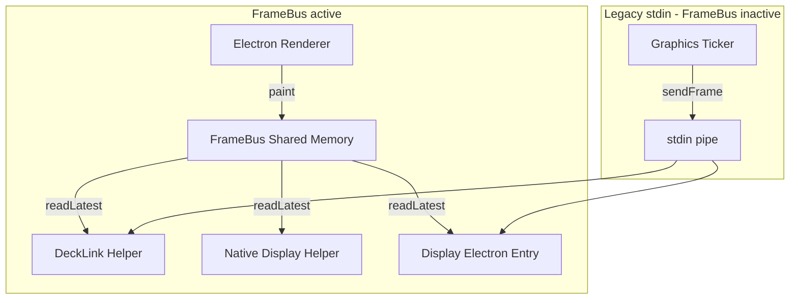

# FrameBus Output Integration

## Overview

FrameBus (shared memory) is **always** used for Display and DeckLink outputs. No env flags; the legacy stdin path has been removed.

## Output Types Summary

| Output Type | Adapter | FrameBus |
|-------------|---------|----------|
| `video_hdmi` + Display | DisplayVideoOutputAdapter | Yes |
| `video_sdi` | DecklinkVideoOutputAdapter | Yes |
| `video_hdmi` + DeckLink | DecklinkVideoOutputAdapter | Yes |
| `key_fill_sdi` | DecklinkKeyFillOutputAdapter | Yes |
| `key_fill_split_sdi` | DecklinkSplitOutputAdapter | Yes |

## Per-Adapter Details

### 1. Display (DisplayVideoOutputAdapter)

- **Native Helper** (`BRIDGE_DISPLAY_NATIVE_HELPER=1`): Reads directly from FrameBus (shared memory), no stdin.
- **Electron Helper**: `display-output-entry.ts` uses `useFrameBus` when set – reads from FrameBus, sends via IPC to renderer.
- `sendFrame()` is a no-op when `isFrameBusOutputEnabled()`.

### 2. DeckLink Video (DecklinkVideoOutputAdapter)

- Constructor: `useFrameBus ?? true`.
- When FrameBus: passes `--framebus-name` and FrameBus env to helper.
- `sendFrame()` is a no-op when `useFrameBus && isFrameBusOutputEnabled()`.
- DeckLink helper (C++) has FrameBus mode: reads from shared memory, outputs to device.

### 3. DeckLink Key/Fill (DecklinkKeyFillOutputAdapter)

- Uses `isFrameBusOutputEnabled()` for configuration and `sendFrame()`.
- FrameBus integration analogous to DecklinkVideoOutputAdapter.

### 4. DeckLink Split (DecklinkSplitOutputAdapter) – Exception

Both sub-adapters are explicitly created with `useFrameBus: false`:

```typescript
private fillAdapter = new DecklinkVideoOutputAdapter({ useFrameBus: false });
private keyAdapter = new DecklinkVideoOutputAdapter({ useFrameBus: false });
```

Comment: "Split key/fill uses the legacy stdin path only (no FrameBus support)."

## Configuration

`BRIDGE_FRAMEBUS_NAME` must be set (e.g. in `config/default.json`). The Graphics Manager creates the shared memory and passes the name to output helpers. No feature flags required.

## Data Flow



## Diagnostics

DeckLink helper metrics show `"source":"framebus"`. If `BRIDGE_FRAMEBUS_NAME` is missing, output configuration will fail.

## References

- [FrameBus Config](apps/bridge/src/services/graphics/framebus/framebus-config.ts)
- [Display Output Adapter](apps/bridge/src/services/graphics/output-adapters/display-output-adapter.ts)
- [DeckLink Video Adapter](apps/bridge/src/services/graphics/output-adapters/decklink-video-output-adapter.ts)
- [DeckLink Key/Fill Adapter](apps/bridge/src/services/graphics/output-adapters/decklink-key-fill-output-adapter.ts)
- [DeckLink Split Adapter](apps/bridge/src/services/graphics/output-adapters/decklink-split-output-adapter.ts)
