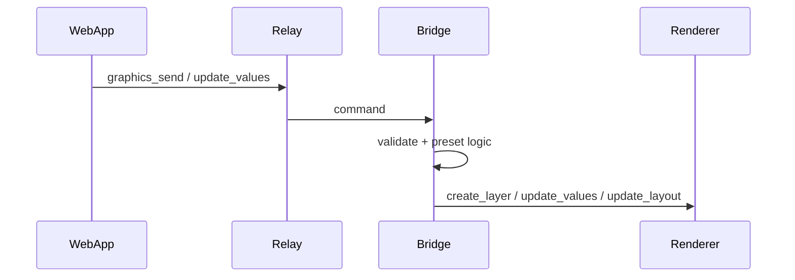
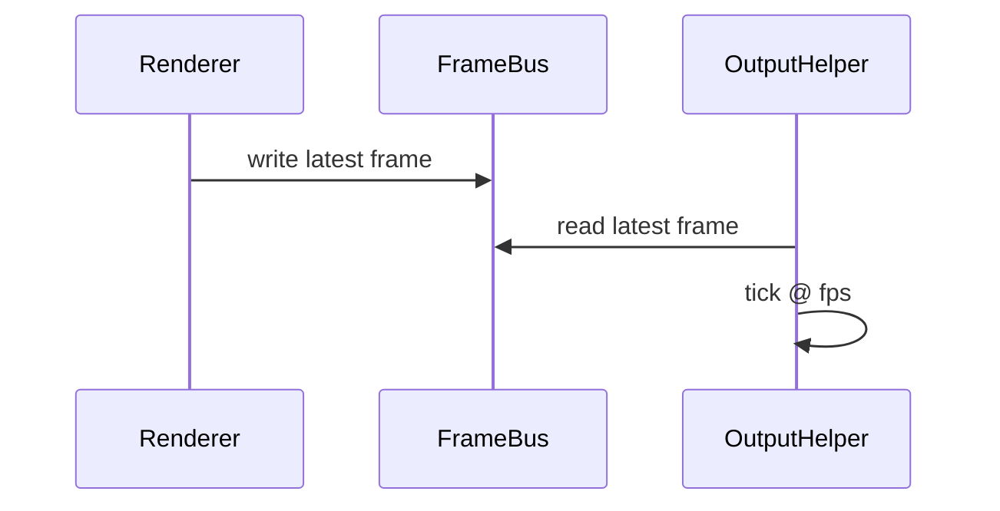

# Graphics Realtime Refactor – Dataflow

## Control-Flow

## Frame-Flow

## Error-Flow
- Renderer fällt aus: Bridge stoppt Output-Helper und publiziert Status.
- Output-Helper fällt aus: Bridge stoppt Session und fordert Re-Konfiguration an.

## Legacy-Fallback Flow (Notfall)
- Bridge empfängt Frames vom Renderer (IPC).
- Bridge compositet Frames und tickt pro Output-FPS.
- Output-Helper erhält Frames über Legacy-stdin.

## TODO
- [ ] Error-Codes und Status-Events final definieren.
