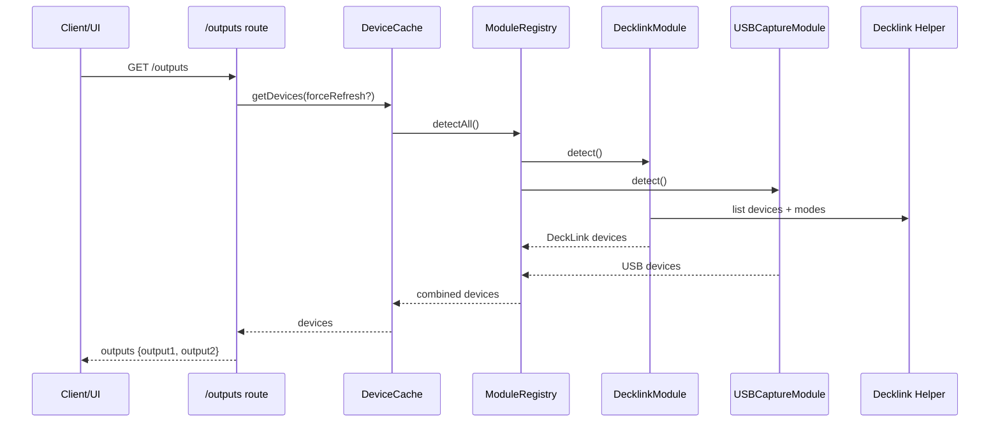

# Bridge Subsystem – Device Discovery

## Zweck
Dieses Subsystem erkennt verfügbare Geräte (DeckLink, USB Capture), cached Ergebnisse und stellt sie der UI als Output‑Liste zur Verfügung.

## Verantwortlichkeiten
- Registrierung von Device‑Modulen
- Parallelisierte Device‑Detection mit Timeout/Isolation
- Cache + Rate‑Limit für Refresh
- Watcher für Hotplug‑Events
- Mapping von Device/Port‑Model zu UI‑Outputs

## Hauptkomponenten
- `apps/bridge/src/modules/index.ts`
- `apps/bridge/src/modules/module-registry.ts`
- `apps/bridge/src/services/device-cache.ts`
- `apps/bridge/src/modules/decklink/*`
- `apps/bridge/src/modules/usb-capture/*`
- `apps/bridge/src/routes/outputs.ts`

## Ablauf (Mermaid)

## Cache & Refresh
- Cache TTL: 1s
- Force‑Refresh: rate‑limited (2s)
- Watcher: debounced refresh (250ms)

## Security & Risiken
- **Native Helper:** DeckLink‑Helper wird per Child‑Process ausgeführt.
- **Platform Abhängigkeit:** DeckLink nur macOS.
- **Untrusted Data:** Helper‑Output wird per Zod geparst und validiert.

## Relevante Dateien
- `apps/bridge/src/services/device-cache.ts`
- `apps/bridge/src/modules/module-registry.ts`
- `apps/bridge/src/modules/decklink/decklink-detector.ts`
- `apps/bridge/src/modules/decklink/decklink-helper.ts`
- `apps/bridge/src/modules/usb-capture/usb-capture-detector.ts`
- `apps/bridge/src/routes/outputs.ts`
