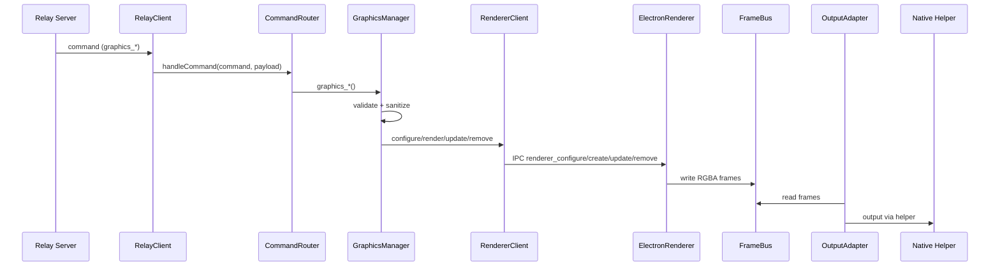

# Bridge Subsystem – Graphics Pipeline

## Zweck
Dieses Subsystem rendert Graphics‑Layer (HTML/CSS) zu RGBA‑Frames und liefert sie an Hardware‑Outputs (z. B. DeckLink SDI/HDMI oder Display-Output). Es orchestriert Assets, Layouts, Presets und Output‑Konfiguration.

## Verantwortlichkeiten
- Validierung und Sanitizing von Graphics‑Payloads
- Rendering über separaten Electron‑Offscreen‑Prozess (Single-Window)
- Session-Konfiguration über FrameBus
- Output‑Konfiguration und Format‑/Target‑Validierung
- Steuerung von Output-Transitions (atomare Re-Konfiguration)

## Entry Points (Commands)
Graphics‑Commands kommen über den Relay‑Client in die Bridge:
1. `apps/bridge/src/services/relay-client.ts` empfängt `command`‑Messages.
2. `apps/bridge/src/services/command-router.ts` dispatcht `graphics_*`.
3. `apps/bridge/src/services/graphics/graphics-manager.ts` führt aus.

Relevante Commands:
- `graphics_configure_outputs`
- `graphics_send`
- `graphics_update_values`
- `graphics_update_layout`
- `graphics_remove`
- `graphics_remove_preset`
- `graphics_test_pattern`
- `graphics_list`

## Datenfluss (Mermaid)

```mermaid
sequenceDiagram
  participant Relay as Relay Server
  participant RC as RelayClient
  participant CR as CommandRouter
  participant GM as GraphicsManager
  participant R as RendererClient
  participant ER as ElectronRenderer
  participant FB as FrameBus
  participant OA as OutputAdapter
  participant H as Native Helper

  Relay->>RC: command (graphics_*)
  RC->>CR: handleCommand(command, payload)
  CR->>GM: graphics_*()
  GM->>GM: validate + sanitize
  GM->>R: configure/render/update/remove
  R->>ER: IPC renderer_configure/create/update/remove
  ER->>FB: write RGBA frames
  OA->>FB: read frames
  OA->>H: output via helper
```

## Validierung & Sicherheit
- Zod‑Schemas: `apps/bridge/src/services/graphics/graphics-schemas.ts`
- Template‑Sanitizing: `apps/bridge/src/services/graphics/template-sanitizer.ts`
  - Blockiert Scripts, Inline‑Events, externe URLs, `@import`, etc.
- Asset‑Handling: `apps/bridge/src/services/graphics/asset-registry.ts`
  - Größenlimits, Asset‑Manifest, `asset://`‑Protokoll im Renderer
- IPC‑Sicherheit Renderer:
  - Token‑Handshake, Payload‑Limits
  - Lokal gebunden an `127.0.0.1`

## Output‑Konfiguration & Device‑Validierung
`GraphicsManager.configureOutputs` validiert:
- Output‑Targets (Port‑Typ, Port‑Rolle, Verfügbarkeit)
- Format‑Support (Width/Height/FPS + Pixel‑Formats)

Dabei werden Device‑Infos aus `device-cache` und Display‑Modes aus Device-Modulen/Helpern verwendet:
- `apps/bridge/src/services/device-cache.ts`
- `apps/bridge/src/modules/decklink/decklink-detector.ts`
- `apps/bridge/src/modules/display/display-module.ts`
- `apps/bridge/src/modules/decklink/decklink-helper.ts`

## Renderer‑IPC (Offscreen)
Renderer‑Client: `apps/bridge/src/services/graphics/renderer/electron-renderer-client.ts`
- Startet Electron‑Rendererprozess mit IPC‑Port + Token
- Befehle: `renderer_configure`, `set_assets`, `create_layer`, `update_values`, `update_layout`, `remove_layer`

Renderer‑Entry: `apps/bridge/src/services/graphics/renderer/electron-renderer-entry.ts`
- Ein Offscreen BrowserWindow (Single-Window) mit Layern via Shadow DOM
- `paint`‑Event liefert BGRA → RGBA
- Schreibt Frames in FrameBus; keine Frame-Payload über IPC

## Output‑Adapter
- `apps/bridge/src/services/graphics/output-adapters/decklink-video-output-adapter.ts`
- `apps/bridge/src/services/graphics/output-adapters/decklink-key-fill-output-adapter.ts`
- `apps/bridge/src/services/graphics/output-adapters/display-output-adapter.ts`
- `apps/bridge/src/services/graphics/output-adapters/stub-output-adapter.ts`

DeckLink und Display-Output nutzen FrameBus als Data-Plane. IPC bleibt Control-Plane.

## Fehlerbilder (typisch)
- Output nicht konfiguriert → `Outputs not configured`
- Format/Port ungültig → Validation Fehler
- Renderer nicht verfügbar → Fallback auf Stub Renderer
- DeckLink Helper fehlt/keine Rechte → configure() Fehler
- FrameBus nicht konfiguriert/verfügbar → `renderer_configure` schlägt fehl

## Relevante Dateien
- `apps/bridge/src/services/relay-client.ts`
- `apps/bridge/src/services/command-router.ts`
- `apps/bridge/src/services/graphics/graphics-manager.ts`
- `apps/bridge/src/services/graphics/graphics-output-transition-service.ts`
- `apps/bridge/src/services/graphics/graphics-schemas.ts`
- `apps/bridge/src/services/graphics/template-sanitizer.ts`
- `apps/bridge/src/services/graphics/asset-registry.ts`
- `apps/bridge/src/services/graphics/renderer/*`
- `apps/bridge/src/services/graphics/framebus/*`
- `apps/bridge/src/services/graphics/output-adapters/*`
- `apps/bridge/src/modules/decklink/*`
- `apps/bridge/src/modules/display/*`
