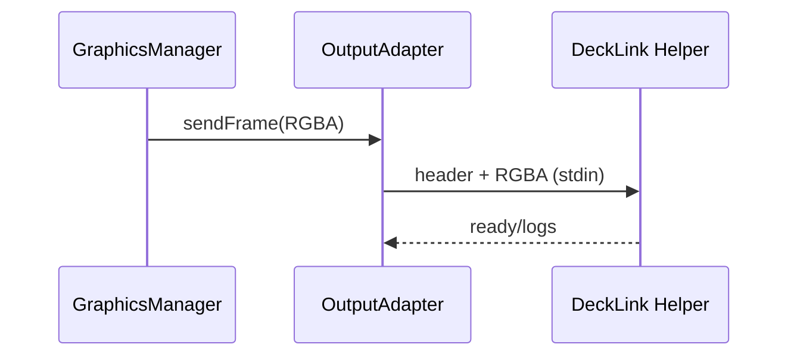

# Bridge Subsystem – Output Adapter & Helper

## Zweck
Dieses Subsystem nimmt RGBA‑Frames entgegen und liefert sie an die jeweilige Hardware‑Ausgabe. Für DeckLink erfolgt dies über einen nativen Helper‑Prozess.

## Verantwortlichkeiten
- Auswahl des Output‑Adapters (Key/Fill, Split, Video, Stub)
- Start/Stop von Helper‑Prozessen
- Streaming von Frames mit Header‑Protokoll
- Validierung von Port‑IDs und Output‑Konfiguration

## Hauptkomponenten
- Adapter Interface: `apps/bridge/src/services/graphics/output-adapter.ts`
- DeckLink Video: `apps/bridge/src/services/graphics/output-adapters/decklink-video-output-adapter.ts`
- DeckLink Key/Fill: `apps/bridge/src/services/graphics/output-adapters/decklink-key-fill-output-adapter.ts`
- DeckLink Split: `apps/bridge/src/services/graphics/output-adapters/decklink-split-output-adapter.ts`
- Stub: `apps/bridge/src/services/graphics/output-adapters/stub-output-adapter.ts`
- Helper Resolve: `apps/bridge/src/modules/decklink/decklink-helper.ts`

## Ablauf (Mermaid)

## Security‑Hinweise
- Helper‑Binary wird per Pfad‑Check (`X_OK`) validiert.
- Keine Shell‑Execution; feste Argumente.
- Frame‑Payloads sind lokal und nicht extern exponiert.

## Fehlerbilder
- Helper nicht vorhanden/kein Execute‑Bit → configure() Fehler
- Port‑ID ungültig → parseDecklinkPortId() Fehler
- Helper exit vor Ready → configure() schlägt fehl

## Relevante Dateien
- `apps/bridge/src/services/graphics/output-adapter.ts`
- `apps/bridge/src/services/graphics/output-adapters/*`
- `apps/bridge/src/modules/decklink/decklink-helper.ts`
- `apps/bridge/native/decklink-helper/src/decklink-helper.cpp`
