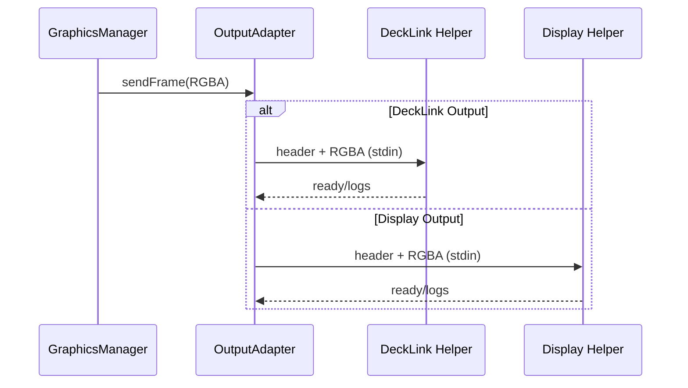

# Bridge Subsystem – Output Adapter & Helper

## Zweck
Dieses Subsystem nimmt RGBA‑Frames entgegen und liefert sie an die jeweilige Ausgabe. Für DeckLink erfolgt dies über einen nativen Helper‑Prozess, für Display‑Outputs über einen Electron‑Helper im Fullscreen‑Fenster.

## Verantwortlichkeiten
- Auswahl des Output‑Adapters (Key/Fill, Split, Video, Stub)
- Start/Stop von Helper‑Prozessen
- Streaming von Frames mit Header‑Protokoll
- Validierung von Port‑IDs und Output‑Konfiguration
- Handshake + Diagnostics für Display‑Output Helper

## Hauptkomponenten
- Adapter Interface: `apps/bridge/src/services/graphics/output-adapter.ts`
- DeckLink Video: `apps/bridge/src/services/graphics/output-adapters/decklink-video-output-adapter.ts`
- DeckLink Key/Fill: `apps/bridge/src/services/graphics/output-adapters/decklink-key-fill-output-adapter.ts`
- DeckLink Split: `apps/bridge/src/services/graphics/output-adapters/decklink-split-output-adapter.ts`
- Display Output: `apps/bridge/src/services/graphics/output-adapters/display-output-adapter.ts`
- Stub: `apps/bridge/src/services/graphics/output-adapters/stub-output-adapter.ts`
- Helper Resolve: `apps/bridge/src/modules/decklink/decklink-helper.ts`
- Display Helper Entry: `apps/bridge/src/services/graphics/display/display-output-entry.ts`
- Display Helper Preload: `apps/bridge/src/services/graphics/display/display-output-preload.cts`

## Ablauf (Mermaid)

## Security‑Hinweise
- Helper‑Binary wird per Pfad‑Check (`X_OK`) validiert.
- Keine Shell‑Execution; feste Argumente.
- Frame‑Payloads sind lokal und nicht extern exponiert.
- Display‑Helper nutzt fest verdrahtete Entry/Preload‑Pfade und whitelisted Env‑Variablen.

## Fehlerbilder
- Helper nicht vorhanden/kein Execute‑Bit → configure() Fehler
- Port‑ID ungültig → parseDecklinkPortId() Fehler
- Helper exit vor Ready → configure() schlägt fehl
- Display‑Helper fehlt oder Preload nicht lesbar → configure() Fehler
- Preload ist ESM → Overlay zeigt `Missing preload API`, keine Frames

## Relevante Dateien
- `apps/bridge/src/services/graphics/output-adapter.ts`
- `apps/bridge/src/services/graphics/output-adapters/*`
- `apps/bridge/src/modules/decklink/decklink-helper.ts`
- `apps/bridge/native/decklink-helper/src/decklink-helper.cpp`
- `apps/bridge/src/services/graphics/output-adapters/display-output-adapter.ts`
- `apps/bridge/src/services/graphics/display/display-output-entry.ts`
- `apps/bridge/src/services/graphics/display/display-output-preload.cts`
