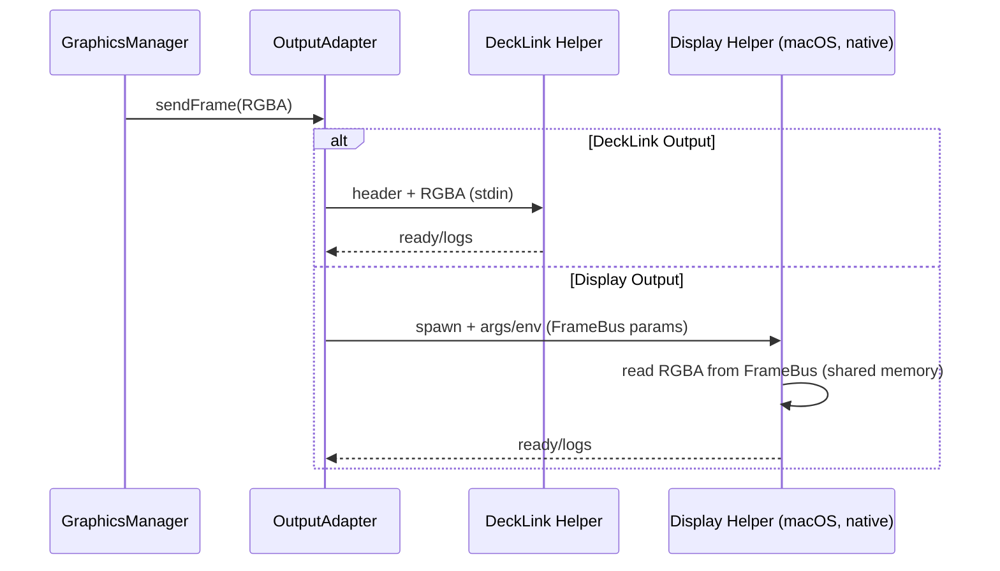

# Bridge Subsystem – Output Adapter & Helper

## Zweck
Dieses Subsystem nimmt RGBA‑Frames entgegen und liefert sie an die jeweilige Ausgabe. Für DeckLink erfolgt dies über einen nativen Helper‑Prozess (stdin-Streaming), für Display‑Outputs über einen nativen C++/SDL2‑Helper via FrameBus (aktuell nur macOS).

## Verantwortlichkeiten
- Auswahl des Output‑Adapters (Key/Fill, Split, Video, Stub)
- Start/Stop von Helper‑Prozessen
- Streaming von Frames mit Header‑Protokoll (DeckLink)
- FrameBus-basierter Display-Output (nativer Helper)
- Validierung von Port‑IDs und Output‑Konfiguration
- Handshake + Diagnostics für Display‑Output Helper

## Hauptkomponenten
- Adapter Interface: `apps/bridge/src/services/graphics/output-adapter.ts`
- DeckLink Video: `apps/bridge/src/services/graphics/output-adapters/decklink-video-output-adapter.ts`
- DeckLink Key/Fill: `apps/bridge/src/services/graphics/output-adapters/decklink-key-fill-output-adapter.ts`
- DeckLink Split: `apps/bridge/src/services/graphics/output-adapters/decklink-split-output-adapter.ts`
- Display Output: `apps/bridge/src/services/graphics/output-adapters/display-output-adapter.ts`
- Stub: `apps/bridge/src/services/graphics/output-adapters/stub-output-adapter.ts`
- Helper Resolve: `apps/bridge/src/modules/decklink/decklink-helper.ts`
- Display Helper Resolve: `apps/bridge/src/modules/display/display-helper.ts`
- Native Display Helper (macOS): `apps/bridge/native/display-helper/src/display-helper.cpp`

## Ablauf (Mermaid)

```mermaid
sequenceDiagram
  participant GM as GraphicsManager
  participant OA as OutputAdapter
  participant DH as DeckLink Helper
  participant EH as Display Helper (macOS, native)

  GM->>OA: sendFrame(RGBA)
  alt DeckLink Output
    OA->>DH: header + RGBA (stdin)
    DH-->>OA: ready/logs
  else Display Output
    OA->>EH: spawn + args/env (FrameBus params)
    EH->>EH: read RGBA from FrameBus (shared memory)
    EH-->>OA: ready/logs
  end
```

## Plattformstatus (Display Output)
- **macOS:** Unterstützt (nativer `display-helper`, SDL2, FrameBus)
- **Windows:** Noch nicht implementiert (Display-Detection und nativer Display-Helper fehlen im produktiven Pfad)
- **Linux:** Nicht implementiert

## Security‑Hinweise
- Helper‑Binary wird per Pfad‑Check (`X_OK`) validiert.
- Keine Shell‑Execution; feste Argumente.
- Frame‑Payloads sind lokal und nicht extern exponiert.
- Display‑Helper nutzt festen Binary-Pfad (Override via `BRIDGE_DISPLAY_HELPER_PATH`) und whitelisted Env‑Variablen.

## Fehlerbilder
- Helper nicht vorhanden/kein Execute‑Bit → configure() Fehler
- Port‑ID ungültig → parseDecklinkPortId() Fehler
- Helper exit vor Ready → configure() schlägt fehl
- Display‑Output auf nicht-macOS → `Display output is only supported on macOS`
- Display‑Helper fehlt/nicht ausführbar → configure() Fehler
- `BRIDGE_FRAMEBUS_NAME` fehlt → configure() Fehler

## Relevante Dateien
- `apps/bridge/src/services/graphics/output-adapter.ts`
- `apps/bridge/src/services/graphics/output-adapters/*`
- `apps/bridge/src/modules/decklink/decklink-helper.ts`
- `apps/bridge/native/decklink-helper/src/decklink-helper.cpp`
- `apps/bridge/src/services/graphics/output-adapters/display-output-adapter.ts`
- `apps/bridge/src/modules/display/display-helper.ts`
- `apps/bridge/native/display-helper/src/display-helper.cpp`
