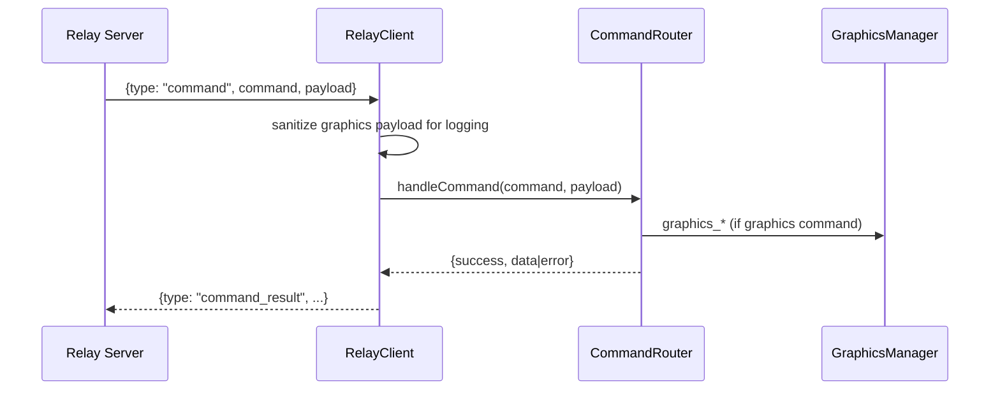

# Bridge Subsystem – Relay & Command Router

## Zweck
Dieses Subsystem nimmt Commands aus dem Relay (WebSocket) entgegen, protokolliert sie und dispatcht sie an die internen Services. Es ist der Haupt‑Einstiegspunkt für `graphics_*` Commands.

## Verantwortlichkeiten
- WebSocket‑Verbindung zum Relay (Outbound)
- Empfang, Parsing und Fehlerbehandlung von Relay‑Messages
- Logging (inkl. Sanitizing für Graphics‑Payloads)
- Dispatch auf den Command Router
- Einheitliches Command‑Result an den Relay zurücksenden

## Hauptkomponenten
- `apps/bridge/src/services/relay-client.ts`
- `apps/bridge/src/services/command-router.ts`
- `apps/bridge/src/services/relay-command-schemas.ts`

## Ablauf (Mermaid)

## Security & Risiken
- **Untrusted Payloads:** Relay ist extern. Payloads werden downstream via Zod validiert
  (non-graphics im `CommandRouter`, graphics im `GraphicsManager`).
- **Signatur:** Commands sind signiert; Bridge verifiziert Signatur, TTL und Replay‑Schutz.
- **Transport:** Relay‑Verbindung ist WebSocket; Reconnect mit Backoff.
- **Pairing:** `bridge_pair_validate` prüft Code + Ablaufzeit aus dem Bridge‑Context (keine Secrets loggen).

## Fehlerbehandlung
- JSON Parse Errors werden geloggt und verworfen.
- Unbekannte Message‑Types führen zu Warnungen.
- Command‑Errors führen zu `command_result` mit `success=false`.

## Relevante Commands (Auszug)
- `bridge_pair_validate`
- `graphics_configure_outputs`
- `graphics_send`
- `graphics_update_values`
- `graphics_update_layout`
- `graphics_remove`
- `graphics_remove_preset`
- `graphics_list`

## Relevante Dateien
- `apps/bridge/src/services/relay-client.ts`
- `apps/bridge/src/services/command-router.ts`
