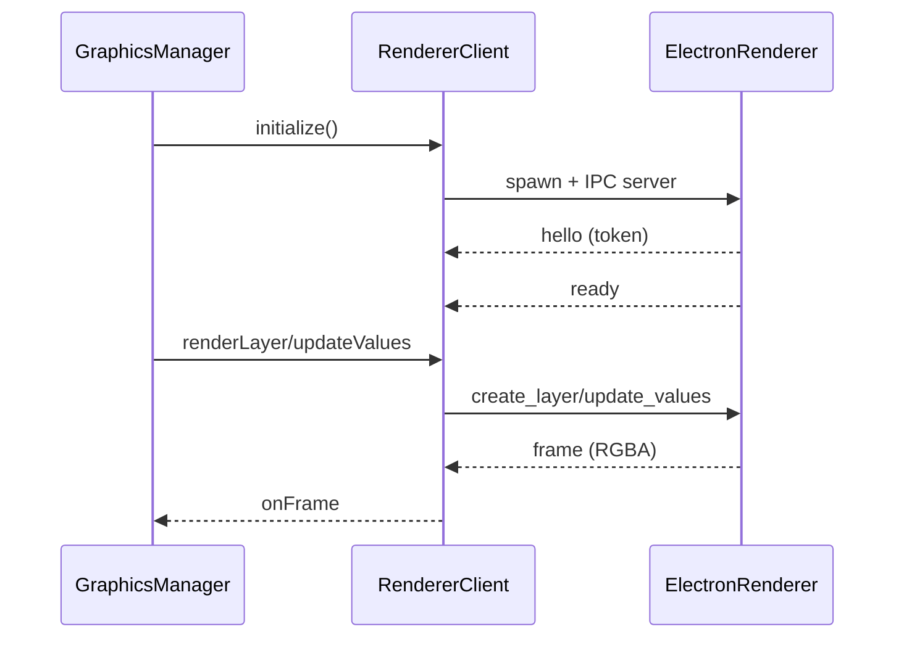

# Bridge Subsystem – Renderer & IPC

## Zweck
Dieses Subsystem rendert HTML/CSS‑Templates in einem separaten Electron‑Offscreen‑Prozess und liefert RGBA‑Frames zurück an die Bridge. Die Kommunikation erfolgt über lokale TCP‑IPC mit Token‑Handshake.

## Verantwortlichkeiten
- Start/Shutdown des Renderer‑Prozesses
- IPC‑Handshake und Nachrichten‑Protokoll
- Offscreen‑Rendering pro Layer (BrowserWindow)
- Frame‑Capture und Rückgabe an die Bridge

## Hauptkomponenten
- Renderer Client (Bridge): `apps/bridge/src/services/graphics/renderer/electron-renderer-client.ts`
- Renderer Entry (Electron): `apps/bridge/src/services/graphics/renderer/electron-renderer-entry.ts`
- Renderer Interface: `apps/bridge/src/services/graphics/renderer/graphics-renderer.ts`
- Animation CSS: `apps/bridge/src/services/graphics/renderer/animation-css.ts`

## IPC‑Protokoll (High‑Level)
- Transport: TCP, gebunden an `127.0.0.1`
- Auth: Token‑Handshake (Bridge generiert Token, Renderer bestätigt)
- Nachrichten: JSON‑Header + optionaler Binary‑Payload

### Commands (Bridge → Renderer)
- `set_assets`
- `create_layer`
- `update_values`
- `update_layout`
- `remove_layer`
- `shutdown`

### Events (Renderer → Bridge)
- `ready`
- `frame` (RGBA‑Buffer)
- `error`

## Ablauf (Mermaid)

## Security‑Hinweise
- IPC ist lokal (`127.0.0.1`) und token‑authentifiziert.
- Payload‑Limits schützen vor Speicher‑Missbrauch.
- Renderer‑BrowserWindow mit `sandbox: true`, `contextIsolation: true`, `nodeIntegration: false`.

## Fehlerbilder
- Renderer Entry nicht gefunden → Initialisierung schlägt fehl, Stub‑Renderer fallback.
- Token‑Mismatch → IPC wird verworfen.
- Buffer‑Mismatch → Frame wird verworfen.

## IPC‑Framing (Detail)
- 4‑Byte Big‑Endian Header‑Length\n
- JSON‑Header enthält `type`, `token`, optional `bufferLength` + Metadaten\n
- Danach optionaler Binary‑Payload (`bufferLength` Bytes)\n
- Limits: Header 64KB, Payload 64MB, Max Frame Dimension 8192px

## Startparameter (Renderer‑Process)
- CLI: `--graphics-renderer --renderer-entry <path>`\n
- Env: `BRIDGE_GRAPHICS_IPC_PORT`, `BRIDGE_GRAPHICS_IPC_TOKEN`

## Relevante Dateien
- `apps/bridge/src/services/graphics/renderer/electron-renderer-client.ts`
- `apps/bridge/src/services/graphics/renderer/electron-renderer-entry.ts`
- `apps/bridge/src/services/graphics/renderer/graphics-renderer.ts`
- `apps/bridge/src/services/graphics/renderer/animation-css.ts`
