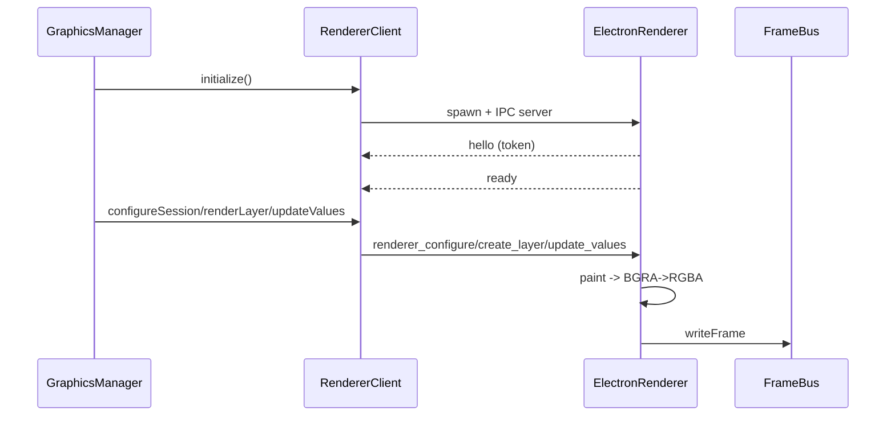

# Bridge Subsystem – Renderer & IPC

## Zweck
Dieses Subsystem steuert das Rendering von HTML/CSS‑Templates in einem separaten Electron‑Offscreen‑Prozess. Die Kommunikation erfolgt über lokale TCP‑IPC mit Token‑Handshake (Control-Plane). Der Frame-Transport läuft über FrameBus (Data-Plane).

## Verantwortlichkeiten
- Start/Shutdown des Renderer‑Prozesses
- IPC‑Handshake und Nachrichten‑Protokoll
- Renderer-Session-Konfiguration (`renderer_configure`)
- Offscreen‑Rendering im Single-Window-Modell
- Begrenzte Runtime-Recovery nach Renderer-Absturz ohne Engine-/ATEM-Neustart

## Hauptkomponenten
- Renderer Client (Bridge): `apps/bridge/src/services/graphics/renderer/electron-renderer-client.ts`
- Renderer Entry (Electron): `apps/bridge/src/services/graphics/renderer/electron-renderer-entry.ts`
- Renderer Interface: `apps/bridge/src/services/graphics/renderer/graphics-renderer.ts`
- IPC Framing: `apps/bridge/src/services/graphics/renderer/renderer-ipc-framing.ts`
- Animation CSS: `apps/bridge/src/services/graphics/renderer/animation-css.ts`

## IPC‑Protokoll (High‑Level)
- Transport: TCP, gebunden an `127.0.0.1`
- Auth: Token‑Handshake (Bridge generiert Token, Renderer bestätigt)
- Nachrichten: JSON‑Header + optionaler Binary‑Payload

### Commands (Bridge → Renderer)
- `renderer_configure`
- `set_assets`
- `create_layer`
- `update_values`
- `update_layout`
- `remove_layer`
- `shutdown`

### Events (Renderer → Bridge)
- `hello`
- `ready`
- `error`

## Ablauf (Mermaid)

```mermaid
sequenceDiagram
  participant GM as GraphicsManager
  participant RC as RendererClient
  participant ER as ElectronRenderer

  GM->>RC: initialize()
  RC->>ER: spawn + IPC server
  ER-->>RC: hello (token)
  ER-->>RC: ready

  GM->>RC: configureSession/renderLayer/updateValues
  RC->>ER: renderer_configure/create_layer/update_values
  ER->>ER: paint -> BGRA->RGBA
  ER->>FrameBus: writeFrame
```

## Security‑Hinweise
- IPC ist lokal (`127.0.0.1`) und token‑authentifiziert.
- Payload‑Limits schützen vor Speicher‑Missbrauch.
- Renderer‑BrowserWindow mit `sandbox: true`, `contextIsolation: true`, `nodeIntegration: false`.

## Fehlerbilder
- Renderer Entry nicht gefunden → Initialisierung schlägt fehl, Stub‑Renderer fallback.
- Token‑Mismatch → IPC wird verworfen.
- Unerwartete Frame-Payload via IPC → wird verworfen (Frames sind FrameBus-only).
- Abnormaler Renderer-Exit → maximal zwei automatische Recovery-Versuche in 5 Minuten.
- Zweiter Recovery-Versuch startet mit deaktivierter GPU, sofern `BRIDGE_GRAPHICS_AUTO_GPU_FALLBACK` nicht `0` ist.
- Nach ausgeschöpftem Limit wechselt Graphics in `degraded`; Engine-/ATEM-Routen bleiben verfügbar.

## Runtime-Recovery
- Der Graphics-Renderer nutzt ein eigenes Electron-Profil: `userData/graphics-renderer-profile`.
- Recovery löscht nur volatile Renderer-Cache-Pfade innerhalb dieses Profils (`GPUCache`, `Code Cache`, `DawnGraphiteCache`, `DawnWebGPUCache`, Shader-Caches).
- Reihenfolge: Renderer-Prozess beendet sich → IPC-Server schließt → Cache-Cleanup → Renderer-Restart → Assets, Session und aktive Layer werden erneut gesendet.
- Recovery-Logs enthalten `recoveryId`, `reason`, `attempt`, `gpuDisabled`, Cleanup-Pfade und Restart-Ergebnis.
- Lifecycle-State: `ready`, `recovering`, `gpu_fallback`, `degraded`.

## IPC‑Framing (Detail)
- 4‑Byte Big‑Endian Header‑Length\n
- JSON‑Header enthält `type`, `token`, optional `bufferLength` + Metadaten\n
- Danach optionaler Binary‑Payload (`bufferLength` Bytes)\n
- Limits: Header 64KB, Payload 64MB, Max Frame Dimension 8192px

## Startparameter (Renderer‑Process)
- CLI: `--graphics-renderer --renderer-entry <path>`\n
- Env: `BRIDGE_GRAPHICS_IPC_PORT`, `BRIDGE_GRAPHICS_IPC_TOKEN`, `BRIDGE_GRAPHICS_USER_DATA_DIR`
- Session-Setup: `renderer_configure` enthält `framebusName`, `framebusSlotCount`, `framebusSize`, `pixelFormat`
- FrameBus-Namen im `ready`-ACK werden für den Vergleich kanonisiert: POSIX kann ein führendes `/`, Windows den Object-Namespace `Local\` oder `Global\` ergänzen. Alle übrigen Config-Metadaten und der kanonische Segmentname müssen weiterhin exakt zur ausstehenden Konfiguration passen.

## Relevante Dateien
- `apps/bridge/src/services/graphics/renderer/electron-renderer-client.ts`
- `apps/bridge/src/services/graphics/renderer/electron-renderer-entry.ts`
- `apps/bridge/src/services/graphics/renderer/graphics-renderer.ts`
- `apps/bridge/src/services/graphics/renderer/animation-css.ts`
