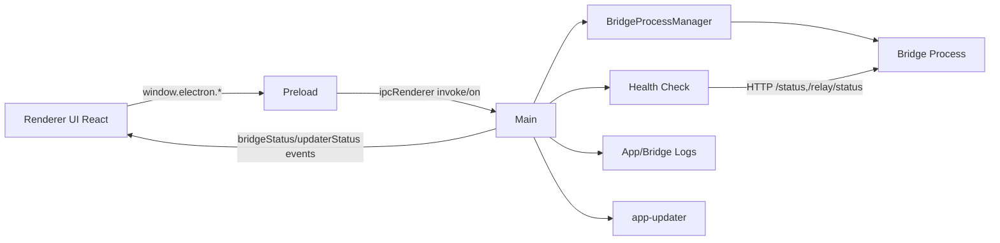

# Desktop App – Architektur & Struktur (Stufe 1)

## Checkliste Stufe 1
- [x] Kurzüberblick abgeschlossen
- [x] Architekturdiagramm verifiziert
- [x] Datenflüsse beschrieben
- [x] Security-Boundaries dokumentiert
- [x] Projektstruktur beschrieben

## Kurzüberblick
Die Desktop-App ist eine Electron-Anwendung, die die Bridge lokal startet/stoppt, Status/Logs anzeigt, Netzwerk-/Port-Optionen bereitstellt und Updater-Status verwaltet. Sie besteht aus Main Process, Preload und React-Renderer.

## Hauptkomponenten (Runtime)
- Main Process: App-Lifecycle, Fenster, IPC-Handlers, Bridge-Start/Stop, Updater
- Preload: sichere API-Expose via `contextBridge`
- Renderer UI: React UI, Hook-basierte State-Logik
- Bridge Process Manager: startet Bridge (dev: `npx tsx`, prod: `process.execPath` + `ELECTRON_RUN_AS_NODE=1`)
- Health/Status: Polling gegen `/status` und `/relay/status`
- Logs/Diagnostics: App-Logdatei + Bridge-Log-Proxy

## Architekturdiagramm (Mermaid)

## Zentrale Datenflüsse
### 1) Bridge Start/Stop
1. UI ruft `window.electron.bridgeStart(config)`.
2. Main validiert Terms-Akzeptanz und Bridge-Name.
3. Main erstellt Pairing-Code und resolved Host/Port-Binding.
4. Bridge Process wird gestartet, danach startet Health-Polling.
5. `bridgeStatus` Events werden an die UI gepusht.

### 2) Status & Logs
1. UI subscribed auf `bridgeStatus`.
2. Main sendet Status via `ipcWebContentsSend`.
3. Logs werden via `bridgeGetLogs`/`appGetLogs` geladen und optional geloescht.

### 3) Engine-Commands
1. Der Desktop-Main-/Preload-Slice kann Engine-Calls an die Bridge weiterreichen.
2. Die produktive Engine-Steuerung liegt jedoch in der WebApp; die Tray-UI ist bewusst **nicht** die zweite Engine-Konfigurationsoberflaeche.
3. Main führt die entsprechenden HTTP Requests an Bridge `/engine/*` aus, wenn dieser Pfad genutzt wird.

## Security-Boundaries
- Renderer ↔ Main: nur via Preload-API; Renderer nutzt keine Node-APIs.
- IPC-Sender-Validierung: `validateEventFrame` in `util.ts` blockiert untrusted Frames.
- Main ↔ Bridge: lokale HTTP-Calls mit Timeouts/AbortController.
- BrowserWindow: Preload gesetzt; `contextIsolation`/`nodeIntegration` werden nicht explizit ueberschrieben (Electron defaults).
- Pairing-Secret wird nicht per CLI, sondern per Env an Bridge uebergeben.

## Projektstruktur (relevant)
- Main: `src/electron/main.ts`
- Preload: `src/electron/preload.cts`
- Services: `src/electron/services/*`
- UI: `src/ui/*`

## Offene Punkte
- IPC-Vertragsdrift zwischen Preload- und Main-Signaturen periodisch pruefen
- Detaillierte Betriebsdoku fuer Dev/Packaged (inkl. Env-Ladepfade) weiter ausbauen
