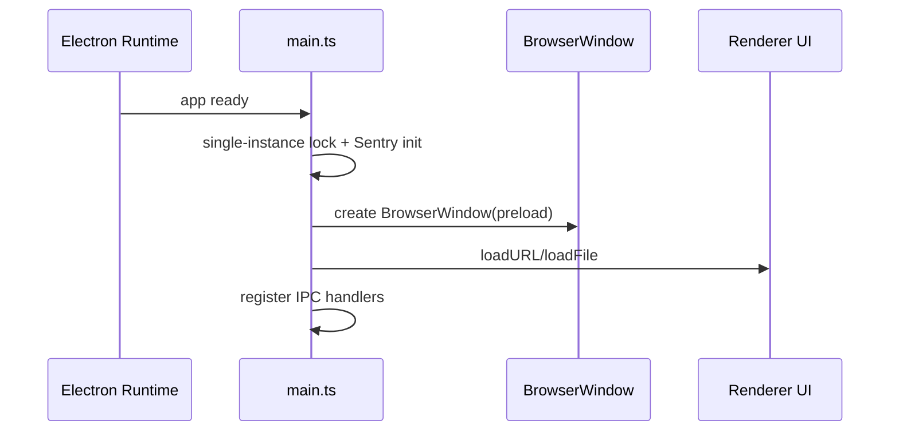
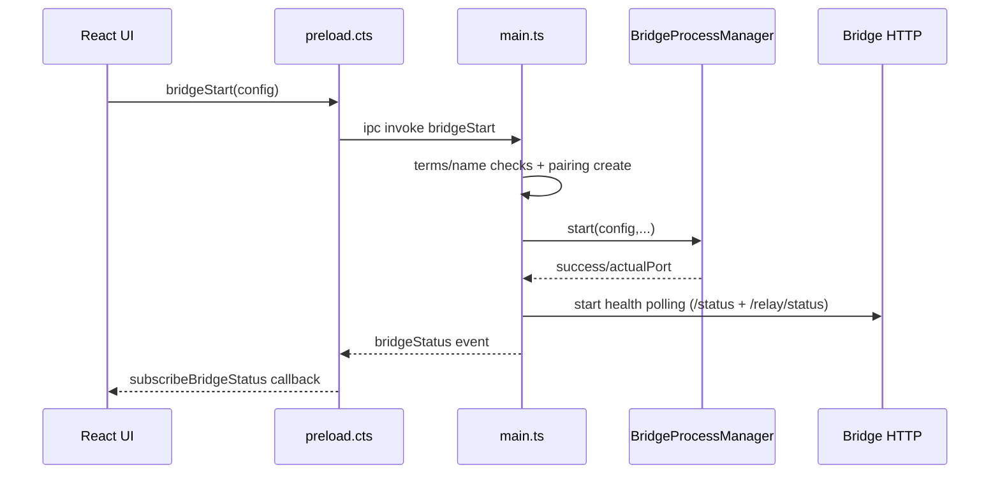
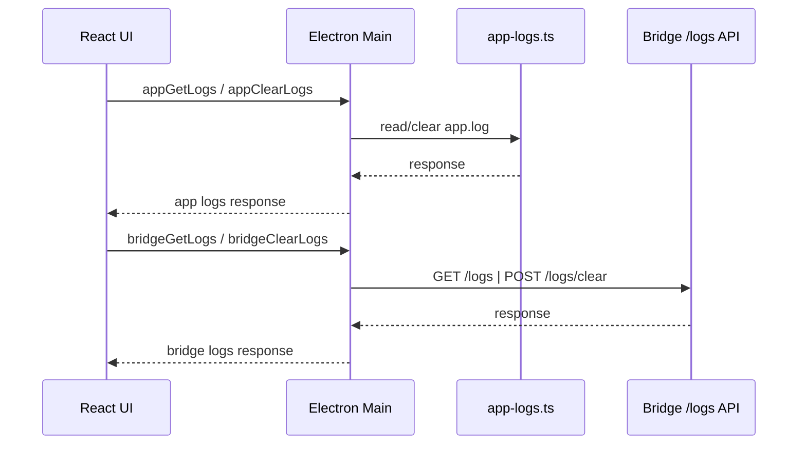
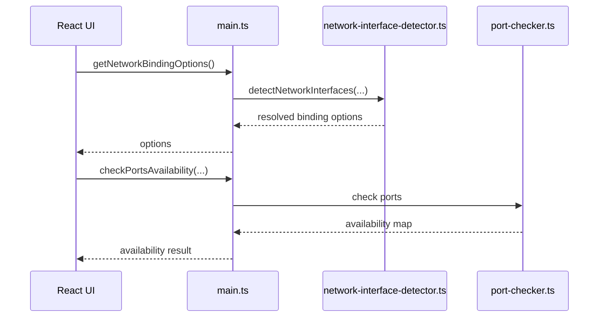
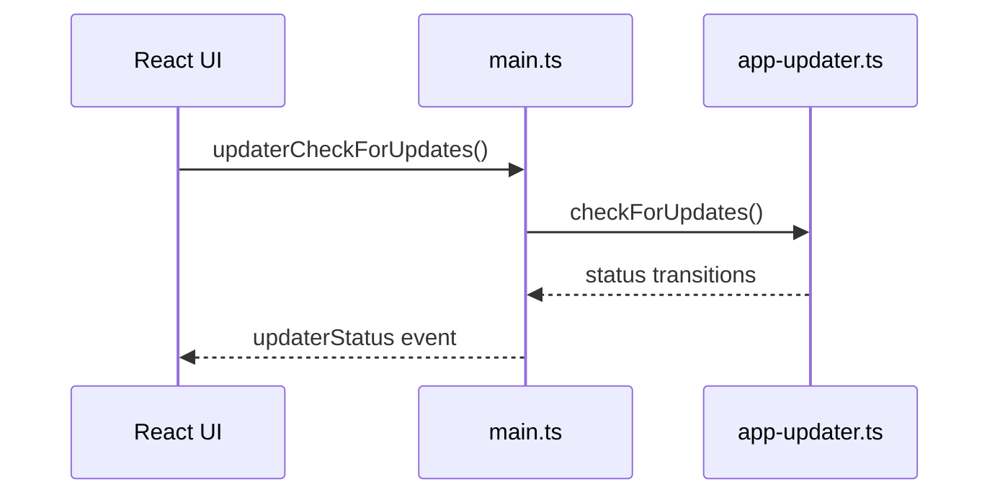

# Desktop App – Dataflows (Aktueller Stand)

## Zweck
Diese Datei beschreibt die aktuellen End-to-End Flows der Electron Desktop App (Renderer, Preload, Main, Bridge).

## 1) App-Startup und Main-Initialisierung

Wesentliche Punkte:
- `main.ts` hat einen separaten Aux-Mode fuer `--graphics-renderer` (Renderer-Subprozess).
- Desktop-Hauptprozess verwendet Single-Instance-Lock und fokussiert existierende Fenster bei Zweitstart.

## 2) Bridge Start -> Health -> Status Events

Wesentliche Punkte:
- Terms-Akzeptanz und Bridge-Name werden im Main Process erzwungen.
- Pairing-Code wird pro Start erzeugt und als Status-Info an UI uebergeben.
- Bei Host `0.0.0.0` werden lokale HTTP-Checks gegen `127.0.0.1` ausgefuehrt.

## 3) Logs & Diagnose

Wesentliche Punkte:
- App-Logs liegen unter `userData/logs/app.log`.
- In Production schreibt der Bridge-Spawn-Pfad zusaetzlich `bridge-process.log`.

## 4) Port-/Netzwerk-Flow

## 5) Updater-Flow (electron-updater)

Wesentliche Punkte:
- Auto-Update ist in Dev deaktiviert und wird nur in unterstuetzten packaged Setups aktiviert.
- Status wird als Snapshot + Event-Stream (`subscribeUpdaterStatus`) bereitgestellt.
