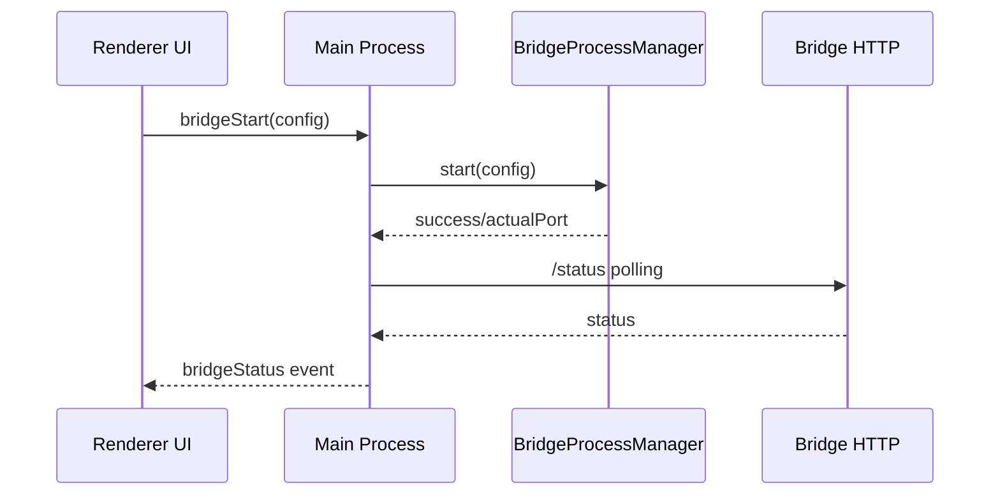

# Desktop Subsystem – Bridge Integration

## Zweck
Beschreibt wie die Desktop‑App die Bridge startet, überwacht und anspricht.

## Ablauf (Mermaid)

## Komponenten
- `src/electron/services/bridge-process-manager.ts`
- `src/electron/services/bridge-health-check.ts`
- `src/electron/services/bridge-outputs.ts`

## Fehlerbilder
- Port belegt → autoFallback oder Fehler
- Bridge nicht erreichbar → Status `reachable=false`

## Relevante Dateien
- `src/electron/main.ts`
- `src/electron/services/bridge-process-manager.ts`
- `src/electron/services/bridge-health-check.ts`
