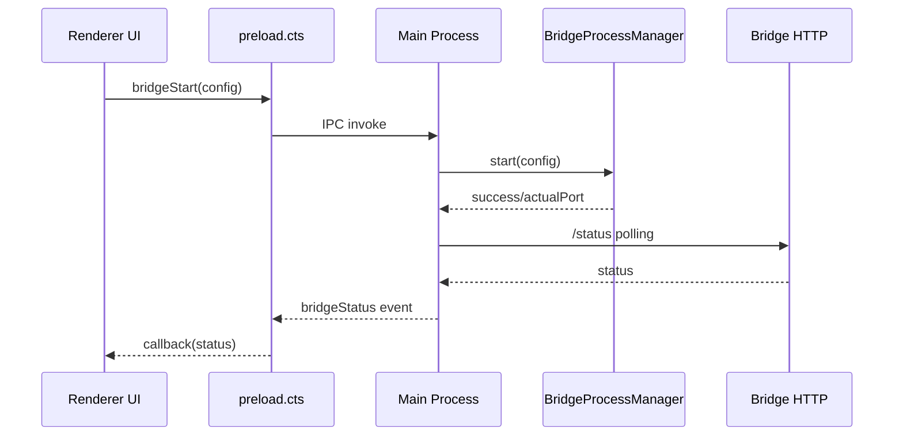

# Desktop Subsystem – Bridge Integration

## Zweck
Beschreibt wie die Desktop‑App die Bridge startet, überwacht und anspricht.

## Ablauf (Mermaid)

```mermaid
sequenceDiagram
  participant UI as Renderer UI
  participant Preload as preload.cts
  participant Main as Main Process
  participant BPM as BridgeProcessManager
  participant Bridge as Bridge HTTP

  UI->>Preload: bridgeStart(config)
  Preload->>Main: IPC invoke
  Main->>BPM: start(config)
  BPM-->>Main: success/actualPort
  Main->>Bridge: /status polling
  Bridge-->>Main: status
  Main-->>Preload: bridgeStatus event
  Preload-->>UI: callback(status)
```

## Komponenten
- `src/electron/services/bridge-process-manager.ts`
- `src/electron/services/bridge-health-check.ts`
- `src/electron/services/bridge-outputs.ts`
- `src/electron/services/bridge-profile.ts`
- `src/electron/services/bridge-pairing.ts`

## Hinweise
- Bridge-Start wird nur erlaubt, wenn Terms akzeptiert und Bridge-Name gesetzt sind.
- Der Main‑Process erzeugt einen Pairing‑Code pro Start und gibt ihn per Env‑Var an die Bridge weiter.
- Pairing-Informationen werden in `bridgeStatus` vom Main Process angereichert.
- Relay wird beim Bridge‑Start (GUI) aktiviert und beim Stop deaktiviert.
- Bei Health/Outputs Requests wird `0.0.0.0` intern auf `127.0.0.1` gemappt.

## Fehlerbilder
- Port belegt → autoFallback oder Fehler
- Bridge nicht erreichbar → Status `reachable=false`
- Terms/Name fehlen → Start wird vor Spawn abgelehnt
- Bridge‑Name fehlt → Start wird abgelehnt

## Relevante Dateien
- `src/electron/main.ts`
- `src/electron/services/bridge-process-manager.ts`
- `src/electron/services/bridge-health-check.ts`
