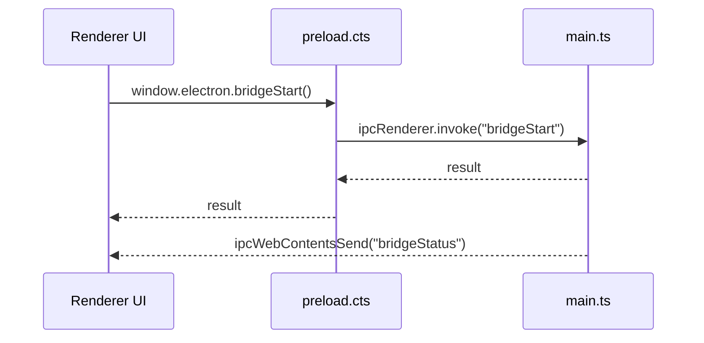

# Desktop Subsystem – IPC Flow

## Zweck
Beschreibt den IPC‑Flow zwischen Renderer → Preload → Main und die wichtigsten Channels.

## Ablauf (Mermaid)

## Channels (Auszug)
- `bridgeGetProfile`, `bridgeSetName`
- `bridgeStart`, `bridgeStop`, `bridgeGetStatus`
- `bridgeGetOutputs`, `bridgeGetLogs`, `bridgeClearLogs`
- `engineConnect`, `engineDisconnect`, `engineGetStatus`, `engineRunMacro`
- `checkPortAvailability`, `checkPortsAvailability`

## Security
- Nur whitelisted Channels werden exposed.
- Renderer hat keinen Node‑Zugriff.

## Relevante Dateien
- `src/electron/preload.cts`
- `src/electron/main.ts`
- `src/electron/types.ts`
