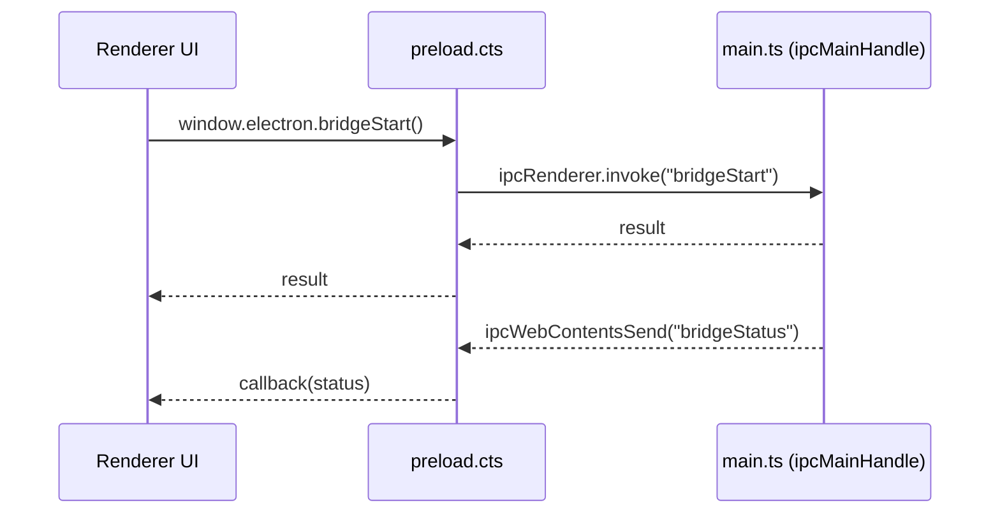

# Desktop Subsystem – IPC Flow

## Zweck
Beschreibt den IPC‑Flow zwischen Renderer → Preload → Main und die wichtigsten Channels.

## Ablauf (Mermaid)

```mermaid
sequenceDiagram
  participant UI as Renderer UI
  participant Preload as preload.cts
  participant Main as main.ts (ipcMainHandle)

  UI->>Preload: window.electron.bridgeStart()
  Preload->>Main: ipcRenderer.invoke("bridgeStart")
  Main-->>Preload: result
  Preload-->>UI: result

  Main-->>Preload: ipcWebContentsSend("bridgeStatus")
  Preload-->>UI: callback(status)
```

## Channels (Auszug)
- `appGetVersion`
- `bridgeGetProfile`, `bridgeAcceptTerms`, `bridgeSetName`
- `bridgeStart`, `bridgeStop`, `bridgeGetStatus`
- `getNetworkConfig`, `detectNetworkInterfaces`, `getNetworkBindingOptions`
- `bridgeGetOutputs`, `bridgeGetLogs`, `bridgeClearLogs`
- `appGetLogs`, `appClearLogs`
- `updaterGetStatus`, `updaterCheckForUpdates`, `updaterDownloadUpdate`, `updaterQuitAndInstall`
- `engineConnect`, `engineDisconnect`, `engineGetStatus`, `engineGetMacros`, `engineRunMacro`, `engineStopMacro`
- `checkPortAvailability`, `checkPortsAvailability`
- `openExternal`
- Events: `bridgeStatus`, `updaterStatus`

Hinweis:

- Die Tray-UI nutzt diese Engine-Channels nicht als eigene konkurrierende Steuerebene; die Engine-Bedienung bleibt in der WebApp zentralisiert.

## Security
- Nur whitelisted Channels werden exposed.
- Renderer hat keinen Node‑Zugriff.
- Main validiert Sender-Frames (`validateEventFrame`) vor Handler-Ausfuehrung.

## Relevante Dateien
- `src/electron/preload.cts`
- `src/electron/main.ts`
- `src/electron/types.ts`
