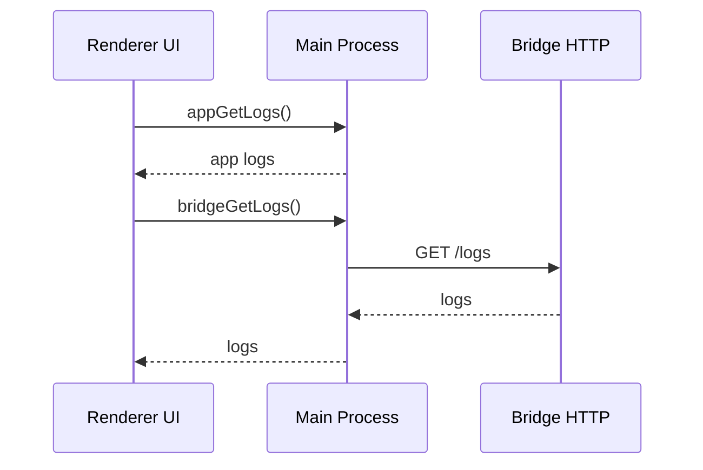

# Desktop Subsystem – Logging & Diagnostics

## Zweck
Beschreibt Logging‑Pfad und Log‑Abruf für App und Bridge.

## Ablauf (Mermaid)

## Komponenten
- `src/electron/services/app-logger.ts`
- `src/electron/services/app-logs.ts`
- `src/electron/services/bridge-logs.ts`

## Relevante Dateien
- `src/electron/services/app-logger.ts`
- `src/electron/services/app-logs.ts`
- `src/electron/services/bridge-logs.ts`
