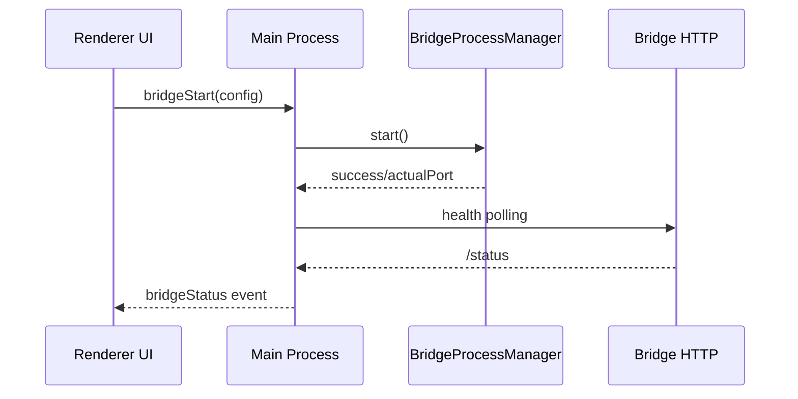

# Desktop Subsystem – Main Process

## Zweck
Der Main‑Process steuert App‑Lifecycle, Fenster, IPC‑Handlers sowie Start/Stop der Bridge. Er orchestriert Health‑Checks und stellt der UI Status/Logs bereit.

## Verantwortlichkeiten
- Fenster‑Lifecycle (BrowserWindow)
- Bridge‑Prozess starten/stoppen
- Health‑Check‑Polling und Status‑Broadcast
- IPC‑Handlers für UI‑Actions
- Netzwerk‑Konfiguration laden
- Bridge‑Profil (Name) und Pairing‑Code verwalten

## Hauptkomponenten
- `src/electron/main.ts`
- `src/electron/services/bridge-process-manager.ts`
- `src/electron/services/bridge-health-check.ts`
- `src/electron/services/bridge-outputs.ts`
- `src/electron/services/bridge-logs.ts`
- `src/electron/services/app-logs.ts`
- `src/electron/services/app-logger.ts`
- `src/electron/services/port-checker.ts`
- `src/electron/services/network-interface-detector.ts`
- `src/electron/services/bridge-profile.ts`
- `src/electron/services/bridge-pairing.ts`

## Ablauf (Mermaid)

## Security‑Hinweise
- IPC‑Handler sind die einzige Brücke vom Renderer.
- Bridge‑API wird lokal via HTTP angesprochen.
- BrowserWindow‑Security‑Flags prüfen (Sandbox/Isolation).
- Pairing‑Code wird nicht über CLI‑Args, sondern via Env‑Vars an die Bridge übergeben.

## Relevante Dateien
- `src/electron/main.ts`
- `src/electron/services/bridge-process-manager.ts`
- `src/electron/services/bridge-health-check.ts`
