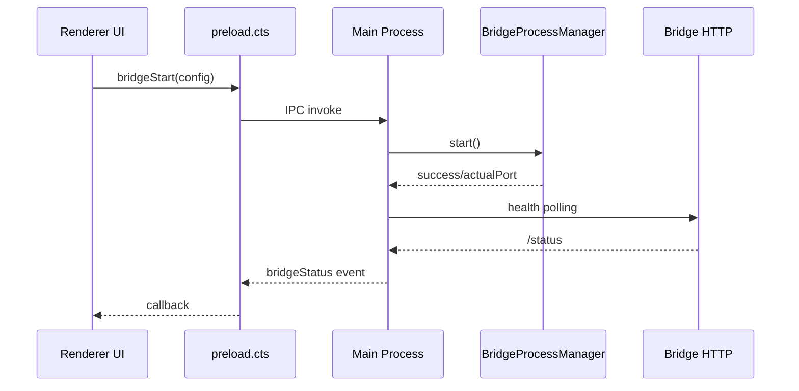

# Desktop Subsystem – Main Process

## Zweck
Der Main‑Process steuert App‑Lifecycle, Fenster, IPC‑Handlers sowie Start/Stop der Bridge. Er orchestriert Health‑Checks, Logs und Updater-Status fuer die UI.

## Verantwortlichkeiten
- Fenster‑Lifecycle (BrowserWindow)
- Single-Instance Lock + Fokus-Handling bei Zweitstart
- Bridge‑Prozess starten/stoppen
- Health‑Check‑Polling und Status‑Broadcast
- IPC‑Handlers für UI‑Actions
- Netzwerk‑Konfiguration laden
- Bridge‑Profil (Name) und Pairing‑Code verwalten
- App-Updater steuern (Check, Download, Install)
- Renderer-Aux-Mode fuer `--graphics-renderer` bootstrappen

## Hauptkomponenten
- `src/electron/main.ts`
- `src/electron/services/bridge-process-manager.ts`
- `src/electron/services/bridge-health-check.ts`
- `src/electron/services/bridge-outputs.ts`
- `src/electron/services/bridge-logs.ts`
- `src/electron/services/app-logs.ts`
- `src/electron/services/app-logger.ts`
- `src/electron/services/port-checker.ts`
- `src/electron/services/network-interface-detector.ts`
- `src/electron/services/bridge-profile.ts`
- `src/electron/services/bridge-pairing.ts`
- `src/electron/services/app-updater.ts`

## Ablauf (Mermaid)

```mermaid
sequenceDiagram
  participant UI as Renderer UI
  participant Preload as preload.cts
  participant Main as Main Process
  participant BPM as BridgeProcessManager
  participant Bridge as Bridge HTTP

  UI->>Preload: bridgeStart(config)
  Preload->>Main: IPC invoke
  Main->>BPM: start()
  BPM-->>Main: success/actualPort
  Main->>Bridge: health polling
  Bridge-->>Main: /status
  Main-->>Preload: bridgeStatus event
  Preload-->>UI: callback
```

## Security‑Hinweise
- IPC‑Handler sind die einzige Brücke vom Renderer.
- IPC Sender Frames werden via `validateEventFrame` verifiziert.
- Bridge‑API wird lokal via HTTP angesprochen.
- BrowserWindow setzt Preload explizit; Security-defaults bleiben aktiv, da Flags nicht gelockert werden.
- Pairing‑Code wird nicht über CLI‑Args, sondern via Env‑Vars an die Bridge übergeben.
- Relay wird beim Bridge‑Start (GUI) aktiviert und beim Stop deaktiviert.
- Bridge-Start wird im Main Process durch Terms-Akzeptanz + Bridge-Name gate-kept.

## Relevante Dateien
- `src/electron/main.ts`
- `src/electron/services/bridge-process-manager.ts`
- `src/electron/services/bridge-health-check.ts`
