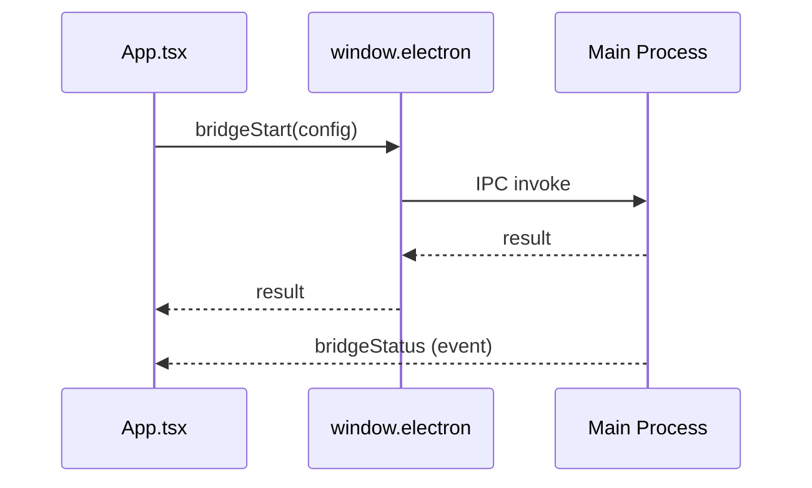

# Desktop Subsystem – Renderer UI

## Zweck
Die Renderer‑UI ist die React‑basierte Oberfläche zur Konfiguration und Steuerung der Bridge.

## Verantwortlichkeiten
- UI‑State (Network, Ports, Bridge‑Status)
- Start/Stop‑Flows
- Darstellung von Logs/Status/Fehlern

## Hauptkomponenten
- `src/ui/App.tsx`
- `src/ui/hooks/*`
- `src/ui/components/*`
- `src/ui/utils/*`

## Ablauf (Mermaid)

## Relevante Dateien
- `src/ui/App.tsx`
- `src/ui/hooks/use-bridge-status.ts`
- `src/ui/components/BridgeControlButton.tsx`
