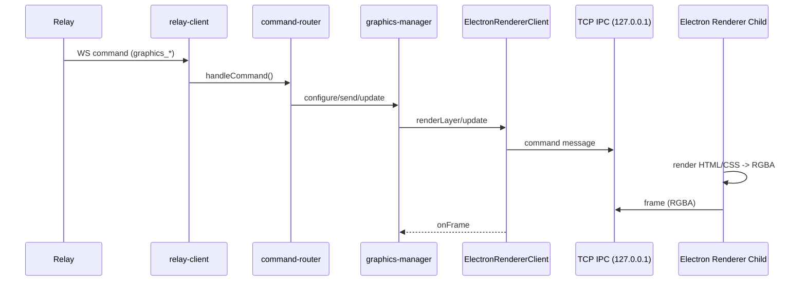

# Bridge Production Dataflow (Graphics)

## Ziel

Zeigt, welche Daten in der Production-Bridge ankommen, wo sie verarbeitet werden (Dateien/Funktionen) und wie Frames an Ausgabegeraete gesendet werden.

## Eingehende Daten (Production)

### 1) Relay Commands (WebApp -> Relay -> Bridge)

**Payload** (WebApp):
```json
{ "bridgeId": "...", "command": "graphics_*", "payload": { } }
```

**Bridge Empfang**:
- `apps/bridge/src/services/relay-client.ts` -> `handleCommand()`
- `apps/bridge/src/services/command-router.ts` -> `handleCommand()`

### 2) Graphics Command Payloads

**graphics_configure_outputs**
- Datei: `apps/bridge/src/services/command-router.ts`
- Weitergabe: `graphicsManager.configureOutputs(payload)`
- Validierung: `apps/bridge/src/services/graphics/graphics-schemas.ts`

**graphics_send / graphics_update_values / graphics_update_layout / graphics_remove / graphics_list**
- Datei: `apps/bridge/src/services/command-router.ts`
- Weitergabe: `graphicsManager.*` in `apps/bridge/src/services/graphics/graphics-manager.ts`
- Validierung: `apps/bridge/src/services/graphics/graphics-schemas.ts`

## Verarbeitung in der Bridge (Graphics)

### 1) Zentrale Orchestrierung

- Datei: `apps/bridge/src/services/graphics/graphics-manager.ts`
- Funktionen:
  - `configureOutputs()`
  - `sendLayer()`
  - `updateValues()`
  - `updateLayout()`
  - `removeLayer()`
  - `getStatus()`

### 2) Asset Handling

- Datei: `apps/bridge/src/services/graphics/asset-registry.ts`
- Funktion: `storeAsset()`
- Persistenz: `userData/graphics-assets/`

### 3) Output Config Persistenz

- Datei: `apps/bridge/src/services/graphics/output-config-store.ts`
- Funktionen: `setConfig()`, `getConfig()`
- Persistenz: `userData/graphics/graphics-output.json`

### 4) Template Sanity/Security

- Datei: `apps/bridge/src/services/graphics/template-sanitizer.ts`
- Funktion: `validateTemplate()`
- Regeln: kein JS, keine externen URLs, nur `asset://`

## Rendering Dataflow



## Composite + Output

```mermaid
flowchart LR
  Layers[Layer Frames RGBA] --> Composite[compositeLayers()]
  Composite --> Output[output-adapter]
  Output --> Helper[DeckLink helper]
  Helper --> Device[SDI Device]
```

- Composite: `apps/bridge/src/services/graphics/composite.ts`
- Output Interface: `apps/bridge/src/services/graphics/output-adapter.ts`
- DeckLink Helper konvertiert RGBA -> YUV (v210) fuer `video_sdi`/`video_hdmi`.
- Key/Fill nutzt ARGB/BGRA und IDeckLinkKeyer.
- Aktuell: DeckLink Key&Fill, DeckLink Video (SDI/HDMI) + Stub Output
  - `apps/bridge/src/services/graphics/output-adapters/decklink-key-fill-output-adapter.ts`
  - `apps/bridge/src/services/graphics/output-adapters/decklink-video-output-adapter.ts`
  - `apps/bridge/src/services/graphics/output-adapters/stub-output-adapter.ts`
  - Native Helper: `apps/bridge/native/decklink-helper/src/decklink-helper.cpp`

## Endgeraete (Output)

- SDI wird ueber `output-adapter` + DeckLink Helper bedient.
- SDI Key&Fill ist ueber den DeckLink Adapter implementiert.
- `key_fill_ndi` ist aktuell Stub (kein NDI Output).

## Relevante Dateien (Kurz)

- `apps/bridge/src/services/relay-client.ts`
- `apps/bridge/src/services/command-router.ts`
- `apps/bridge/src/services/graphics/graphics-manager.ts`
- `apps/bridge/src/services/graphics/renderer/electron-renderer-client.ts`
- `apps/bridge/src/services/graphics/renderer/electron-renderer-entry.ts`
- `apps/bridge/src/services/graphics/output-adapter.ts`
