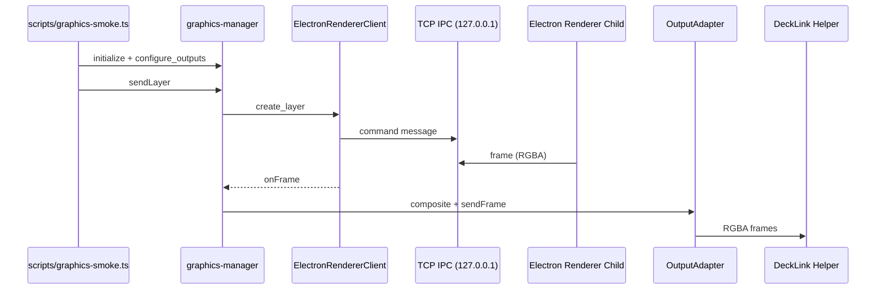
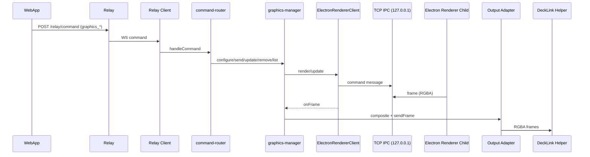
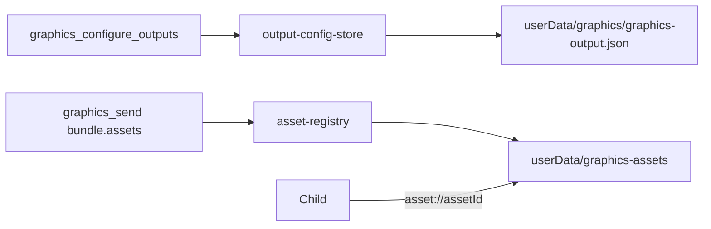

# Graphics Dataflow Overview (Compact)

## 1) Smoke Test Flow

Hinweis: Renderer liefert RGBA 8-bit; DeckLink Helper konvertiert nach YUV (v210) fuer `video_sdi`/`video_hdmi`.
IPC nutzt lokalen TCP Socket mit Token-Handshake.

## 2) Real Command Flow (WebApp -> Relay -> Bridge)

## 3) Persistenz + Assets (Kurz)

