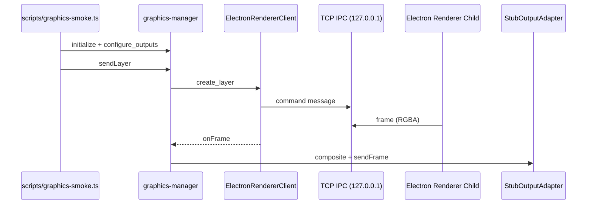
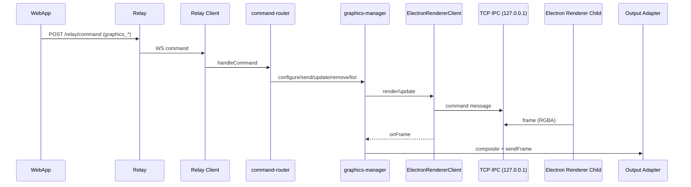
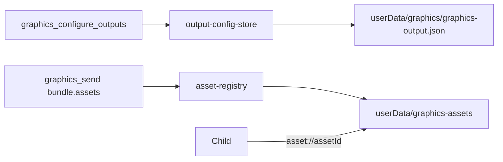

# Graphics Dataflow Overview (Compact)

## 1) Smoke Test Flow

```mermaid
sequenceDiagram
  participant Script as scripts/graphics-smoke.ts
  participant Graphics as graphics-manager
  participant Renderer as ElectronRendererClient
  participant IPC as TCP IPC (127.0.0.1)
  participant Child as Electron Renderer Child
  participant Output as StubOutputAdapter

  Script->>Graphics: initialize + configure_outputs
  Script->>Graphics: sendLayer
  Graphics->>Renderer: create_layer
  Renderer->>IPC: command message
  Child->>IPC: frame (RGBA)
  Renderer-->>Graphics: onFrame
  Graphics->>Output: composite + sendFrame
```

## 2) Real Command Flow (WebApp -> Relay -> Bridge)

```mermaid
sequenceDiagram
  participant WebApp as WebApp
  participant Relay as Relay
  participant Bridge as Relay Client
  participant Router as command-router
  participant Graphics as graphics-manager
  participant Renderer as ElectronRendererClient
  participant IPC as TCP IPC (127.0.0.1)
  participant Child as Electron Renderer Child
  participant Output as Output Adapter

  WebApp->>Relay: POST /relay/command (graphics_*)
  Relay->>Bridge: WS command
  Bridge->>Router: handleCommand
  Router->>Graphics: configure/send/update/remove/list
  Graphics->>Renderer: render/update
  Renderer->>IPC: command message
  Child->>IPC: frame (RGBA)
  Renderer-->>Graphics: onFrame
  Graphics->>Output: composite + sendFrame
```

## 3) Persistenz + Assets (Kurz)

```mermaid
flowchart LR
  Configure[graphics_configure_outputs]
  Configure --> Store[output-config-store]
  Store --> Disk[userData/graphics/graphics-output.json]

  Bundle[graphics_send bundle.assets]
  Bundle --> Assets[asset-registry]
  Assets --> DiskAssets[userData/graphics-assets]
  Child -->|asset://assetId| DiskAssets
```
