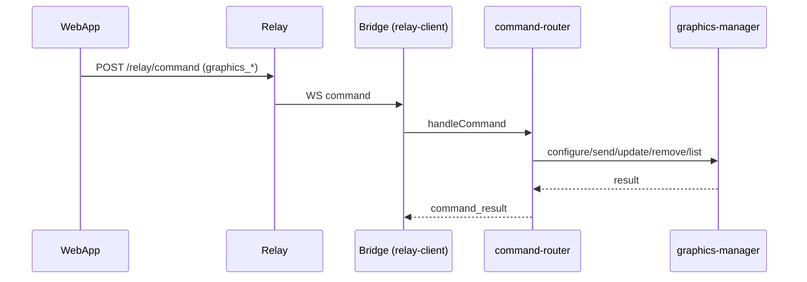
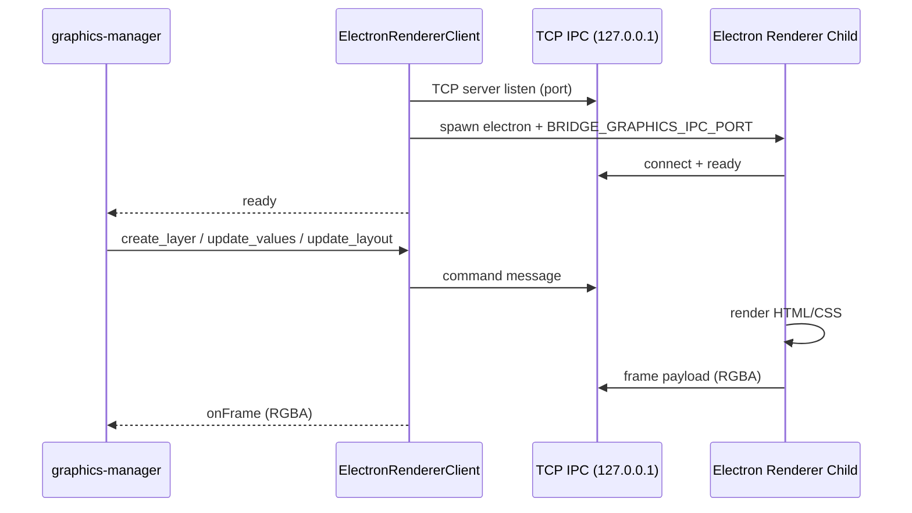
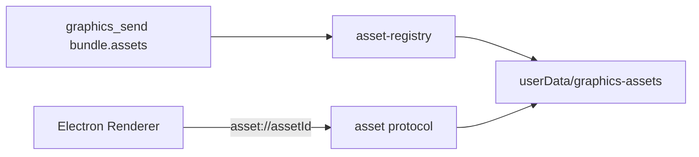
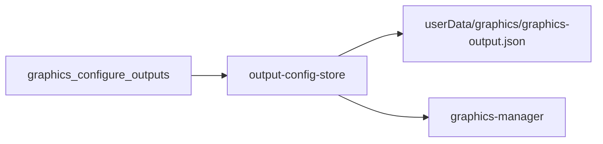
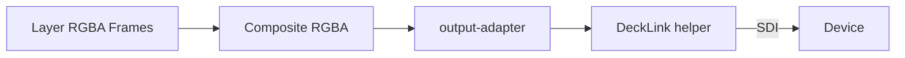

# Graphics Dataflows (Bridge)

## Ziel

Dieses Dokument beschreibt die internen Dataflows fuer Graphics in der Bridge (Command -> Rendering -> Output), inklusive Persistenz, Asset-Handling und IPC zwischen Bridge und Renderer.

## High-Level Flow

1. Relay empfängt `graphics_*` Command.
2. Bridge `command-router` validiert und routed an `graphics-manager`.
3. `graphics-manager` validiert Outputs/Layer, registriert Layer und triggert Rendering.
4. Offscreen Renderer (Electron Child) rendert HTML/CSS zu RGBA und sendet Frames via TCP IPC.
5. `graphics-manager` compositet Layer und liefert Frames an `output-adapter`
   (DeckLink Key&Fill, DeckLink Video oder Stub).

## Dataflows

### 1) Command Flow (Relay -> Bridge)

### 2) Renderer IPC Flow (Bridge <-> Electron Child)

### 3) Asset Flow (Base64 -> Disk -> asset://)

### 4) Output Config Persistenz

### 5) Composite + Output Tick

Hinweis:
- DeckLink Helper konvertiert RGBA -> YUV (v210) fuer `video_sdi`/`video_hdmi`.
- `key_fill_ndi` ist aktuell Stub (kein NDI Output).

## Security Hinweise

- Templates: kein JS, keine externen URLs, nur `asset://` erlaubt.
- Output Targets werden validiert gegen bekannte Devices/Ports.
- Renderer Child laeuft ohne Node Integration (sandboxed).

## Relevante Dateien

- `apps/bridge/src/services/graphics/graphics-manager.ts`
- `apps/bridge/src/services/graphics/renderer/electron-renderer-client.ts`
- `apps/bridge/src/services/graphics/renderer/electron-renderer-entry.ts`
- `apps/bridge/src/services/graphics/asset-registry.ts`
- `apps/bridge/src/services/graphics/output-config-store.ts`
- `apps/bridge/src/services/graphics/graphics-schemas.ts`
- `apps/bridge/src/services/graphics/output-adapter.ts`
- `apps/bridge/src/services/graphics/output-adapters/decklink-key-fill-output-adapter.ts`
- `apps/bridge/src/services/graphics/output-adapters/decklink-video-output-adapter.ts`
- `apps/bridge/src/services/graphics/output-adapters/stub-output-adapter.ts`
- `apps/bridge/src/services/graphics/composite.ts`
- `apps/bridge/src/services/command-router.ts`
- `apps/bridge/scripts/graphics-smoke.ts`
- `apps/bridge/native/decklink-helper/src/decklink-helper.cpp`
