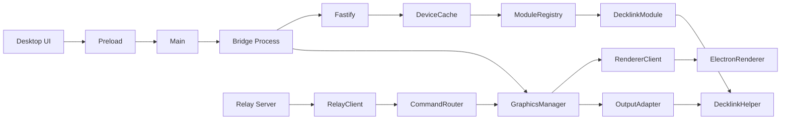

# Integration – Architektur & Struktur (Stufe 1)

## Checkliste Stufe 1
- [ ] Systemüberblick abgeschlossen
- [ ] Gesamtarchitekturdiagramm verifiziert
- [ ] End-to-End Datenfluss beschrieben
- [ ] Security-Boundaries dokumentiert

## Systemüberblick
Das System besteht aus einer Desktop-App (Electron), einer lokalen Bridge (Fastify + Renderer + Output) und einem nativen DeckLink Helper. Optional verbindet sich die Bridge mit einem Relay-Server, der Commands aus der Cloud zustellt.

## Gesamtarchitektur (Mermaid)

## End-to-End Flow (Graphics)
1. Command kommt via Relay (oder direkte API) in die Bridge.
2. Command Router validiert und dispatcht an Graphics Manager.
3. Renderer (Electron Offscreen) rendert HTML/CSS zu RGBA Frames.
4. Graphics Manager compositet und sendet Frames an Output-Adapter.
5. Output-Adapter streamt Frames an nativen DeckLink Helper.
6. Helper schreibt Frames auf die physische Output-Hardware.

## Security-Boundaries
- Desktop ↔ Bridge: lokale IPC + HTTP, keine direkten Node-APIs im Renderer.
- Bridge ↔ Renderer: lokale IPC mit Token-Handshake und Payload-Limits.
- Bridge ↔ Helper: native Binary, feste Args, X_OK-Check.
- Relay ↔ Bridge: untrusted Commands, Zod + Template-Sanitizing.

## Offene Punkte
- Vollständige Schnittstellenbeschreibung Desktop ↔ Bridge
- Relay-Protokoll und Auth-Strategie
- Betriebsdetails pro Umgebung (Dev/Prod)
