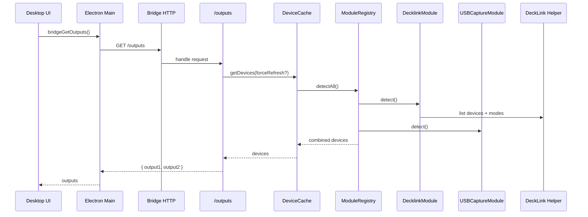

# Integration Flow – Device Discovery (E2E)

## Ziel
Beschreibt den End‑to‑End‑Flow von Device‑Erkennung bis zur UI‑Ausgabe der verfügbaren Outputs.

## Ablauf (Mermaid)

## Komponenten
- Desktop IPC: `src/electron/preload.cts`, `src/electron/main.ts`
- Bridge Outputs Route: `apps/bridge/src/routes/outputs.ts`
- Device Cache: `apps/bridge/src/services/device-cache.ts`
- Module Registry: `apps/bridge/src/modules/module-registry.ts`
- DeckLink Module/Helper: `apps/bridge/src/modules/decklink/*`
- USB Capture Module: `apps/bridge/src/modules/usb-capture/*`

## Security
- Helper‑Output wird geparst/validiert (Zod).
- Bridge liefert nur Output‑Metadaten, keine Secrets.

## Fehlerbilder
- Keine Geräte → leere Output‑Listen
- Helper fehlt → DeckLink‑Devices leer
- Rate‑Limit bei Refresh → 429 in `/outputs`

## Relevante Dateien
- `apps/bridge/src/routes/outputs.ts`
- `apps/bridge/src/services/device-cache.ts`
- `apps/bridge/src/modules/module-registry.ts`
- `apps/bridge/src/modules/decklink/decklink-detector.ts`
- `apps/bridge/src/modules/decklink/decklink-helper.ts`
- `apps/bridge/src/modules/usb-capture/usb-capture-detector.ts`
