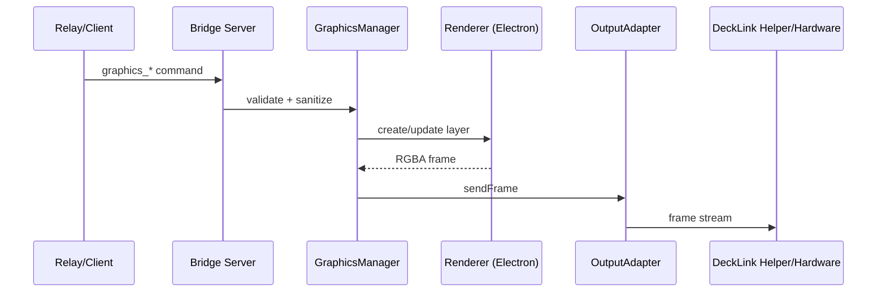

# Integration Flow – Graphics (End‑to‑End)

## Ziel
Beschreibt den vollständigen Graphics‑Datenfluss vom Command‑Ingress bis zur Hardware‑Ausgabe über DeckLink.

## Ablauf (High‑Level)
1. Command kommt von Relay oder lokaler HTTP‑API.
2. Bridge validiert und rendert Layer über Offscreen‑Renderer.
3. Frames werden compositet und an den Output‑Adapter gestreamt.
4. Adapter schreibt Frames an nativen DeckLink Helper.
5. Helper gibt Frames auf der Hardware aus.

## End‑to‑End Sequenz (Mermaid)

## Schnittstellen
- Relay Command: `command` Message mit `graphics_*`
- Bridge Internal: `graphicsManager.*` Methoden
- Renderer IPC: lokal, token‑auth, frames als binary payload
- Helper IO: stdin stream mit Header + RGBA

## Sicherheit
- Untrusted Commands: Zod + Sanitizing
- Renderer IPC: localhost + Token + Payload‑Limits
- Helper: binäre Ausführung mit festen Args

## Debug‑Punkte
- Relay Logs: Graphics payload logging (sanitized)
- Renderer Logs: Debug frames + DOM‑State
- Output Adapter: Pixel‑Format + Ready‑Handshake
- Helper: stdout/stderr parsing

## Relevante Dateien (Auszug)
- `apps/bridge/src/services/relay-client.ts`
- `apps/bridge/src/services/command-router.ts`
- `apps/bridge/src/services/graphics/graphics-manager.ts`
- `apps/bridge/src/services/graphics/renderer/electron-renderer-client.ts`
- `apps/bridge/src/services/graphics/renderer/electron-renderer-entry.ts`
- `apps/bridge/src/services/graphics/output-adapters/*`
- `apps/bridge/native/decklink-helper/src/decklink-helper.cpp`
