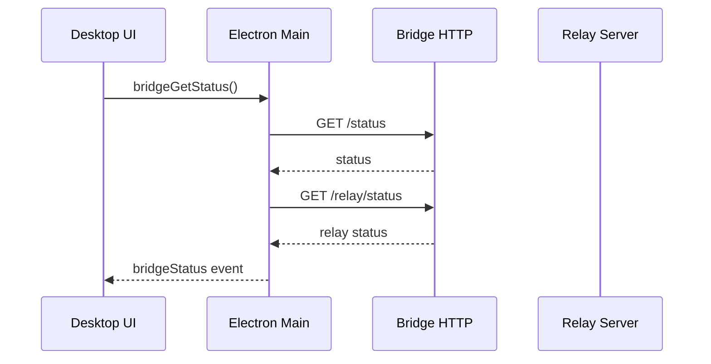

# Integration Flow – Health/Status (E2E)

## Ziel
Beschreibt den Status‑Flow vom Desktop UI bis zur Bridge und optional zum Relay.

## Ablauf (Mermaid)

## Komponenten
- Desktop: `src/electron/main.ts`, `src/electron/services/bridge-health-check.ts`
- Bridge: `apps/bridge/src/routes/status.ts`, `apps/bridge/src/routes/relay.ts`
- Relay: `apps/bridge/src/services/relay-client.ts`

## Felder (BridgeStatus)
- `running`, `reachable`, `version`, `uptime`, `mode`, `host`, `port`
- `relayConnected`, `bridgeId` (falls Relay aktiv)

## Fehlerbilder
- Port belegt → Status liefert Fehler
- Relay nicht konfiguriert → `relayConnected=false`

## Relevante Dateien
- `src/electron/services/bridge-health-check.ts`
- `apps/bridge/src/routes/status.ts`
- `apps/bridge/src/routes/relay.ts`
