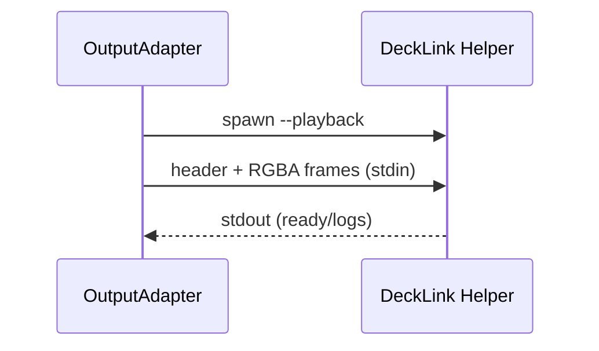

# Integration Flow – Helper‑Protokolle (DeckLink)

## Ziel
Beschreibt die CLI‑Protokolle des nativen DeckLink‑Helpers (List/Modes/Watch/Playback).

## CLI‑Modi
- `--list` → JSON‑Array mit Devices
- `--list-modes --device <id> --output-port <id>` → JSON‑Array mit Display‑Modes
- `--watch` → JSON‑Events (device_added/device_removed)
- `--playback` → Stdin Frames (RGBA + Header)

## Playback‑Stream (Header)
- Magic: `BRGF`
- Version: `1`
- Type: `FRAME` oder `SHUTDOWN`
- Width/Height
- Timestamp
- Payload‑Length

## Ablauf (Mermaid)

## Relevante Dateien
- `apps/bridge/native/decklink-helper/src/decklink-helper.cpp`
- `apps/bridge/src/modules/decklink/decklink-helper.ts`
- `apps/bridge/src/services/graphics/output-adapters/*`
