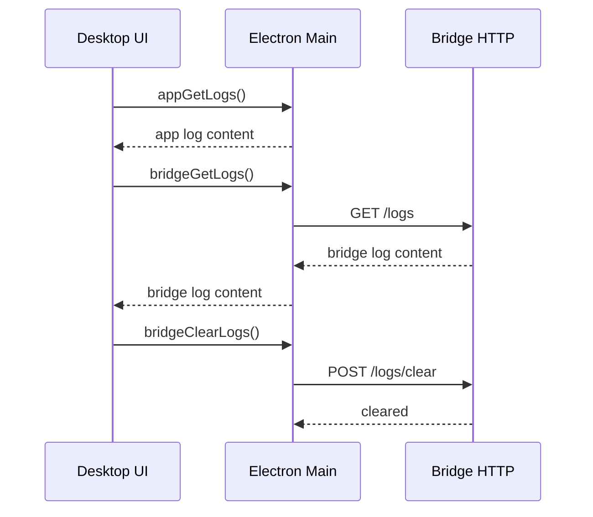

# Integration Flow – Logging & Diagnose

## Ziel
Beschreibt den Diagnose‑Flow für Logs (Desktop + Bridge) und die beteiligten Schnittstellen.

## Ablauf (Mermaid)

## Komponenten
- Desktop: `src/electron/services/app-logs.ts`, `src/electron/services/app-logger.ts`
- Bridge: `apps/bridge/src/routes/logs.ts`, `apps/bridge/src/services/log-file.ts`

## Fehlerbilder
- Logdatei fehlt → leere Antwort
- Bridge nicht erreichbar → HTTP‑Fehler

## Relevante Dateien
- `src/electron/services/app-logs.ts`
- `src/electron/services/bridge-logs.ts`
- `apps/bridge/src/routes/logs.ts`
- `apps/bridge/src/services/log-file.ts`
