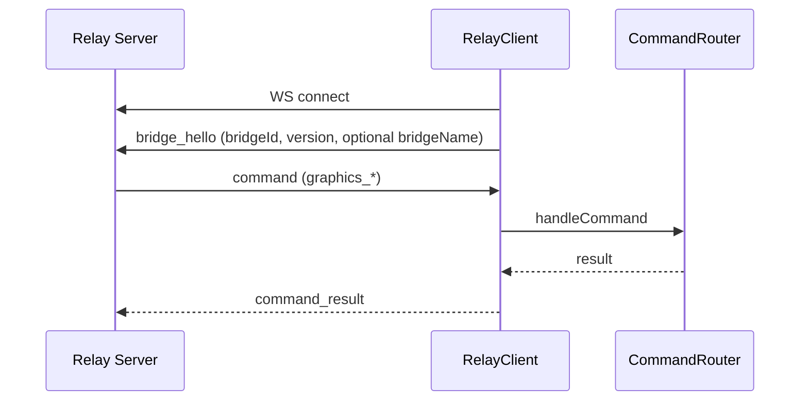

# Integration Flow – Relay (Cloud ↔ Bridge)

## Ziel
Beschreibt den Datenfluss zwischen Cloud‑Relay und Bridge (Commands + Results).

## Ablauf (Mermaid)

## Komponenten
- Bridge: `apps/bridge/src/services/relay-client.ts`
- Router: `apps/bridge/src/services/command-router.ts`

## Reconnect
- Exponentieller Backoff (1s → 60s)

## Sicherheit
- Payloads sind untrusted → Validierung downstream (Zod)
- Logging mit sanitized CSS‑Payloads
- Pairing‑Command validiert Code + Ablaufzeit im Bridge‑Context

## Relevante Dateien
- `apps/bridge/src/services/relay-client.ts`
- `apps/bridge/src/services/command-router.ts`
